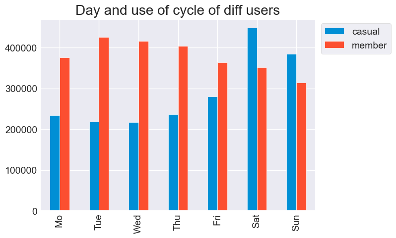
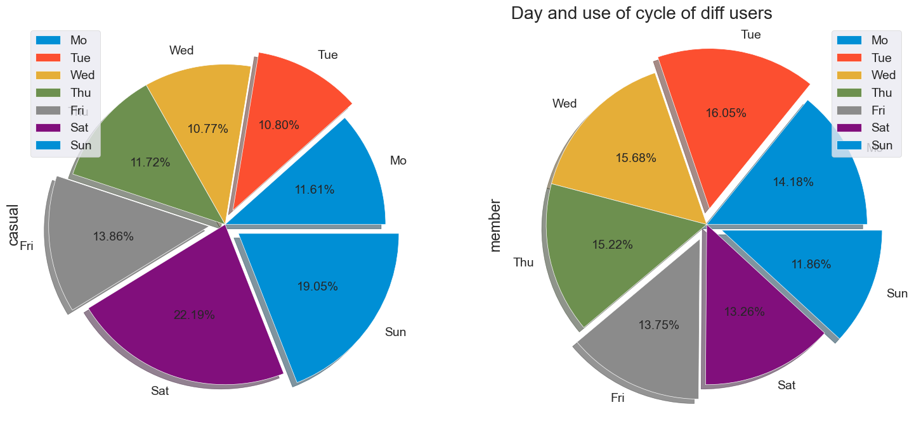
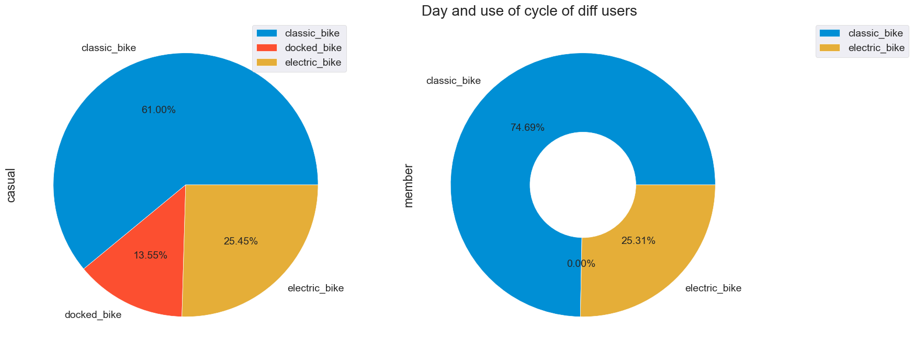
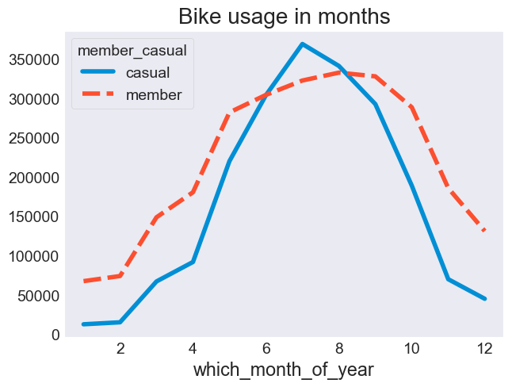
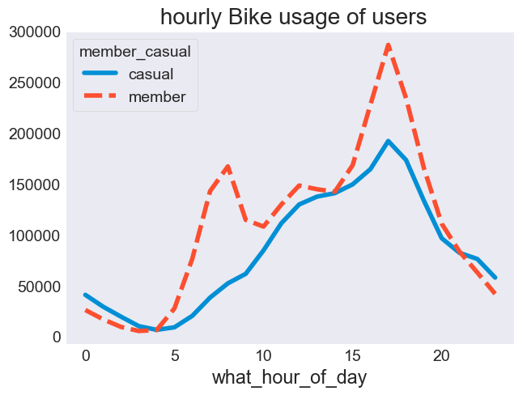

## About the company
In 2016, Cyclistic launched a successful bike-share offering. Since then, the program has grown to a fleet of 5,824 bicycles thatare geotracked and locked into a network of 692 stations across Chicago. The bikes can be unlocked from one station and
returned to any other station in the system anytime.
Until now, Cyclistic’s marketing strategy relied on building general awareness and appealing to broad consumer segments.
One approach that helped make these things possible was the flexibility of its pricing plans: single-ride passes, full-day passes,and annual memberships. Customers who purchase single-ride or full-day passes are referred to as casual riders. Customers
who purchase annual memberships are Cyclistic members.
Cyclistic’s finance analysts have concluded that annual members are much more profitable than casual riders. Although the
pricing flexibility helps Cyclistic attract more customers, Moreno believes that maximizing the number of annual members will
be key to future growth. Rather than creating a marketing campaign that targets all-new customers, Moreno believes there is a
very good chance to convert casual riders into members. She notes that casual riders are already aware of the Cyclistic
program and have chosen Cyclistic for their mobility needs.
Moreno has set a clear goal: Design marketing strategies aimed at converting casual riders into annual members. In order to
do that, however, the marketing analyst team needs to better understand how annual members and casual riders differ, why
casual riders would buy a membership, and how digital media could affect their marketing tactics. Moreno and her team are
interested in analyzing the Cyclistic historical bike trip data to identify trends.

## How Does a Bike-Share Navigate Speedy Success?
In this case study, I will work for a fictional company, Cyclistic, a bike-share company in Chicago. I will design a new marketing strategy to convert casual riders into annual members. But first, Cyclistic executives must approve my recommendations, so they must be backed up with compelling data insights and professional data visualizations.

## What is the problem to be solved?
The director of marketing and finance analysts believe that annual members are more profitable to the company than the casual riders. One of the questions assigned to this analysis to be answered is that how do annual members and casual riders use Cyclistic bikes differently? Thus we are intersted in analyzing the Cyclistic historical bike trip data to identify trends and find the solution to the business task. The result of this analysis will be used to design marketing strategies to convert casual riders into annual members.

#### The stakeholders
The director of marketing (Lily Moreno)
Cyclistic marketing analytics team
Cyclistic executive team

### Datasets
The required data sources, which included 12 files for last 12 months history of bike trips from 06-2021 to 05-2022,  This is public data that we can use to explore how different customer types are using Cyclistic bikes. But data-privacy issues prohibit us from using riders   personally identifiable information.

The data provided is in the csv format and is organized in rows and columns. The provided data source comes from a trusted data source so we are sure that it is complete, accurate and reliable and not bias in anyway and it reflects the overal population.

We have access to the original data source from a reliable organization and we are not relying to second or third-party inoformation, so we don't need to worry about the origin of the data we are going to base our analysis on. The provided data soure is comprehensive and contains all the necessary information wee need to answer the questions and accomplish the business task. We can also see that Motivate International keeps the data conitously updated and we have access to the most recent data (for the year 2022) as well. This gives us the confidence that it is the most current information available.

### Process
For the purpose of this project I chose Jupyter notebook to do most of the data cleaning tasks and to create related reports and visualizations. In order to make sure the data is cleand, I will checked for any null and duplicated values. The column names were already clean and descriptive enough. 


```python
import pandas as pd
import seaborn as sns
import matplotlib.pyplot as plt
import numpy as np
import warnings
import seaborn as sns
warnings.filterwarnings('ignore')
import klib as k
import plotly.express as plx
```


```python
data1=pd.read_csv('./202201-divvy-tripdata.csv')
data2=pd.read_csv('./202202-divvy-tripdata.csv')
data3=pd.read_csv('./202203-divvy-tripdata.csv')
data4=pd.read_csv('./202204-divvy-tripdata.csv')
data5=pd.read_csv('./202205-divvy-tripdata.csv')
data6=pd.read_csv('./202106-divvy-tripdata.csv')
data7=pd.read_csv('./202107-divvy-tripdata.csv')
data8=pd.read_csv('./202108-divvy-tripdata.csv')
data9=pd.read_csv('./202109-divvy-tripdata.csv')
data10=pd.read_csv('./202110-divvy-tripdata.csv')
data11=pd.read_csv('./202111-divvy-tripdata.csv')
data12=pd.read_csv('./202112-divvy-tripdata.csv')

```


```python
frames=[data1,data2,data3,data4,data5,data6,data7,data8,data9,data10,data11,data12]
new_data=pd.concat(frames)

```


```python
new_data.head()
```


<div>
<style scoped>
    .dataframe tbody tr th:only-of-type {
        vertical-align: middle;
    }

    .dataframe tbody tr th {
        vertical-align: top;
    }

    .dataframe thead th {
        text-align: right;
    }
</style>
<table border="1" class="dataframe">
  <thead>
    <tr style="text-align: right;">
      <th></th>
      <th>ride_id</th>
      <th>rideable_type</th>
      <th>started_at</th>
      <th>ended_at</th>
      <th>start_station_name</th>
      <th>start_station_id</th>
      <th>end_station_name</th>
      <th>end_station_id</th>
      <th>start_lat</th>
      <th>start_lng</th>
      <th>end_lat</th>
      <th>end_lng</th>
      <th>member_casual</th>
    </tr>
  </thead>
  <tbody>
    <tr>
      <th>0</th>
      <td>C2F7DD78E82EC875</td>
      <td>electric_bike</td>
      <td>2022-01-13 11:59:47</td>
      <td>2022-01-13 12:02:44</td>
      <td>Glenwood Ave &amp; Touhy Ave</td>
      <td>525</td>
      <td>Clark St &amp; Touhy Ave</td>
      <td>RP-007</td>
      <td>42.012800</td>
      <td>-87.665906</td>
      <td>42.012560</td>
      <td>-87.674367</td>
      <td>casual</td>
    </tr>
    <tr>
      <th>1</th>
      <td>A6CF8980A652D272</td>
      <td>electric_bike</td>
      <td>2022-01-10 08:41:56</td>
      <td>2022-01-10 08:46:17</td>
      <td>Glenwood Ave &amp; Touhy Ave</td>
      <td>525</td>
      <td>Clark St &amp; Touhy Ave</td>
      <td>RP-007</td>
      <td>42.012763</td>
      <td>-87.665967</td>
      <td>42.012560</td>
      <td>-87.674367</td>
      <td>casual</td>
    </tr>
    <tr>
      <th>2</th>
      <td>BD0F91DFF741C66D</td>
      <td>classic_bike</td>
      <td>2022-01-25 04:53:40</td>
      <td>2022-01-25 04:58:01</td>
      <td>Sheffield Ave &amp; Fullerton Ave</td>
      <td>TA1306000016</td>
      <td>Greenview Ave &amp; Fullerton Ave</td>
      <td>TA1307000001</td>
      <td>41.925602</td>
      <td>-87.653708</td>
      <td>41.925330</td>
      <td>-87.665800</td>
      <td>member</td>
    </tr>
    <tr>
      <th>3</th>
      <td>CBB80ED419105406</td>
      <td>classic_bike</td>
      <td>2022-01-04 00:18:04</td>
      <td>2022-01-04 00:33:00</td>
      <td>Clark St &amp; Bryn Mawr Ave</td>
      <td>KA1504000151</td>
      <td>Paulina St &amp; Montrose Ave</td>
      <td>TA1309000021</td>
      <td>41.983593</td>
      <td>-87.669154</td>
      <td>41.961507</td>
      <td>-87.671387</td>
      <td>casual</td>
    </tr>
    <tr>
      <th>4</th>
      <td>DDC963BFDDA51EEA</td>
      <td>classic_bike</td>
      <td>2022-01-20 01:31:10</td>
      <td>2022-01-20 01:37:12</td>
      <td>Michigan Ave &amp; Jackson Blvd</td>
      <td>TA1309000002</td>
      <td>State St &amp; Randolph St</td>
      <td>TA1305000029</td>
      <td>41.877850</td>
      <td>-87.624080</td>
      <td>41.884621</td>
      <td>-87.627834</td>
      <td>member</td>
    </tr>
  </tbody>
</table>
</div>


```python
new_data.tail()
```


<div>
<style scoped>
    .dataframe tbody tr th:only-of-type {
        vertical-align: middle;
    }

    .dataframe tbody tr th {
        vertical-align: top;
    }

    .dataframe thead th {
        text-align: right;
    }
</style>
<table border="1" class="dataframe">
  <thead>
    <tr style="text-align: right;">
      <th></th>
      <th>ride_id</th>
      <th>rideable_type</th>
      <th>started_at</th>
      <th>ended_at</th>
      <th>start_station_name</th>
      <th>start_station_id</th>
      <th>end_station_name</th>
      <th>end_station_id</th>
      <th>start_lat</th>
      <th>start_lng</th>
      <th>end_lat</th>
      <th>end_lng</th>
      <th>member_casual</th>
    </tr>
  </thead>
  <tbody>
    <tr>
      <th>247535</th>
      <td>847431F3D5353AB7</td>
      <td>electric_bike</td>
      <td>2021-12-12 13:36:55</td>
      <td>2021-12-12 13:56:08</td>
      <td>Canal St &amp; Madison St</td>
      <td>13341</td>
      <td>NaN</td>
      <td>NaN</td>
      <td>41.882289</td>
      <td>-87.639752</td>
      <td>41.890000</td>
      <td>-87.610000</td>
      <td>casual</td>
    </tr>
    <tr>
      <th>247536</th>
      <td>CF407BBC3B9FAD63</td>
      <td>electric_bike</td>
      <td>2021-12-06 19:37:50</td>
      <td>2021-12-06 19:44:51</td>
      <td>Canal St &amp; Madison St</td>
      <td>13341</td>
      <td>Kingsbury St &amp; Kinzie St</td>
      <td>KA1503000043</td>
      <td>41.882123</td>
      <td>-87.640053</td>
      <td>41.889106</td>
      <td>-87.638862</td>
      <td>member</td>
    </tr>
    <tr>
      <th>247537</th>
      <td>60BB69EBF5440E92</td>
      <td>electric_bike</td>
      <td>2021-12-02 08:57:04</td>
      <td>2021-12-02 09:05:21</td>
      <td>Canal St &amp; Madison St</td>
      <td>13341</td>
      <td>Dearborn St &amp; Monroe St</td>
      <td>TA1305000006</td>
      <td>41.881956</td>
      <td>-87.639955</td>
      <td>41.880254</td>
      <td>-87.629603</td>
      <td>member</td>
    </tr>
    <tr>
      <th>247538</th>
      <td>C414F654A28635B8</td>
      <td>electric_bike</td>
      <td>2021-12-13 09:00:26</td>
      <td>2021-12-13 09:14:39</td>
      <td>Lawndale Ave &amp; 16th St</td>
      <td>362.0</td>
      <td>NaN</td>
      <td>NaN</td>
      <td>41.860000</td>
      <td>-87.720000</td>
      <td>41.850000</td>
      <td>-87.710000</td>
      <td>member</td>
    </tr>
    <tr>
      <th>247539</th>
      <td>37AC57E34B2E7E97</td>
      <td>classic_bike</td>
      <td>2021-12-13 08:45:32</td>
      <td>2021-12-13 08:49:09</td>
      <td>Michigan Ave &amp; Jackson Blvd</td>
      <td>TA1309000002</td>
      <td>Dearborn St &amp; Monroe St</td>
      <td>TA1305000006</td>
      <td>41.877850</td>
      <td>-87.624080</td>
      <td>41.881320</td>
      <td>-87.629521</td>
      <td>member</td>
    </tr>
  </tbody>
</table>
</div>


```python
new_data.sample(10)
```


<div>
<style scoped>
    .dataframe tbody tr th:only-of-type {
        vertical-align: middle;
    }

    .dataframe tbody tr th {
        vertical-align: top;
    }

    .dataframe thead th {
        text-align: right;
    }
</style>
<table border="1" class="dataframe">
  <thead>
    <tr style="text-align: right;">
      <th></th>
      <th>ride_id</th>
      <th>rideable_type</th>
      <th>started_at</th>
      <th>ended_at</th>
      <th>start_station_name</th>
      <th>start_station_id</th>
      <th>end_station_name</th>
      <th>end_station_id</th>
      <th>start_lat</th>
      <th>start_lng</th>
      <th>end_lat</th>
      <th>end_lng</th>
      <th>member_casual</th>
    </tr>
  </thead>
  <tbody>
    <tr>
      <th>127200</th>
      <td>99D56D19B79F5BE0</td>
      <td>classic_bike</td>
      <td>2021-12-04 10:34:18</td>
      <td>2021-12-04 10:39:38</td>
      <td>Clark St &amp; Schiller St</td>
      <td>TA1309000024</td>
      <td>Larrabee St &amp; North Ave</td>
      <td>TA1306000008</td>
      <td>41.907993</td>
      <td>-87.631501</td>
      <td>41.910210</td>
      <td>-87.643500</td>
      <td>member</td>
    </tr>
    <tr>
      <th>696995</th>
      <td>04D443BB47372723</td>
      <td>electric_bike</td>
      <td>2021-09-25 17:23:14</td>
      <td>2021-09-25 17:48:04</td>
      <td>NaN</td>
      <td>NaN</td>
      <td>NaN</td>
      <td>NaN</td>
      <td>41.970000</td>
      <td>-87.640000</td>
      <td>41.990000</td>
      <td>-87.660000</td>
      <td>casual</td>
    </tr>
    <tr>
      <th>220943</th>
      <td>2BFA2AEE09A7EA2F</td>
      <td>electric_bike</td>
      <td>2021-08-27 11:18:58</td>
      <td>2021-08-27 11:23:09</td>
      <td>Canal St &amp; Madison St</td>
      <td>13341</td>
      <td>Clinton St &amp; Polk St</td>
      <td>15542</td>
      <td>41.882132</td>
      <td>-87.640171</td>
      <td>41.871676</td>
      <td>-87.640914</td>
      <td>casual</td>
    </tr>
    <tr>
      <th>684155</th>
      <td>A3B3C0E60AE855A0</td>
      <td>classic_bike</td>
      <td>2021-08-18 11:57:35</td>
      <td>2021-08-18 12:09:27</td>
      <td>DuSable Lake Shore Dr &amp; Monroe St</td>
      <td>13300</td>
      <td>Streeter Dr &amp; Grand Ave</td>
      <td>13022</td>
      <td>41.880958</td>
      <td>-87.616743</td>
      <td>41.892278</td>
      <td>-87.612043</td>
      <td>casual</td>
    </tr>
    <tr>
      <th>225015</th>
      <td>4909E2A51D3FCBE8</td>
      <td>classic_bike</td>
      <td>2022-05-10 18:02:27</td>
      <td>2022-05-10 18:39:38</td>
      <td>Clinton St &amp; Jackson Blvd</td>
      <td>638</td>
      <td>Bernard St &amp; Elston Ave</td>
      <td>18016</td>
      <td>41.878317</td>
      <td>-87.640981</td>
      <td>41.949923</td>
      <td>-87.713949</td>
      <td>member</td>
    </tr>
    <tr>
      <th>410277</th>
      <td>7FCD3EE76709CFDB</td>
      <td>classic_bike</td>
      <td>2021-07-20 08:46:32</td>
      <td>2021-07-20 08:54:33</td>
      <td>Ashland Ave &amp; Division St</td>
      <td>13061</td>
      <td>Ashland Ave &amp; Grand Ave</td>
      <td>13434</td>
      <td>41.903450</td>
      <td>-87.667747</td>
      <td>41.891072</td>
      <td>-87.666611</td>
      <td>casual</td>
    </tr>
    <tr>
      <th>459936</th>
      <td>25A9DE1ADBDDFF41</td>
      <td>electric_bike</td>
      <td>2021-09-02 18:25:10</td>
      <td>2021-09-02 18:39:44</td>
      <td>Pine Grove Ave &amp; Irving Park Rd</td>
      <td>TA1308000022</td>
      <td>Montrose Harbor</td>
      <td>TA1308000012</td>
      <td>41.954456</td>
      <td>-87.648052</td>
      <td>41.963926</td>
      <td>-87.638206</td>
      <td>member</td>
    </tr>
    <tr>
      <th>278026</th>
      <td>96E5DCA384AB0DE4</td>
      <td>classic_bike</td>
      <td>2021-10-14 14:29:51</td>
      <td>2021-10-14 14:39:07</td>
      <td>Paulina St &amp; Flournoy St</td>
      <td>KA1504000104</td>
      <td>Sangamon St &amp; Washington Blvd</td>
      <td>13409</td>
      <td>41.872950</td>
      <td>-87.669130</td>
      <td>41.883165</td>
      <td>-87.651100</td>
      <td>casual</td>
    </tr>
    <tr>
      <th>543210</th>
      <td>CF9A43A63228A03A</td>
      <td>classic_bike</td>
      <td>2022-05-17 17:30:54</td>
      <td>2022-05-17 17:47:40</td>
      <td>Pine Grove Ave &amp; Waveland Ave</td>
      <td>TA1307000150</td>
      <td>Larrabee St &amp; Webster Ave</td>
      <td>13193</td>
      <td>41.949473</td>
      <td>-87.646453</td>
      <td>41.921822</td>
      <td>-87.644140</td>
      <td>member</td>
    </tr>
    <tr>
      <th>296106</th>
      <td>C2EE20371B8C8DB5</td>
      <td>docked_bike</td>
      <td>2021-06-03 15:46:54</td>
      <td>2021-06-03 16:00:38</td>
      <td>Wood St &amp; Milwaukee Ave</td>
      <td>13221</td>
      <td>Claremont Ave &amp; Hirsch St</td>
      <td>13245</td>
      <td>41.907655</td>
      <td>-87.672552</td>
      <td>41.907781</td>
      <td>-87.685854</td>
      <td>casual</td>
    </tr>
  </tbody>
</table>
</div>


### Data cleaning


```python
#droping unnecessary columns
new_data.drop(columns='ride_id',inplace=True)
new_data.drop(columns='start_station_id',inplace=True)
```


```python
new_data.drop(columns='end_station_id',inplace=True)
```


```python

```


```python
new_data.describe().T
```


<div>
<style scoped>
    .dataframe tbody tr th:only-of-type {
        vertical-align: middle;
    }

    .dataframe tbody tr th {
        vertical-align: top;
    }

    .dataframe thead th {
        text-align: right;
    }
</style>
<table border="1" class="dataframe">
  <thead>
    <tr style="text-align: right;">
      <th></th>
      <th>count</th>
      <th>mean</th>
      <th>std</th>
      <th>min</th>
      <th>25%</th>
      <th>50%</th>
      <th>75%</th>
      <th>max</th>
    </tr>
  </thead>
  <tbody>
    <tr>
      <th>start_lat</th>
      <td>5860776.0</td>
      <td>41.900356</td>
      <td>0.047040</td>
      <td>41.64</td>
      <td>41.881032</td>
      <td>41.898886</td>
      <td>41.929143</td>
      <td>45.635034</td>
    </tr>
    <tr>
      <th>start_lng</th>
      <td>5860776.0</td>
      <td>-87.646809</td>
      <td>0.030490</td>
      <td>-87.84</td>
      <td>-87.661198</td>
      <td>-87.642985</td>
      <td>-87.627834</td>
      <td>-73.796477</td>
    </tr>
    <tr>
      <th>end_lat</th>
      <td>5855740.0</td>
      <td>41.900612</td>
      <td>0.047134</td>
      <td>41.39</td>
      <td>41.881109</td>
      <td>41.899181</td>
      <td>41.929465</td>
      <td>42.168116</td>
    </tr>
    <tr>
      <th>end_lng</th>
      <td>5855740.0</td>
      <td>-87.647004</td>
      <td>0.030123</td>
      <td>-88.97</td>
      <td>-87.661406</td>
      <td>-87.643118</td>
      <td>-87.627844</td>
      <td>-87.490000</td>
    </tr>
  </tbody>
</table>
</div>


```python
new_data.shape
```


    (5860776, 10)


```python
new_data.isnull().mean()*100
```


    rideable_type          0.000000
    started_at             0.000000
    ended_at               0.000000
    start_station_name    14.045358
    end_station_name      14.986718
    start_lat              0.000000
    start_lng              0.000000
    end_lat                0.085927
    end_lng                0.085927
    member_casual          0.000000
    dtype: float64


```python
# droping null values
new_data.dropna(inplace=True)
```


```python

```


```python
new_data.duplicated().sum()
```


    396


```python
new_data.info()
```

    <class 'pandas.core.frame.DataFrame'>
    Int64Index: 4667299 entries, 0 to 247539
    Data columns (total 10 columns):
     #   Column              Dtype  
    ---  ------              -----  
     0   rideable_type       object 
     1   started_at          object 
     2   ended_at            object 
     3   start_station_name  object 
     4   end_station_name    object 
     5   start_lat           float64
     6   start_lng           float64
     7   end_lat             float64
     8   end_lng             float64
     9   member_casual       object 
    dtypes: float64(4), object(6)
    memory usage: 391.7+ MB
    


```python
#converting column type object to datetime
new_data[["started_at", "ended_at"]] = new_data[["started_at", "ended_at"]].apply(pd.to_datetime)
```


```python
converted_new_data=new_data.info()
```

    <class 'pandas.core.frame.DataFrame'>
    Int64Index: 4667299 entries, 0 to 247539
    Data columns (total 10 columns):
     #   Column              Dtype         
    ---  ------              -----         
     0   rideable_type       object        
     1   started_at          datetime64[ns]
     2   ended_at            datetime64[ns]
     3   start_station_name  object        
     4   end_station_name    object        
     5   start_lat           float64       
     6   start_lng           float64       
     7   end_lat             float64       
     8   end_lng             float64       
     9   member_casual       object        
    dtypes: datetime64[ns](2), float64(4), object(4)
    memory usage: 391.7+ MB
    

# 1. How do annual members and casual riders use Cyclistic bikes differently?
To answer the business question, I needed to calculate the duration of the trip. To accomplish this, I added two new columns to the existing data and assign them to ride_length and ride_length_seconds columns.


```python
new_data['ride_length'] = new_data.ended_at - new_data.started_at
new_data['ride_length_seconds'] = new_data['ride_length'].dt.total_seconds()
```


```python
new_data
```


<div>
<style scoped>
    .dataframe tbody tr th:only-of-type {
        vertical-align: middle;
    }

    .dataframe tbody tr th {
        vertical-align: top;
    }

    .dataframe thead th {
        text-align: right;
    }
</style>
<table border="1" class="dataframe">
  <thead>
    <tr style="text-align: right;">
      <th></th>
      <th>rideable_type</th>
      <th>started_at</th>
      <th>ended_at</th>
      <th>start_station_name</th>
      <th>end_station_name</th>
      <th>start_lat</th>
      <th>start_lng</th>
      <th>end_lat</th>
      <th>end_lng</th>
      <th>member_casual</th>
      <th>ride_length</th>
      <th>ride_length_seconds</th>
    </tr>
  </thead>
  <tbody>
    <tr>
      <th>0</th>
      <td>electric_bike</td>
      <td>2022-01-13 11:59:47</td>
      <td>2022-01-13 12:02:44</td>
      <td>Glenwood Ave &amp; Touhy Ave</td>
      <td>Clark St &amp; Touhy Ave</td>
      <td>42.012800</td>
      <td>-87.665906</td>
      <td>42.012560</td>
      <td>-87.674367</td>
      <td>casual</td>
      <td>0 days 00:02:57</td>
      <td>177.0</td>
    </tr>
    <tr>
      <th>1</th>
      <td>electric_bike</td>
      <td>2022-01-10 08:41:56</td>
      <td>2022-01-10 08:46:17</td>
      <td>Glenwood Ave &amp; Touhy Ave</td>
      <td>Clark St &amp; Touhy Ave</td>
      <td>42.012763</td>
      <td>-87.665967</td>
      <td>42.012560</td>
      <td>-87.674367</td>
      <td>casual</td>
      <td>0 days 00:04:21</td>
      <td>261.0</td>
    </tr>
    <tr>
      <th>2</th>
      <td>classic_bike</td>
      <td>2022-01-25 04:53:40</td>
      <td>2022-01-25 04:58:01</td>
      <td>Sheffield Ave &amp; Fullerton Ave</td>
      <td>Greenview Ave &amp; Fullerton Ave</td>
      <td>41.925602</td>
      <td>-87.653708</td>
      <td>41.925330</td>
      <td>-87.665800</td>
      <td>member</td>
      <td>0 days 00:04:21</td>
      <td>261.0</td>
    </tr>
    <tr>
      <th>3</th>
      <td>classic_bike</td>
      <td>2022-01-04 00:18:04</td>
      <td>2022-01-04 00:33:00</td>
      <td>Clark St &amp; Bryn Mawr Ave</td>
      <td>Paulina St &amp; Montrose Ave</td>
      <td>41.983593</td>
      <td>-87.669154</td>
      <td>41.961507</td>
      <td>-87.671387</td>
      <td>casual</td>
      <td>0 days 00:14:56</td>
      <td>896.0</td>
    </tr>
    <tr>
      <th>4</th>
      <td>classic_bike</td>
      <td>2022-01-20 01:31:10</td>
      <td>2022-01-20 01:37:12</td>
      <td>Michigan Ave &amp; Jackson Blvd</td>
      <td>State St &amp; Randolph St</td>
      <td>41.877850</td>
      <td>-87.624080</td>
      <td>41.884621</td>
      <td>-87.627834</td>
      <td>member</td>
      <td>0 days 00:06:02</td>
      <td>362.0</td>
    </tr>
    <tr>
      <th>...</th>
      <td>...</td>
      <td>...</td>
      <td>...</td>
      <td>...</td>
      <td>...</td>
      <td>...</td>
      <td>...</td>
      <td>...</td>
      <td>...</td>
      <td>...</td>
      <td>...</td>
      <td>...</td>
    </tr>
    <tr>
      <th>247528</th>
      <td>electric_bike</td>
      <td>2021-12-07 15:55:37</td>
      <td>2021-12-07 16:00:17</td>
      <td>Canal St &amp; Madison St</td>
      <td>Desplaines St &amp; Kinzie St</td>
      <td>41.881372</td>
      <td>-87.640042</td>
      <td>41.888456</td>
      <td>-87.644336</td>
      <td>casual</td>
      <td>0 days 00:04:40</td>
      <td>280.0</td>
    </tr>
    <tr>
      <th>247532</th>
      <td>electric_bike</td>
      <td>2021-12-01 16:50:52</td>
      <td>2021-12-01 16:55:18</td>
      <td>Canal St &amp; Madison St</td>
      <td>Desplaines St &amp; Kinzie St</td>
      <td>41.881999</td>
      <td>-87.639265</td>
      <td>41.888415</td>
      <td>-87.644342</td>
      <td>casual</td>
      <td>0 days 00:04:26</td>
      <td>266.0</td>
    </tr>
    <tr>
      <th>247536</th>
      <td>electric_bike</td>
      <td>2021-12-06 19:37:50</td>
      <td>2021-12-06 19:44:51</td>
      <td>Canal St &amp; Madison St</td>
      <td>Kingsbury St &amp; Kinzie St</td>
      <td>41.882123</td>
      <td>-87.640053</td>
      <td>41.889106</td>
      <td>-87.638862</td>
      <td>member</td>
      <td>0 days 00:07:01</td>
      <td>421.0</td>
    </tr>
    <tr>
      <th>247537</th>
      <td>electric_bike</td>
      <td>2021-12-02 08:57:04</td>
      <td>2021-12-02 09:05:21</td>
      <td>Canal St &amp; Madison St</td>
      <td>Dearborn St &amp; Monroe St</td>
      <td>41.881956</td>
      <td>-87.639955</td>
      <td>41.880254</td>
      <td>-87.629603</td>
      <td>member</td>
      <td>0 days 00:08:17</td>
      <td>497.0</td>
    </tr>
    <tr>
      <th>247539</th>
      <td>classic_bike</td>
      <td>2021-12-13 08:45:32</td>
      <td>2021-12-13 08:49:09</td>
      <td>Michigan Ave &amp; Jackson Blvd</td>
      <td>Dearborn St &amp; Monroe St</td>
      <td>41.877850</td>
      <td>-87.624080</td>
      <td>41.881320</td>
      <td>-87.629521</td>
      <td>member</td>
      <td>0 days 00:03:37</td>
      <td>217.0</td>
    </tr>
  </tbody>
</table>
<p>4667299 rows × 12 columns</p>
</div>


Further on, I will compute and assign the day of the week and the hour of the day in which the bike was rented and assign it to the corresponding columns.

Day of the week is mapped this way: (Monday=1, Sunday=7)


```python
new_data['which_day_of_week'] = new_data['started_at'].dt.dayofweek
new_data['what_hour_of_day'] = new_data['started_at'].dt.hour
new_data['which_month_of_year'] = new_data['started_at'].dt.month
```


```python
new_data
```


<div>
<style scoped>
    .dataframe tbody tr th:only-of-type {
        vertical-align: middle;
    }

    .dataframe tbody tr th {
        vertical-align: top;
    }

    .dataframe thead th {
        text-align: right;
    }
</style>
<table border="1" class="dataframe">
  <thead>
    <tr style="text-align: right;">
      <th></th>
      <th>rideable_type</th>
      <th>started_at</th>
      <th>ended_at</th>
      <th>start_station_name</th>
      <th>end_station_name</th>
      <th>start_lat</th>
      <th>start_lng</th>
      <th>end_lat</th>
      <th>end_lng</th>
      <th>member_casual</th>
      <th>ride_length</th>
      <th>ride_length_seconds</th>
      <th>which_day_of_week</th>
      <th>what_hour_of_day</th>
      <th>which_month_of_year</th>
    </tr>
  </thead>
  <tbody>
    <tr>
      <th>0</th>
      <td>electric_bike</td>
      <td>2022-01-13 11:59:47</td>
      <td>2022-01-13 12:02:44</td>
      <td>Glenwood Ave &amp; Touhy Ave</td>
      <td>Clark St &amp; Touhy Ave</td>
      <td>42.012800</td>
      <td>-87.665906</td>
      <td>42.012560</td>
      <td>-87.674367</td>
      <td>casual</td>
      <td>0 days 00:02:57</td>
      <td>177.0</td>
      <td>3</td>
      <td>11</td>
      <td>1</td>
    </tr>
    <tr>
      <th>1</th>
      <td>electric_bike</td>
      <td>2022-01-10 08:41:56</td>
      <td>2022-01-10 08:46:17</td>
      <td>Glenwood Ave &amp; Touhy Ave</td>
      <td>Clark St &amp; Touhy Ave</td>
      <td>42.012763</td>
      <td>-87.665967</td>
      <td>42.012560</td>
      <td>-87.674367</td>
      <td>casual</td>
      <td>0 days 00:04:21</td>
      <td>261.0</td>
      <td>0</td>
      <td>8</td>
      <td>1</td>
    </tr>
    <tr>
      <th>2</th>
      <td>classic_bike</td>
      <td>2022-01-25 04:53:40</td>
      <td>2022-01-25 04:58:01</td>
      <td>Sheffield Ave &amp; Fullerton Ave</td>
      <td>Greenview Ave &amp; Fullerton Ave</td>
      <td>41.925602</td>
      <td>-87.653708</td>
      <td>41.925330</td>
      <td>-87.665800</td>
      <td>member</td>
      <td>0 days 00:04:21</td>
      <td>261.0</td>
      <td>1</td>
      <td>4</td>
      <td>1</td>
    </tr>
    <tr>
      <th>3</th>
      <td>classic_bike</td>
      <td>2022-01-04 00:18:04</td>
      <td>2022-01-04 00:33:00</td>
      <td>Clark St &amp; Bryn Mawr Ave</td>
      <td>Paulina St &amp; Montrose Ave</td>
      <td>41.983593</td>
      <td>-87.669154</td>
      <td>41.961507</td>
      <td>-87.671387</td>
      <td>casual</td>
      <td>0 days 00:14:56</td>
      <td>896.0</td>
      <td>1</td>
      <td>0</td>
      <td>1</td>
    </tr>
    <tr>
      <th>4</th>
      <td>classic_bike</td>
      <td>2022-01-20 01:31:10</td>
      <td>2022-01-20 01:37:12</td>
      <td>Michigan Ave &amp; Jackson Blvd</td>
      <td>State St &amp; Randolph St</td>
      <td>41.877850</td>
      <td>-87.624080</td>
      <td>41.884621</td>
      <td>-87.627834</td>
      <td>member</td>
      <td>0 days 00:06:02</td>
      <td>362.0</td>
      <td>3</td>
      <td>1</td>
      <td>1</td>
    </tr>
    <tr>
      <th>...</th>
      <td>...</td>
      <td>...</td>
      <td>...</td>
      <td>...</td>
      <td>...</td>
      <td>...</td>
      <td>...</td>
      <td>...</td>
      <td>...</td>
      <td>...</td>
      <td>...</td>
      <td>...</td>
      <td>...</td>
      <td>...</td>
      <td>...</td>
    </tr>
    <tr>
      <th>247528</th>
      <td>electric_bike</td>
      <td>2021-12-07 15:55:37</td>
      <td>2021-12-07 16:00:17</td>
      <td>Canal St &amp; Madison St</td>
      <td>Desplaines St &amp; Kinzie St</td>
      <td>41.881372</td>
      <td>-87.640042</td>
      <td>41.888456</td>
      <td>-87.644336</td>
      <td>casual</td>
      <td>0 days 00:04:40</td>
      <td>280.0</td>
      <td>1</td>
      <td>15</td>
      <td>12</td>
    </tr>
    <tr>
      <th>247532</th>
      <td>electric_bike</td>
      <td>2021-12-01 16:50:52</td>
      <td>2021-12-01 16:55:18</td>
      <td>Canal St &amp; Madison St</td>
      <td>Desplaines St &amp; Kinzie St</td>
      <td>41.881999</td>
      <td>-87.639265</td>
      <td>41.888415</td>
      <td>-87.644342</td>
      <td>casual</td>
      <td>0 days 00:04:26</td>
      <td>266.0</td>
      <td>2</td>
      <td>16</td>
      <td>12</td>
    </tr>
    <tr>
      <th>247536</th>
      <td>electric_bike</td>
      <td>2021-12-06 19:37:50</td>
      <td>2021-12-06 19:44:51</td>
      <td>Canal St &amp; Madison St</td>
      <td>Kingsbury St &amp; Kinzie St</td>
      <td>41.882123</td>
      <td>-87.640053</td>
      <td>41.889106</td>
      <td>-87.638862</td>
      <td>member</td>
      <td>0 days 00:07:01</td>
      <td>421.0</td>
      <td>0</td>
      <td>19</td>
      <td>12</td>
    </tr>
    <tr>
      <th>247537</th>
      <td>electric_bike</td>
      <td>2021-12-02 08:57:04</td>
      <td>2021-12-02 09:05:21</td>
      <td>Canal St &amp; Madison St</td>
      <td>Dearborn St &amp; Monroe St</td>
      <td>41.881956</td>
      <td>-87.639955</td>
      <td>41.880254</td>
      <td>-87.629603</td>
      <td>member</td>
      <td>0 days 00:08:17</td>
      <td>497.0</td>
      <td>3</td>
      <td>8</td>
      <td>12</td>
    </tr>
    <tr>
      <th>247539</th>
      <td>classic_bike</td>
      <td>2021-12-13 08:45:32</td>
      <td>2021-12-13 08:49:09</td>
      <td>Michigan Ave &amp; Jackson Blvd</td>
      <td>Dearborn St &amp; Monroe St</td>
      <td>41.877850</td>
      <td>-87.624080</td>
      <td>41.881320</td>
      <td>-87.629521</td>
      <td>member</td>
      <td>0 days 00:03:37</td>
      <td>217.0</td>
      <td>0</td>
      <td>8</td>
      <td>12</td>
    </tr>
  </tbody>
</table>
<p>4667299 rows × 15 columns</p>
</div>


.

In order to speed up the  process I divided the two categories of the users and assign them to casual_users and member_users dataframes.


```python
casual_users = new_data[new_data['member_casual'] == 'casual']
member_users = new_data[new_data['member_casual'] == 'member']
```


```python
new_data
```


<div>
<style scoped>
    .dataframe tbody tr th:only-of-type {
        vertical-align: middle;
    }

    .dataframe tbody tr th {
        vertical-align: top;
    }

    .dataframe thead th {
        text-align: right;
    }
</style>
<table border="1" class="dataframe">
  <thead>
    <tr style="text-align: right;">
      <th></th>
      <th>rideable_type</th>
      <th>started_at</th>
      <th>ended_at</th>
      <th>start_station_name</th>
      <th>end_station_name</th>
      <th>start_lat</th>
      <th>start_lng</th>
      <th>end_lat</th>
      <th>end_lng</th>
      <th>member_casual</th>
      <th>ride_length</th>
      <th>ride_length_seconds</th>
      <th>which_day_of_week</th>
      <th>what_hour_of_day</th>
      <th>which_month_of_year</th>
    </tr>
  </thead>
  <tbody>
    <tr>
      <th>0</th>
      <td>electric_bike</td>
      <td>2022-01-13 11:59:47</td>
      <td>2022-01-13 12:02:44</td>
      <td>Glenwood Ave &amp; Touhy Ave</td>
      <td>Clark St &amp; Touhy Ave</td>
      <td>42.012800</td>
      <td>-87.665906</td>
      <td>42.012560</td>
      <td>-87.674367</td>
      <td>casual</td>
      <td>0 days 00:02:57</td>
      <td>177.0</td>
      <td>3</td>
      <td>11</td>
      <td>1</td>
    </tr>
    <tr>
      <th>1</th>
      <td>electric_bike</td>
      <td>2022-01-10 08:41:56</td>
      <td>2022-01-10 08:46:17</td>
      <td>Glenwood Ave &amp; Touhy Ave</td>
      <td>Clark St &amp; Touhy Ave</td>
      <td>42.012763</td>
      <td>-87.665967</td>
      <td>42.012560</td>
      <td>-87.674367</td>
      <td>casual</td>
      <td>0 days 00:04:21</td>
      <td>261.0</td>
      <td>0</td>
      <td>8</td>
      <td>1</td>
    </tr>
    <tr>
      <th>2</th>
      <td>classic_bike</td>
      <td>2022-01-25 04:53:40</td>
      <td>2022-01-25 04:58:01</td>
      <td>Sheffield Ave &amp; Fullerton Ave</td>
      <td>Greenview Ave &amp; Fullerton Ave</td>
      <td>41.925602</td>
      <td>-87.653708</td>
      <td>41.925330</td>
      <td>-87.665800</td>
      <td>member</td>
      <td>0 days 00:04:21</td>
      <td>261.0</td>
      <td>1</td>
      <td>4</td>
      <td>1</td>
    </tr>
    <tr>
      <th>3</th>
      <td>classic_bike</td>
      <td>2022-01-04 00:18:04</td>
      <td>2022-01-04 00:33:00</td>
      <td>Clark St &amp; Bryn Mawr Ave</td>
      <td>Paulina St &amp; Montrose Ave</td>
      <td>41.983593</td>
      <td>-87.669154</td>
      <td>41.961507</td>
      <td>-87.671387</td>
      <td>casual</td>
      <td>0 days 00:14:56</td>
      <td>896.0</td>
      <td>1</td>
      <td>0</td>
      <td>1</td>
    </tr>
    <tr>
      <th>4</th>
      <td>classic_bike</td>
      <td>2022-01-20 01:31:10</td>
      <td>2022-01-20 01:37:12</td>
      <td>Michigan Ave &amp; Jackson Blvd</td>
      <td>State St &amp; Randolph St</td>
      <td>41.877850</td>
      <td>-87.624080</td>
      <td>41.884621</td>
      <td>-87.627834</td>
      <td>member</td>
      <td>0 days 00:06:02</td>
      <td>362.0</td>
      <td>3</td>
      <td>1</td>
      <td>1</td>
    </tr>
    <tr>
      <th>...</th>
      <td>...</td>
      <td>...</td>
      <td>...</td>
      <td>...</td>
      <td>...</td>
      <td>...</td>
      <td>...</td>
      <td>...</td>
      <td>...</td>
      <td>...</td>
      <td>...</td>
      <td>...</td>
      <td>...</td>
      <td>...</td>
      <td>...</td>
    </tr>
    <tr>
      <th>247528</th>
      <td>electric_bike</td>
      <td>2021-12-07 15:55:37</td>
      <td>2021-12-07 16:00:17</td>
      <td>Canal St &amp; Madison St</td>
      <td>Desplaines St &amp; Kinzie St</td>
      <td>41.881372</td>
      <td>-87.640042</td>
      <td>41.888456</td>
      <td>-87.644336</td>
      <td>casual</td>
      <td>0 days 00:04:40</td>
      <td>280.0</td>
      <td>1</td>
      <td>15</td>
      <td>12</td>
    </tr>
    <tr>
      <th>247532</th>
      <td>electric_bike</td>
      <td>2021-12-01 16:50:52</td>
      <td>2021-12-01 16:55:18</td>
      <td>Canal St &amp; Madison St</td>
      <td>Desplaines St &amp; Kinzie St</td>
      <td>41.881999</td>
      <td>-87.639265</td>
      <td>41.888415</td>
      <td>-87.644342</td>
      <td>casual</td>
      <td>0 days 00:04:26</td>
      <td>266.0</td>
      <td>2</td>
      <td>16</td>
      <td>12</td>
    </tr>
    <tr>
      <th>247536</th>
      <td>electric_bike</td>
      <td>2021-12-06 19:37:50</td>
      <td>2021-12-06 19:44:51</td>
      <td>Canal St &amp; Madison St</td>
      <td>Kingsbury St &amp; Kinzie St</td>
      <td>41.882123</td>
      <td>-87.640053</td>
      <td>41.889106</td>
      <td>-87.638862</td>
      <td>member</td>
      <td>0 days 00:07:01</td>
      <td>421.0</td>
      <td>0</td>
      <td>19</td>
      <td>12</td>
    </tr>
    <tr>
      <th>247537</th>
      <td>electric_bike</td>
      <td>2021-12-02 08:57:04</td>
      <td>2021-12-02 09:05:21</td>
      <td>Canal St &amp; Madison St</td>
      <td>Dearborn St &amp; Monroe St</td>
      <td>41.881956</td>
      <td>-87.639955</td>
      <td>41.880254</td>
      <td>-87.629603</td>
      <td>member</td>
      <td>0 days 00:08:17</td>
      <td>497.0</td>
      <td>3</td>
      <td>8</td>
      <td>12</td>
    </tr>
    <tr>
      <th>247539</th>
      <td>classic_bike</td>
      <td>2021-12-13 08:45:32</td>
      <td>2021-12-13 08:49:09</td>
      <td>Michigan Ave &amp; Jackson Blvd</td>
      <td>Dearborn St &amp; Monroe St</td>
      <td>41.877850</td>
      <td>-87.624080</td>
      <td>41.881320</td>
      <td>-87.629521</td>
      <td>member</td>
      <td>0 days 00:03:37</td>
      <td>217.0</td>
      <td>0</td>
      <td>8</td>
      <td>12</td>
    </tr>
  </tbody>
</table>
<p>4667299 rows × 15 columns</p>
</div>


Now that the data is stored appropriately and has been prepared for analysis, I will start putting it to work. Since the purpose of this analysis is to know how users (casual and members) use Cyclistic differently


```python
#droping values in ride_length_column that lower than 0
new_data.drop(new_data[new_data['ride_length_seconds'] < 0].index, inplace = True)
```


```python
min_ride_length_casual = casual_users['ride_length'].min()
min_ride_length_member = member_users['ride_length'].min()

mean_ride_length_casual = casual_users['ride_length'].mean()
mean_ride_length_member = member_users['ride_length'].mean()


```


```python

print('Minimum ride length of casual :',min_ride_length_casual)
print('Minimum ride length of member :',min_ride_length_member)

print('Mean ride length of casual :',mean_ride_length_casual)
print('Mean ride length of member :',mean_ride_length_member)

```

    Minimum ride length of casual : -1 days +23:04:06
    Minimum ride length of member : -1 days +23:05:55
    Mean ride length of casual : 0 days 00:30:06.016790533
    Mean ride length of member : 0 days 00:12:40.530999982
    

In this result it is understandable that on average, casual users spend more time cycling than members.

### How different users ride accross each day of the week
It is great to have a better understanding of renting behavious of the two groups of users per each day of the week:


```python
pivot_by_day = new_data.pivot_table(index='which_day_of_week',
               columns='member_casual',
               values='rideable_type',                     
               aggfunc=len,
               fill_value=0)

pivot_by_day.set_axis(['Mo', 'Tue','Wed', 'Thu', 'Fri', 'Sat', 'Sun'], axis=0, inplace=True )
pivot_by_day
```


<div>
<style scoped>
    .dataframe tbody tr th:only-of-type {
        vertical-align: middle;
    }

    .dataframe tbody tr th {
        vertical-align: top;
    }

    .dataframe thead th {
        text-align: right;
    }
</style>
<table border="1" class="dataframe">
  <thead>
    <tr style="text-align: right;">
      <th>member_casual</th>
      <th>casual</th>
      <th>member</th>
    </tr>
  </thead>
  <tbody>
    <tr>
      <th>Mo</th>
      <td>234476</td>
      <td>375390</td>
    </tr>
    <tr>
      <th>Tue</th>
      <td>218114</td>
      <td>424836</td>
    </tr>
    <tr>
      <th>Wed</th>
      <td>217423</td>
      <td>415199</td>
    </tr>
    <tr>
      <th>Thu</th>
      <td>236528</td>
      <td>403001</td>
    </tr>
    <tr>
      <th>Fri</th>
      <td>279818</td>
      <td>364131</td>
    </tr>
    <tr>
      <th>Sat</th>
      <td>447979</td>
      <td>350948</td>
    </tr>
    <tr>
      <th>Sun</th>
      <td>384549</td>
      <td>314058</td>
    </tr>
  </tbody>
</table>
</div>


```python
pivot_by_day.plot.bar()
plt.title('Day and use of cycle of diff users')
plt.legend(bbox_to_anchor=(1,1))

plt.show()
```


    

    


```python
myexplode=0,0.1,0,0,0.1,0,0.1
pivot_by_day.plot(kind='pie', subplots=True, figsize=(16,8),autopct='%1.2f%%',explode=myexplode,shadow=True)
plt.title(' Day and use of cycle of diff users', loc="left")

plt.show()
```


    

    


From the above graphs, it is clear that casual users mostly rent and ride bikes on weekends (Saturday and Sunday), however this happens on Tuesday for members. On Tuesday and Wednesday less causual users rent a bike from Cyclistic. Annual members, by the way ride less often on Sunday.

### What sort of bikes each user group uses mostly¶
To find this, we need to categorize the rides by the membership type and the bike type they used for the ride:


```python
pivot_by_type = new_data.pivot_table(index='rideable_type',
               columns='member_casual',
               values='start_station_name',                     
               aggfunc=len,
               fill_value=0)
```


```python
pivot_by_type.plot(kind='pie', subplots=True, figsize=(16,8),autopct='%1.2f%%')
plt.title(' Day and use of cycle of diff users', loc="left")
plt.legend(bbox_to_anchor=(1.5,1))
centre_circle = plt.Circle((0,0),0.40,fc='white')
fig = plt.gcf()
fig.gca().add_artist(centre_circle)
plt.figure(figsize=[20,20])
plt.show()
```


    

    


    <Figure size 2000x2000 with 0 Axes>


```python
sampl_data=new_data.sample(10000)
fig=plx.scatter_mapbox(sampl_data,lat='start_lat',lon='start_lng',color="member_casual")
fig.update_layout(mapbox_style="open-street-map")
fig.show()
```


<div>                            <div id="111a6cee-6bc8-416e-bcc7-c12c688d6f67" class="plotly-graph-div" style="height:525px; width:100%;"></div>            <script type="text/javascript">                require(["plotly"], function(Plotly) {                    window.PLOTLYENV=window.PLOTLYENV || {};                                    if (document.getElementById("111a6cee-6bc8-416e-bcc7-c12c688d6f67")) {                    Plotly.newPlot(                        "111a6cee-6bc8-416e-bcc7-c12c688d6f67",                        [{"hovertemplate":"member_casual=casual<br>start_lat=%{lat}<br>start_lng=%{lon}<extra></extra>","lat":[41.865312,41.877945,41.89895466666667,41.9716,41.880958,41.907993,41.883984833333336,41.943739,41.913865,41.89592566666666,41.9094285,41.876243,41.90323583333333,41.93132,41.97334764047304,41.97334764047304,41.93947775040509,41.97491129677,41.932588,41.891578,41.96400283333333,41.90132066666666,41.897764,41.8671177825,41.904613,41.882134,41.894237833333335,41.88468133333333,41.881032,41.90096039,41.906866,41.89675,41.879255,41.89380805624359,41.867888,41.85410683333333,41.96152593287,41.894548666666665,41.89766,41.940113833333335,41.866095,41.92962083333333,41.892225333333336,41.886024,41.876198,41.893992,41.893808,41.89084704062381,41.877181,41.90068,41.989743,41.93648516666666,41.918084,41.809855,41.93758231600629,41.90096039,42.052939,41.94367,41.961536333333335,41.8839840647265,41.894556,41.886976,41.93191866666667,41.910522,41.943739,41.86729483333333,41.8984725,41.87295,41.889187,41.897764,41.89434513742426,41.91844,41.91710803478932,41.92556258,41.97561480459,41.936266,41.9366884494997,41.929546,41.94018,41.935852,41.97561480459,41.845687,41.90301883333333,41.92154,41.87772613,41.89084704062381,41.89576474564,41.89102331025185,41.9155535,41.880958,41.8810317,41.90096039,41.89766,41.911722,41.963982,41.890992403,41.96909,41.856594443,41.894672166666666,41.831379,41.867227,41.870769,41.885637,41.90285516666667,41.89637337,41.87785,41.88294566666666,41.936266,41.925905,41.92669,41.89084704062381,41.907655,41.929143,41.967094,41.940775,41.89766,41.89675,41.896746973093805,41.8672915,41.89766,41.893992,41.918306,41.93132,41.890791666666665,41.933067666666666,41.90981333333333,41.91052316666666,41.880958,41.954245,41.894503,41.911722,41.895639333333335,41.88121916666667,41.940775,41.838556,41.902997,41.949074,41.9093960065,41.94454,41.896362458,41.8810317,41.949074,41.896746973093805,41.93132,41.925858,41.885837,41.80258466666667,41.91649083333333,41.88111816666667,41.984037,41.89184737210993,41.929143,41.89257,42.01256011541,41.90345,41.967081189,41.92533,41.887104666666666,41.879284166666665,41.881110666666665,41.93190196886,41.94815,41.89102331025185,41.917092,41.911974,41.89380805624359,42.016977,41.936083,41.89675,41.867227,41.91175866666666,41.81409271048,41.90707566666666,41.90270659438,42.00864,41.90345,41.920771,41.92409085038,41.92594133333333,42.052939,41.90342016666666,41.775393,41.889906,41.94815,41.885837,41.907655,41.946176,41.866118,41.906866,41.890912166666666,41.85008369347577,41.88971466666667,41.911722,41.90096,41.913798666666665,41.901458,41.8792755,41.8839840647265,41.9286725,41.95786652415174,41.94938533333333,41.940106,41.903222,41.9434755,41.943739,41.90096039,41.95848816666667,41.891117,41.935890666666666,41.867227,41.9716,41.96167,41.90348607004,41.915689,41.9362534831413,41.903266,41.954177,41.952833,42.058239,41.940106,41.89576474564,41.90808466666667,41.94454,41.9367405,41.911722,41.79172820953,41.88634906269,41.890573,41.95216219326,41.892278,41.907066,41.94363483333333,41.86722595682,41.94367,41.932418,41.88115966666667,41.90230870122,41.894722,41.98121566666666,41.915689,41.915689,41.914166,41.852609,41.93591,41.963982,41.888554166666665,41.87785,41.989809666666666,41.868563,41.889187,41.92625083333333,41.881086,41.886976,41.884616,41.912133,41.91768416666667,41.90260911,41.88586316666667,41.872773,41.954177,41.882091,41.881032,41.8672865,41.94947274088333,41.8900565,41.89637337,41.90096039,41.925563,41.884493166666665,41.89380805624359,41.889906,41.87210733333333,41.882242,41.943739,41.856802,41.90096039,42.012701,41.9093960065,41.857957166666665,41.892278,41.834734,41.90692883333333,41.894722,41.880958,41.90985465216731,41.92182583333334,41.902901666666665,41.911722,41.893992,41.893992,41.92619483333333,41.870769,41.92533,41.89051083333333,41.877181,41.897448,41.902754188,41.898203,41.9256018819,41.864883,41.872666,41.795212,41.879805833333336,41.953393,41.9093960065,41.89637337,41.894503,41.890762,41.93258963429789,41.928712,41.870769,41.898203,41.88338,41.88192683333333,41.88283,41.885637,41.788746,41.894124,41.93929116666666,41.920771,41.929143,41.912133,41.94367,41.91844,41.911722,41.889187,41.984021166666665,41.913688,41.879472,41.95469,41.945529,41.891927,41.91844,41.907626,41.953733,41.945529,42.015963,41.881319815,41.95267666666667,41.885837,41.881032,41.8603235,41.93947775040509,41.89434513742426,41.865234,41.795212,41.88677216666667,41.8746255,41.92019556200566,41.894666,41.967968,41.878538166666665,41.90096039,41.90811866666667,41.85316816666667,41.887714333333335,42.00112133333333,41.872773,41.925602,42.0191445,41.894722,41.89881833333333,41.92958766666667,41.864059,41.880958,41.8925915,41.90096039,41.838842,41.88283,41.911722,41.93314,41.86722595682,41.939743,41.913688,41.911722,41.89084704062381,41.978353,41.911974,42.00109233333333,41.896746973093805,41.921822,41.931931,41.90096039,41.926277,41.9466358306,41.925905,41.907993,41.871737,41.931328666666666,41.8796165,41.892278,41.965221,41.92154,41.85418424947,41.88215066666667,41.9096715,41.88110016666667,41.907626,41.98405783333333,41.921822,41.867226,41.90101116666666,41.802562,41.884728,41.9560485,41.915689,41.8985866514,41.931248,41.896362458,41.93588,41.937582,41.918306,41.92459,41.983593,41.999252,41.93132,41.91168316666667,41.907655,41.894722,41.896746973093805,41.81409271048,41.93758231600629,41.857611,41.891023,41.879356,41.894556,41.81665889302,41.894503,41.86193049278259,41.889187,41.884241,41.94815,41.90096039,41.896751,41.915689,41.902973,41.902973,41.940133,41.902973,41.95430233333333,41.885837,41.906724,41.9688935,41.8526655,41.882824166666666,41.884576228,41.932418,41.870257,41.883073,41.857813,41.890850666666665,41.87504766666667,41.892278,41.89257,41.892278,41.90096039,41.79949429373,41.878157,41.891072,41.892278,41.912133,41.93258963429789,41.890762,41.886024,41.880958,41.87785,41.90096039,41.809835,41.929546,41.886976,41.907626,41.86722595682,41.886024,41.867227,41.920771,41.87947235235,41.958494,41.89052866666667,41.744531,41.903548666666666,41.92154,41.93314,41.9481465,41.902973,41.973348,41.86884466666667,41.864059,41.954177,41.882242,41.89576474564,41.882134,41.79342945658,41.882242,41.872132,41.94018,41.854184,41.889168,41.89102331025185,41.940775,41.888243,41.880419,41.87772613,41.885837,41.87207763285,41.903004,41.912133,41.79292964599,41.936688,41.93314,41.885637,41.88461618962,41.894722,41.888243,41.9003035,41.89766,41.915689,41.903222,41.903266,42.06382283333333,41.890363666666666,41.92556258,41.928915,41.8944365,41.893992,41.88283,41.8310363140161,41.892278,41.94,41.799568,41.928887,41.880419,41.891466,41.963004,41.886875,41.86722595682,41.90021949323,41.93125583333333,41.88917683258,41.907993,41.884241,41.880317,41.906724,41.93966966666667,41.87865266666667,41.922167,41.946176,41.886875,41.876511,41.857398,41.89084704062381,41.943739,41.892278,41.932225,41.913688,41.81409271048,41.943062833333336,41.918306,41.932439,41.81409271048,41.90096039,41.880958,41.86722595682,41.886637,41.943403,41.89,41.884241,41.902368333333335,41.939743,41.880958,41.88597266666667,41.890573,41.884114,41.91844,41.94454,41.85494483333333,41.903145,41.746559,41.90985465216731,41.9105780349,41.94367,41.909435153,41.886976,41.936083,41.93758231600629,41.92533,41.867227,41.926277,41.79172820953,41.857412,42.00797192287,41.911722,41.922167,41.895634,41.907676333333335,41.866095,41.78509714636,41.926256333333335,41.94366183333333,41.928887,41.944602833333335,41.93758231600629,41.867888,41.911386,41.967968,41.928712,41.936266,41.882242,42.001782166666665,41.917805,41.886572666666666,41.87692716666667,41.9013265,41.8810317,41.979851,41.898969,41.883668,41.81665889302,41.90096039,41.94947274088333,41.95421666666667,41.8839840647265,41.867888,41.867888,41.912616,41.9267559875,41.94012833333333,41.885814333333336,41.864059,41.902973,41.880329633634624,41.901315,41.94454,41.69226255589166,41.91061783333333,41.912133,41.925858,41.943362,41.886024,41.886976,41.928887,41.890982,41.880676,41.911722,41.9289295,41.85308455741279,41.940775,41.912168,41.891752,41.885837,41.925858,41.89179683333333,41.92409085038,41.949324,41.912133,41.932557464,41.87259733333333,41.891281,41.911722,41.961540166666666,41.90345,41.867491,41.894503,41.89060383333333,41.91599466666667,41.912133,41.892278,41.92589516666666,41.872596,41.94367,41.911386,41.867888,41.860384,41.882091,41.86046383333333,41.95600355078549,41.919936,41.878059666666665,42.032562,41.891466,41.894167333333336,41.902893,41.93842879148,41.89459733333333,41.906724,41.907993,41.88137,41.961004,41.91844,41.903266,41.88602082773,41.886835,41.91044,41.917649,41.874053,41.966435833333335,41.911722,41.907993,41.865234,41.909427404,41.89184737210993,41.969486594,41.886024,41.95078,41.891466,41.90096,41.9400855,41.872596,41.885958333333335,41.931248,41.90764116666666,41.917805,41.91292283333333,41.906724,41.902973,41.91710803478932,41.816659,41.88210466666666,41.911722,41.89202783333333,41.8901285,41.88379033333333,41.96949666666666,41.867227,41.892278,41.92,41.89576474564,41.925905,41.932225,41.881892,41.8810317,41.799568,41.906724,41.894161,41.867888,41.794228,41.880951333333336,41.91751339399,41.9267559875,41.91461,41.9366884494997,41.89087,42.050491,41.952833,41.90096039,41.918216,41.892278,41.936688,41.894722,41.928773,41.89701083333333,41.69170975847015,41.76929308995,41.8777079559,41.895966,41.906724,41.93314,41.93568033333333,41.912133,41.892278,41.892278,41.876243,41.932413333333336,41.94018,41.90985465216731,41.94018,41.93757133333333,41.936266,41.9393395,41.912133,41.931248,41.957829333333336,41.9658535,41.909668,41.87947235235,41.882134,41.90348607004,41.907655,41.913688,41.885483,41.891466,41.917721,41.883984,41.872596,41.961004,41.920771,41.88169,41.911722,41.932225,41.892278,41.92533,41.892278,41.926277,41.903266,41.90348607004,41.8777079559,41.879255,41.9010135,41.909664166666666,41.889548,41.8810317,41.907993,41.890762,41.921525,41.911974,41.891466,41.92556258,41.91597016666667,41.872187,41.891466,41.973815,41.963982,41.965845,41.90348607004,41.79933626261,41.9366884494997,41.906866,41.936266,41.791478,41.90333116666667,41.95358617895,41.89479166666667,41.892278,41.898418,41.903222,41.799568,41.8920375,41.89215166666666,41.931248,41.79949429373,41.74156583333333,41.921822,41.9658395,41.936266,41.89108616666667,41.88184916666667,41.893992,41.929546,41.8810317,41.86722595682,41.886927666666665,41.894722,41.91262316666667,41.8549705,41.892278,41.912616,41.882664,41.8854833079,41.88461618962,41.92875033333333,41.926277,41.93625716666666,41.924161029067626,41.92624283333333,41.80254983333333,41.878177,41.795212,41.90096,41.912133,41.872773,41.92555,41.88628516666667,41.78509714636,41.889187,41.91639416666666,41.882134,42.00446316666667,41.88859516666667,41.919936,41.891847,41.774074,41.8810317,41.87772613,41.894722,41.7664929373,41.74,41.89841768945,41.931248,41.8776415962753,42.00455,41.911722,41.921525,41.890573,41.89766,41.92571266666667,41.965875,41.867226,41.892278,41.89936843921,41.895769,41.886875,41.950687,41.90345,41.90311366666667,41.88461618962,41.795254666666665,41.9364968219,41.89084704062381,41.911722,41.889906,41.918216,41.876268,41.939365,41.891466,41.886835,41.872773,41.880958,41.892278,41.915689,41.867888,41.884678982069246,41.890762,41.948797,41.967968,41.89257,41.9218015,41.90096039,41.917741,41.94018,41.90345,41.880121,41.912133,41.92019556200566,41.94947274088333,41.886616486027656,41.83010465416,41.92533,41.883165,41.865312,41.911974,41.922167,41.890847,41.883668,41.856268,41.939411,41.963982,41.878110166666666,41.940106,41.8310363140161,41.87743866666667,41.880958,41.9093960065,41.9267559875,41.85308455741279,41.926277,41.925858,41.892278,41.892278,41.99086,41.9259305,41.892278,41.901315,41.8767225,41.87295,41.902893,41.94334,41.93758231600629,41.870769,41.79933626261,41.876511,41.926277,41.943403,41.898203,41.88340566666667,41.940775,41.9692335,41.896747,41.884728,41.940775,41.867888,41.878107166666666,41.92154,41.911722,41.88325319522858,41.96668636205,41.884241,41.96909,41.89576474564,41.949399,41.88917683258,41.838198,41.928773,41.853085,41.94815,41.896898,41.788746,41.90096039,41.892278,41.917539833333336,41.88335383333333,41.90068,41.884806833333336,41.940775,41.870769,41.965845,41.87963633333333,41.8831375,41.869265218438194,41.88533266666666,41.929567,41.8898375,41.886024,41.90345,41.926277,41.907993,41.886858833333335,41.88456166666667,42.057044,41.90706466666666,41.87631916666667,41.925858,41.891686,41.896746973093805,41.874770833333336,41.906866,41.915689,41.880958,41.915689,41.907081,41.917741,41.906957,41.93252416666667,41.907993,41.921822,41.88324033333333,41.881892,41.931248,41.89084704062381,41.967098666666665,41.91870083333333,41.90345,41.6991865,41.78509714636,41.896362458,41.991178,41.90317933333333,41.86503,41.888716036,41.967094,41.904613,41.891795,41.89217816666667,41.9835735,41.984009,41.890762,41.83127423549,41.93770633333333,41.9376635,42.019096833333336,41.9221465,41.95,41.973815,41.932418,41.877708,41.965845,41.994190333333336,41.9099105,41.87793,41.961588,41.926277,41.93947775040509,41.7664929373,41.895765,41.87934437346,41.842052,41.929546,41.892278,41.8776415962753,41.95786652415174,41.911722,41.93758231600629,41.93132,41.928712,41.97803916666667,41.949074,41.890573,41.929143,41.92454283333333,41.888011,41.906724,41.899643,41.94454,41.902973,41.925662,41.929546,41.880958,41.895769,41.81665889302,41.922167,41.876268,41.89637337,41.92154,41.869265218438194,41.880299,41.925858,41.884576228,41.883073,41.8827945,41.98400916666667,41.88186983333333,41.867226,41.884679,41.895966,41.879255,41.88105266666667,41.887713552,41.89,41.906724,41.9659,41.872773,41.911722,41.880958,41.896370833333336,41.906866,41.903486,41.90345,41.894722,41.939365,41.892278,41.910522,41.87934437346,41.882091,41.8810317,41.854109,41.925858,41.802562,41.94907483333333,41.8765351944122,41.94018,41.943745666666665,42.015987333333335,41.949183833333336,41.911722,41.799568,41.766452,41.895501,41.940775,41.70012137923888,41.9182955629354,41.88445395657,41.967094,41.925858,41.857556,41.892278,41.8765351944122,41.902924,41.89637337,41.912616,41.909668,41.89597933333334,41.900332,41.939365,41.881892,41.949399,41.88539083333333,41.881892,41.909396,41.963982,41.889187,41.978353,41.943739,41.856268,41.892278,41.90345,41.96328366666667,41.874754,41.886875,41.957867,41.91461,41.91059883333333,41.97334764047304,41.93,41.89936843921,41.872596,41.907066,41.87184,41.887939,41.911386,41.903266,41.89691,41.883278,41.9492195,41.867226,41.95078,41.88189883333333,41.902973,41.8750236280333,41.87934437346,41.895634,41.877708,41.92559283333333,41.984021,41.8712425,41.867227,42.001099333333336,41.899643,41.943403,41.92393131136619,41.882242,41.892278,41.864883,41.876678987795,41.889906,41.90345,41.931248,41.89102331025185,41.87207763285,41.95600355078549,41.89,41.925696,41.932588,41.751731,41.911722,41.891795,41.881432,41.925602,41.9798755,41.94,41.93842879148,41.88461618962,41.96943083333333,41.75923602425868,41.96167,41.93588,41.875888833333335,41.91830733333333,41.932225,41.880958,41.926277,41.894503,41.880958,41.92533,41.9780115,41.886875,41.795212,41.9363865,41.95078,41.96909,41.79172820953,41.88479533333334,41.867491,41.9105780349,41.89084704062381,41.940106,41.940775,41.936266,41.8925585,41.88462107257936,41.89434513742426,41.89691,41.86739166666667,41.895484333333336,41.9105780349,41.939743,41.85741178707404,41.89465883333333,41.940775,41.880958,41.921822,41.889187,41.93132,41.891072,41.932588,41.926277,41.9364968219,41.8525965,41.892278,41.880449,41.889906,41.838198,41.93947775040509,41.931248,41.883165,41.92591383333333,41.912133,41.922695,41.88592,41.925940833333335,41.8910745,41.890173,41.8776415962753,41.95086033333333,41.93132,41.91367316666667,41.892278,41.882091,41.91650883333333,41.95274883333333,41.954383,41.88602082773,41.92154,41.867226,41.88314336439022,41.96709116666667,41.952833,41.92019556200566,41.94018,41.91844,41.891578,41.967094,41.93258963429789,41.880578,41.902893,41.91044,41.929567,41.8945235,41.894245,41.898969,41.87952383333333,41.891578,41.897764,41.95786652415174,41.831379,41.89730333333333,41.92556258,41.961004,41.894722,41.939694333333335,41.8701675,41.89257,41.949399,41.881319815,41.872773,41.90096039,41.91850816666667,41.84358,41.950855833333335,41.91830483333333,41.881892,41.885837,41.897448,41.87254,41.8810317,41.932588,41.8759326655,41.893992,41.879255,41.893992,41.89841768945,41.935733,41.893992,41.89224433333333,41.913865,41.8810317,41.867226,41.89084704062381,41.984019,41.88338,41.925905,41.864059,41.936266,41.945529,41.90230870122,41.952833,41.856270333333335,41.882091,41.896362833333335,41.9366884494997,41.911974,41.8583706903062,41.88685933333333,41.894722,41.8776415962753,41.8918145,41.88169,41.915689,41.907066,41.876289,41.896746973093805,41.831274,41.911722,41.89257,41.892278,41.891466,41.926277,41.890864968,41.70518633333333,41.870769,41.896362458,41.891772,41.926277,41.949399,41.93758231600629,41.975633,41.8817,41.88461916666667,41.893992,41.943739,41.89131133333333,41.91005966666667,41.89675,41.939367833333336,41.903119,41.85418424947,41.909405,41.867226,41.762189,41.965221,41.841633,41.928773,41.929465,41.88602082773,41.90096039,41.751173,41.911722,41.932588,41.94947274088333,41.88634906269,41.9366884494997,41.788746,41.92463247165,41.932418,41.918216,41.95400483876,41.90270566666667,41.87892633333333,41.924618,41.892278,41.9199205,41.952833,41.87146651779,41.84358,41.98403669612,41.912919,41.90767866666667,41.918324166666665,41.91815833333333,41.89184737210993,41.8854833079,41.791478,41.890368333333335,41.872773,41.894503,41.917741,41.885354166666666,41.896748185,41.898969,41.893992,41.89231883333333,41.881319815,41.866095,41.884114,41.894722,41.940103666666666,41.886875,41.882137,41.890762,41.90345,41.90348607004,41.902973,41.99478,41.892278,41.89102331025185,41.978353,41.89434513742426,41.85741178707404,41.842052,41.906492166666666,41.842052,41.918084,41.876535,41.88462107257936,41.93947775040509,41.867888,41.868968,41.83453,41.91573416666667,41.915689,41.9364968219,41.895966,41.892324,41.795212,41.8854833079,41.881111,41.91267416666667,42.050491,41.926277,41.88117666666667,41.918306,41.79430062054,41.842052,41.875933,41.891466,41.80299483333334,41.891578,41.96835449363,41.902973,41.929567,41.8776025,41.88634906269,41.906866,41.907014833333335,41.895765,41.910681,41.86722595682,41.9364968219,41.898203,41.93947775040509,41.91844,41.9139185,41.92393131136619,41.882091,41.915689,41.932588,41.880958,41.98974251144,41.901084833333336,41.881315,41.90322116666667,41.928614736,41.94018,41.961004,41.93190196886,41.8839840647265,41.928773,41.885466,41.894722,41.915689,41.929143,41.89936843921,41.94454,41.903266,41.911386,41.9117725,41.911974,41.921806333333336,41.85268133333334,41.8794905,41.898969,41.88917683258,41.78509714636,41.880958,41.909668,41.945529,41.911974,41.912133,41.90345,41.94454,41.894722,41.94334,41.917805,41.950651666666666,41.867888,41.9480375,41.8923115,41.926277,41.870816,41.917584,41.87785,41.897448,41.8854833079,41.853181,41.93193266666667,41.9364968219,41.88917683258,41.8513751729,41.842733,41.8750236280333,41.895769,41.89691,41.929546,41.89507166666667,41.888716036,41.870769,41.874053,41.8810317,41.926277,41.879344,41.918084,41.878166,41.96157066666667,41.926277,41.891795,41.915689,41.903222,41.872596,41.928712,41.954396,41.89257,41.943340166666665,41.8777079559,41.89144533333333,42.0192165,41.89434513742426,41.958494,41.93639733333333,41.79933626261,41.932225,41.89708483333333,41.884678982069246,41.888243,41.95447016666667,41.94454,41.928887,41.946614333333336,42.00104377979,41.960631,41.894556,41.881731333333335,41.896746973093805,41.9256018819,41.9366884494997,41.891847,41.90096,41.9364968219,41.912133,41.90230870122,41.975672,41.88461618962,41.88952883333333,41.913688,41.932588,41.93314,41.93,41.867226,41.890762,41.89541033333333,41.867227,41.89279604,41.892278,41.884873166666665,41.79430062054,41.949399,41.88634906269,41.892278,41.884576228,41.94018,41.897448,41.89380805624359,41.902973,41.891578,41.929143,41.89841768945,41.78509714636,41.89184737210993,41.940106,41.872078,41.9025935,41.911722,41.90290216666666,41.872773,41.954383,41.896779,41.925602,41.880422,41.8907265,41.906724,41.897496833333335,41.93132,41.91205016666667,41.892278,41.924199,41.78091096424803,41.89257,41.8810995,41.884576228,41.925543547,41.872773,41.881032,41.892592119709725,41.88181616666667,41.932418,41.92186733333333,41.98403669612,41.87785,41.926277,41.9364968219,41.855136,41.91050936666395,41.892150666666666,41.881892,41.92879383333333,41.9364968219,41.94947274088333,41.90096039,41.875885,41.872773,41.891847,41.90096,41.896362,41.88634906269,41.87943409140013,42.00864533333333,41.92595133333333,41.867888,41.91461,41.89257,41.9093960065,41.88850166666667,41.8708255,41.94370033333333,41.90798466666666,41.89257,41.9629665,41.903222,41.89505333333334,41.896746973093805,41.85418424947,41.92886416666666,41.921822,41.8841395,41.886024,41.892278,41.881909728,41.865312,41.89084704062381,41.90098066666667,41.886459,41.892278,41.831213,41.903486,41.912133,41.866095,41.915689,41.971622333333336,41.961548666666665,41.915689,41.919936,41.88602082773,41.9716,41.795212,41.93758231600629,41.918306,41.881892,41.89675,41.894538833333336,41.9366884494997,41.89766,41.8835425,41.911722,41.913865,41.7218499,41.95786652415174,41.892278,41.8777079559,41.883668,41.87785,41.890219212,41.891578,41.886835,41.838198,41.877945,41.867141833333335,41.872773,41.88461618962,41.945529,41.881319815,41.926277,41.91849115368695,41.889118833333335,41.899102,41.871262,42.039742,41.872773,41.87471466666667,41.891466,41.894877,41.791478,41.967968,41.94018,41.883253,41.97334764047304,41.963982,41.91050601,41.881305,41.80299333333333,41.867227,41.918306,41.89001733333333,41.94018,42.0010845,41.891466,41.91461,41.8810317,41.87934437346,41.940775,41.9105780349,41.88592,41.892278,41.89766,41.87846366666667,41.87772613,41.903370333333335,41.916020333333336,41.83452116666667,41.9126355,41.87947235235,41.93255333333333,41.88602082773,41.890591666666666,41.691211034981045,41.8985866514,41.880958,41.89438233333333,41.889906,41.841707,41.894722,41.910535,41.872596,41.94018,41.872773,41.8810317,41.90041216666667,41.791478,41.932588,41.876243,41.94,41.929567,41.92154,41.912133,41.903222,41.93244216666667,41.954383,42.032562,41.90953916666667,41.965221,41.952833,41.886976,41.870257,41.93758231600629,41.89675,41.919936,41.886024,41.857611,41.891466,41.92393131136619,41.854955912,41.89452383333333,41.92154,41.897448,41.89691,41.886875,41.912133,41.90096039,41.90096039,41.945529,41.910522,41.910564,41.925905,41.924678,41.91821366666667,41.891795,41.88199483333333,41.92957616666666,41.91578,41.882134,42.00104377979,41.849527,41.872773,41.89766,41.89231433333333,41.90230870122,41.8839935,41.87811890091227,41.911722,41.945529,41.928712,41.87785,41.967087,41.92393131136619,41.90230870122,41.965845,41.893992,41.920082,41.921822,41.8858975,41.892278,41.87785,41.9105780349,41.910442333333336,41.935733,41.82171266666667,41.87772613,41.892278,41.88917683258,41.884576228,41.94367,41.892278,41.99116966666666,41.880958,41.878166,41.95434085219,41.89675,41.867227,41.932418,41.961422166666665,41.898969,41.929567,41.911722,41.883165,41.867226,41.903266,41.877708,41.912133,41.9100675,41.87811890091227,41.94942433333333,41.940775,41.919942,41.94915316666667,41.877783666666666,41.939365,41.94018,41.925858,41.912133,41.886616486027656,41.8671177825,41.890009166666665,41.894556,41.921819,41.886835,41.87474885079,41.9366884494997,41.948043166666665,41.88177483333333,41.97563272521,41.870816,41.903222,41.82879201994,41.89184737210993,41.925905,41.892278,41.8793563587,41.876268,41.93932683333333,41.932993833333335,41.880958,41.909668,41.97383466666667,41.892278,41.90096,41.965845,41.88549170626906,41.89671066666666,41.9779966544,41.87934437346,41.907221,41.881032,41.93128566666667,41.864883,41.94454,41.870769,41.894574,41.87217166666667,41.91779416666667,41.882134,41.90096039,41.929143,41.949399,41.897764,41.92393131136619,41.892278,41.90096039,41.866095,41.912133,41.940083,41.9839995,41.879662333333336,41.876535,41.91050936666395,41.886835,41.949399,41.91,41.94454,41.929546,41.874255,41.92626883333333,41.91050936666395,41.92409085038,41.903285833333335,41.91461,41.89084704062381,41.937582,41.886875,41.90230870122,41.884728,41.884678982069246,41.867491,41.8839840647265,41.89084704062381,41.902893,41.89257,41.975672,41.9105835,41.96167,41.911722,41.91829716666667,41.94454,41.913688,41.857611,41.872187,41.85765716666667,41.92669,41.967968,41.95846616666667,41.91468,41.892278,41.912133,41.918306,41.936783166666665,41.94454,41.895769,41.9947796884,41.86722595682,41.892278,41.950687,41.895769,41.89434513742426,41.920082,41.882242,41.932418,41.876678987795,41.978343,41.894722,41.903222,41.929567,41.894503,41.929546,41.94334,41.8810317,41.79172820953,41.94367,41.95796266666667,41.891466,41.856268,41.874579787,41.889906,41.791478,41.857611,41.88634906269,41.93676416666667,41.906724,41.89257,41.907993,41.780063166666665,41.8765351944122,41.893992,41.94815,41.853156,41.85774683333333,41.891466,41.953393,41.936499,41.87197283333333,41.747363,41.875679,41.907163382,41.899159,41.935733,41.990839,41.88314483333333,41.949473,41.894345,41.949399,41.936266,41.892278,41.858224,41.91844,41.898438,41.910475,41.870769,41.913865,41.899643,41.8513751729,41.88502966666667,41.886976,41.915689,41.892278,41.936688,41.895748,41.924059166666666,41.928773,41.8841515,41.909668,41.892278,41.926756,41.890573,41.8793563587,41.961588,41.8776415962753,41.961406,41.870769,41.93842879148,41.880419,41.88391933333333,41.91844,41.8895185,41.838198,41.932225,41.866095,41.912133,41.882091,41.885811833333335,41.876268,41.91461,41.90345,41.90096039,41.9396415,41.87214166666666,41.95078,42.00461233333333,41.856594,41.87768,41.95786652415174,41.915689,41.95,41.943739,41.72820421535798,42.04833333333333,41.881449,41.931248,41.95449516666667,41.90353066666667,41.79172820953,41.928712,41.94454,41.87934437346,41.89084704062381,41.984045,41.896362458,41.87934616666666,41.87184,41.791478,42.01058656284,41.88917683258,41.921822,41.939365,41.793242,41.919994235,41.90345,41.89576474564,41.94618883333333,41.872773,41.886024,41.847203,41.90345,41.87651122881695,41.793242,41.8839840647265,41.85418424947,41.898587,41.87947235235,41.963982,41.936674,41.89084704062381,41.96167,41.945529,41.915689,41.874053,41.898969,41.89637337,41.893992,41.89576474564,41.874053,41.886976,41.884069,41.867226,41.8810317,41.89486983333333,41.925858,41.89691,41.910522,41.928712,41.884728,41.93758231600629,41.926756,41.865298,41.94947274088333,41.953733,41.882134,41.886024,41.89691,41.918306,41.87785,41.90319,41.92393131136619,41.892278,41.90021949323,41.99476,41.91468,41.906724,41.791478,41.880958,41.89084704062381,41.89257,41.872773,41.9492715,41.896362458,41.903222,41.799568,41.922695,41.89830033333333,41.926277,41.93132,41.875882,41.918306,41.79949429373,41.88283,42.052939,41.890762,41.8810317,41.864883,41.920771,41.945529,42.050491,41.894556,41.87868133333333,41.864059,41.892278,41.891994833333335,41.909858,41.915689,41.907066,41.918306,41.92884733333333,41.97334764047304,41.9406,41.872596,41.867888,42.058219666666666,41.880958,41.90230870122,41.891073,41.867226,41.886875,41.884678982069246,41.88988116666667,41.925858,41.94947274088333,41.94454,41.919936,41.963982,41.79,41.918084,41.911722,41.92481559681187,41.912133,41.8959743225961,41.89434513742426,41.935733,41.925905,41.906866,41.903266,41.885637,41.889899,41.6870405,41.89766,41.920082,41.8854833079,41.883620666666665,41.7886175,41.878166,41.911722,41.881892,41.86652333333333,41.89434513742426,41.890847,41.884728,41.919936,41.876535,41.93126133333333,41.894416666666665,41.983576166666666,41.903119,41.96911433333333,41.965221,41.90668083333333,41.886976,41.887921,41.9364968219,41.89102331025185,41.95461633333333,41.886976,41.898969,41.780911,41.89691,41.963982,41.92393131136619,41.892278,41.889187,41.922167,41.94018,41.925848,41.93758231600629,41.918306,41.88283,41.89004516666667,41.891578,41.93966066666667,41.922167,41.90096039,41.8602055,41.867226,41.94454,41.868968,41.89637337,41.9093960065,41.876511,41.880958,41.88023116666667,41.95078,41.92,41.860384,41.880422,41.896362,41.926012278,41.931248,41.886611342,41.97986866666667,41.894556,41.907993,41.877945,41.882091,41.91843833333333,41.866095,41.932588,41.91064566666667,41.906866,41.91596416666667,41.8985866514,41.954383,41.9364968219,41.940775,41.93947775040509,41.830777,41.892278,41.791728,41.89691,41.97801883333333,41.92533,41.929546,41.898969,41.95469,41.87184,41.880958,41.895748,41.838556,41.88109833333333,41.881892,41.867227,41.893992,41.886349,41.9256018819,41.8854833079,41.867226,41.659150427597744,41.8839840647265,41.928887,41.891795,41.898203,41.88461618962,41.867226,41.9362235,41.940801666666665,42.03258316666667,41.880958,41.880121,41.900363,41.909328,41.907626,41.910522,41.89445416666667,41.94018,41.894722,41.911722,41.85378,41.902973,41.92876716666667,41.90323133333333,41.886024,41.88096783333334,41.91844,41.89576474564,41.939354,41.894722,41.94454,41.89434513742426,41.8777079559,41.8854833079,41.876369833333335,41.90348607004,41.892278,41.903222,41.945529,41.91844,41.919936,41.957081,41.89766,41.961406,41.903222,41.85418424947,41.965845,41.865312,41.96167,41.895765,41.940775,41.787968166666666,41.925858,41.867888,41.89637337,41.8839840647265,41.88461618962,41.8826775,41.896362458,41.865312,41.865312,41.89796,41.8917995,41.880958,41.958494,41.91461,41.886875,41.91044,41.86650148316,41.87207763285,41.882134,41.78509714636,41.907898,41.903222,41.928887,41.97797533333333,41.89576474564,41.922167,41.88121516666666,41.910658,41.884678982069246,41.96590013976,41.940106166666666,41.967968,41.90096039,41.915689,41.96919166666667,41.872773,41.943739,41.888243,41.892278,41.91751339399,41.963004,41.8057665,41.911722,41.95078,41.892278,41.925920833333336,41.940775,41.802406,41.8765351944122,41.890573,41.92669,41.888243,41.795212,41.86947166666667,41.91593933333333,41.838556,41.892278,41.886976,41.91853566666666,41.870257,41.87785,41.880958,41.881032,41.87295,41.860384,41.932588,41.911386,41.9177965,41.928773,41.911974,41.8750236280333,41.881032,41.9492055,41.880958,41.85152966666666,41.94018,41.954571666666666,41.906724,41.9117065,41.9363345,41.90137966666666,41.880958,41.891795,41.8810317,41.96519583333333,41.921822,41.886024,41.838491,41.89098233333333,41.894689,41.880281,41.95078,41.87772966666667,41.867192333333335,41.909668,41.873015642,41.918306,41.9105780349,41.93314,41.889720833333335,41.949399,41.932418,41.891466,41.914027,41.90096,41.872773,41.94454,41.907056,41.8973635,41.932588,41.8836105,41.902973,41.929143833333335,41.866095,41.884576,41.929546,41.889187,41.892278,42.00104377979,41.878018,41.78794281287,41.90096039,41.93258963429789,41.93188766666667,41.932418,41.892278,41.870857666666666,41.89766,41.89576474564,41.876243,41.919936,41.85795,41.96909,41.791478,41.915983,41.892278,41.889682666666666,41.86722595682,41.911722,41.967968,41.87934437346,41.90331866666666,41.90230870122,41.965845,41.866095,41.936083,41.97803062248656,41.897448,41.870769,41.89084704062381,41.94454,41.926277,41.939743,41.892278,41.89076466666667,41.891272,41.90348607004,41.88577925240433,41.932581425,41.892278,41.8777079559,41.907993,41.93255833333333,41.867888,41.9257105,42.048091166666666,41.892255,41.866095,41.928887,41.912133,41.911762,41.88102966666667,41.882134,41.96909,41.864059,41.882845333333336,41.90096039,41.886024,41.89546530305,41.886976,41.922647833333336,41.802406,41.903119,41.965845,41.751173,41.898587,41.96883066666667,41.886875,41.8918065,41.90985465216731,41.901014333333336,41.884241,41.884241,41.907066,41.925602,41.886835,41.892307162,41.896746973093805,41.9198655,41.9093960065,41.880958,41.7800775,41.943739,41.98401033333333,41.886024,41.911429166666665,41.87785,41.895748,41.872596,41.90076166666667,41.9256018819,41.918216,41.896362458,41.892278,41.802406,41.8810317,41.883668,41.89434513742426,41.87072183333333,41.886976,41.95418566666667,41.88113616666666,41.896335666666666,41.864059,41.89489866666667,41.894722,41.90107266666666,41.925858,41.911722,41.77369066666667,41.8764425,41.895748,41.945529,41.88634483333333,41.894556,41.88462633333333,41.891701,41.889187,41.885837,41.882134,41.8855255,41.85308455741279,41.89434513742426,41.94024133333333,41.816499,41.903413666666665,41.906724,41.91773466666667,41.889187,41.886976,41.912935,41.91751339399,41.911974,41.877708,41.911722,41.93314,41.943739,41.915983,41.909437833333335,41.92393131136619,41.911722,41.8765351944122,41.906724,41.918306,41.874726,41.87480933333333,41.90096039,41.886024,41.838842,41.928773,41.95078,41.9256018819,41.877708,41.949399,41.910522,41.86808,41.8384615,41.827059,41.894722,41.71896342165455,41.89434513742426,41.920082,41.86780433333333,41.93930433333333,41.9267559875,41.856268,41.925858,41.86802183333333,41.90272866666667,42.00109716666667,41.929143,41.89213466666666,41.918084,41.91468,41.88461618962,41.963982,41.8810317,41.870769,41.90096,41.946245,41.881892,41.949310833333335,41.9364968219,41.8378,41.95403666666667,41.892278,41.831379,41.86528716666667,41.885951,41.92154,41.870816,41.94904133333333,41.8382065,41.884728,41.856594,41.88189966666667,41.948797,41.89935316666666,41.88304683333333,41.929143,41.867888,41.928773,41.92393131136619,41.879255,41.882091,41.891795,41.892278,41.894345,41.90088933333333,41.94806583333333,41.867491,41.902973,41.9318485,41.902973,41.881132666666666,41.932170166666666,41.9367105,41.89102331025185,41.891578,41.93758231600629,41.886875,41.9687575,41.884728,41.910522,41.918306,41.8777079559,41.929546,41.86722595682,41.978353,41.90319933333333,41.894666,41.890762,41.89434513742426,41.892278,41.867227,41.886024,41.937768166666665,41.88602082773,41.892278,41.892278,41.867085,41.950687,41.89885783333333,41.87934437346,41.91643342912655,41.92186333333333,42.063921666666666,41.95786652415174,41.89576474564,41.9093960065,41.864059,41.888716036,41.86722595682,41.885483,41.93258963429789,42.016934,41.913865,41.877181,41.949074,41.85795,41.895966,41.911386,41.892278,41.968812,41.89380805624359,42.025784,41.921822,41.882664,41.891466,41.795264,41.894722,41.89235166666667,41.954383,41.890847,41.925858,41.889187,41.912133,41.93314,41.885482333333336,41.889149333333336,41.886976,41.890028,41.90125966666667,41.886976,41.871390833333336,41.918306,41.923931,41.9579075,41.91578,41.891072,41.88117783333333,41.907993,41.89102331025185,41.86722595682,41.857971787,41.89637337,41.881032,41.872773,41.89184737210993,41.92533,41.94947274088333,41.89257,41.935733,41.898203,41.8820135,41.89675,41.883984,41.931248,41.892278,41.9393435,41.891578,41.925905,41.99478,41.921822,41.88137,41.91710803478932,41.89675,41.691315,41.971646666666665,41.9093960065,41.803038,41.88634906269,41.867227,41.928712,41.893992,41.799336,41.751173,41.90096039,41.92596966666667,41.88870983333333,41.911722,41.894556,41.87464,41.89257,41.95090716666667,41.946655,41.877245,41.91044,41.9639285,41.890573,41.902973,41.880419,41.9585225,41.885637,41.89226983333333,41.99116283333333,41.853161,41.9291495,41.94018,42.052939,41.866185,41.87501,41.89576474564,41.85008369347577,41.79949429373,42.0106215,41.95078,41.907626,42.00104377979,42.058239,41.91801814237187,41.836773666666666,41.857506,41.95786652415174,41.894722,41.870769,41.9401645,41.800908,41.907993,41.886976,41.886976,41.99082933333333,41.902973,41.87748466666667,41.9105125,41.902973,42.050491,41.88412733333333,41.892278,41.8810317,41.94367,41.92943283333334,41.894345,41.880958,41.880958,42.02368616666666,41.95603533333333,41.8810317,41.93634716666666,41.9691625,41.879434,41.922167,41.88634906269,41.886024,41.84163253965,41.886024,41.90096,41.918301105,41.8955725,41.92082666666667,41.88577925240433,41.961004,41.867227,41.89380805624359,41.89993001,41.892278,41.890762,41.89576474564,41.892278,41.876268,41.93314,41.9358115,41.788746,41.932588,41.88385,41.912133,41.929143,41.915689,41.94947274088333,41.940106,41.881032,41.973815,41.90462316666667,41.9076055,41.874915,41.896746973093805,41.86650148316,41.88283,41.8922725,41.9217095,41.86749833333333,41.8939985,41.892278,41.8954215,41.91751339399,41.892278,41.886397958,41.876243,41.903266,41.9,41.90328316666667,41.94549666666666,41.907066,41.892180833333335,41.88117133333333,41.87474885079,41.8810317,41.89217266666667,41.93947283333333,41.92556258,41.91207466666667,41.931248,41.9716,41.94018,41.90021949323,41.87213166666667,41.885637,41.94454,41.881892,41.961004,41.88113916666666,41.966399801840986,41.8712595,41.838198,41.842052,41.93132,41.92001183333333,41.915898166666665,41.89230416666667,41.867888,41.886976,41.915983,41.872773,41.92409085038,41.929567,41.918306,41.867227,41.87146651779,41.926277,41.898519666666665,41.932418,41.89184737210993,41.961588,41.96909,41.872773,41.8810317,41.795198,41.87480766666667,41.9490475,41.793242,41.902973,41.889187,41.921822,41.965845,41.989743,41.958494,41.931248,41.890573,41.90066633333333,41.93314,41.92580866666667,41.891069,41.9366884494997,41.8246,41.928773,41.906866,41.866095,41.88917683258,41.89056866666667,41.90230870122,41.92622583333333,41.87207763285,41.8854833079,41.793262166666665,41.876243,41.97561480459,41.963982,41.90103333333333,41.88085,41.9366884494997,41.9466358306,41.93258963429789,41.880958,41.886021,41.912133,41.912133,41.911722,42.004451,41.883668,41.932588,41.949399,41.892278,41.86484183333334,41.894877,41.881892,41.8810317,41.925858,41.867491,41.92575566666667,41.898587,41.885951,41.897764,41.94888366666667,41.866095,41.915689,41.89691,41.883668,41.88445395657,41.87066983333333,41.87715283333333,41.929561666666665,41.744615,41.88602082773,41.92154,41.889187,41.89766,41.83849833333333,41.9615945,41.973815,41.86722595682,41.94947274088333,41.8985866514,41.8915,41.864059,41.766,41.936688,41.8810317,41.939262166666666,41.88320433333333,41.88148,41.926277,41.880958,41.925614333333336,41.884114,41.892254,41.885837,41.881092,41.886024,41.954245,41.914166,41.879255,41.96909,41.940775,41.95432683333333,41.892278,41.922695,41.881032,41.867272166666666,41.918126666666666,41.909379666666666,41.90811183333334,41.98974251144,41.949399,41.925597833333335,41.911722,42.03974783333334,41.892278,41.882999833333336,41.894722,41.892278,41.889187,41.893992,41.928712,41.8777079559,41.88404066666666,41.871262,41.90345,41.9096375,41.924021333333336,41.885837,41.9183425,41.87947235235,41.90096039,41.874053,41.880958,41.838464,41.94906933333333,41.891466,41.882134,41.793456316,41.910475,41.880958,41.792822,41.929143,41.913865,41.938423666666665,41.911974,41.932418,41.910522,41.940106,41.896396,41.888716036,41.940775,41.880958,41.931248,41.86706266666667,41.8765351944122,41.910578,41.918216,41.93259,41.892278,41.90348607004,41.93132,41.881892,41.925858,41.886976,41.891466,41.872187,41.93249716666666,42.00104377979,41.943669,41.8793563587,41.95415033333333,41.9256018819,41.894503,41.902698,41.90096,41.91141316666667,41.9093960065,41.866095,41.929546,41.88338,41.860384,41.880958,41.903136,41.80227466666667,41.881892,41.89102331025185,41.946655,41.92393131136619,41.920082,41.8985866514,41.880958,41.883668,41.8793563587,41.95078,41.89766,41.912616,41.888716036,41.876243,41.79348016666667,41.97561480459,41.8810317,41.97334764047304,41.93758231600629,41.78509714636,41.90096039,42.063598,41.882242,41.902973,41.929476857,41.89766,41.97561480459,41.876243,41.886634666666666,41.8909935,41.85795,41.870769,41.93758231600629,41.945529,41.89766,41.854819166666665,41.946176,41.881892,41.91168966666667,41.894722,41.92154,41.911386,41.83673833333334,41.936266,41.911722,41.889906,41.954383,41.8672525,41.867888,41.866095,41.894877,41.88917683258,41.886875,41.903119,41.892278,41.925858,41.984037,41.952833,41.886976,41.98404033333333,41.794301,41.881032,41.926277,41.88917683258,41.90096039,41.791478,41.968812,41.918286,41.757871,41.872773,41.882268833333335,41.880958,41.87776483333333,41.903266,41.928712,41.880419,41.9571285,41.94018,41.880207,41.8839840647265,41.892278,41.967096,41.902973,41.939452333333335,41.9325055,41.886976,41.93132,41.9779966544,41.88110133333333,41.9256018819,41.94018,41.8810317,41.90096039,41.89434513742426,41.911722,41.88338,41.795212,41.928773,41.88285533333333,41.94454,41.952833,41.88602082773,41.89380805624359,42.01213227742,41.91710803478932,41.939408,41.90985465216731,41.891795,41.892278,41.93758231600629,41.834734,41.911386,41.891466,41.86786983333333,41.886835,41.86418866666666,42.00797192287,41.89102331025185,41.929567,41.910337,41.911722,41.79949429373,41.881032,41.9093960065,41.925563,41.890762,41.890762,41.89084704062381,41.891466,41.913865,41.89766,41.920082,41.872773,41.881032,41.956057,41.93,41.945529,41.896,41.8917115,41.9093960065,41.963982,41.865312,41.77372095205,41.857611,41.865316166666666,41.94367,41.875679,41.881319815,41.877875333333336,41.95078,41.88338,41.89691,41.9025655,41.864883,41.892278,41.906724,41.885637,41.95769416666667,41.923931,41.932588,41.936266,41.68,41.890573,41.940775,41.894556,41.94454,41.94815,41.795212,41.948845,41.871262,41.799568,41.890762,41.791478,41.886875,41.886976,41.92533,41.89766,41.88132,41.885534166666666,41.8384945,41.871944,41.888716036,41.94381833333333,41.94922016666666,41.925858,41.929217666666666,41.925858,41.902882814,41.9364968219,41.882134,41.9093960065,41.891264346481535,41.886835,41.928706166666665,41.867888,41.87207763285,41.856269121,41.93314,41.9217425,41.937582,41.889906,41.911722,41.926277,41.911974,41.91594516666667,41.87785,41.898969,41.89993001,41.946655,41.888243,41.87498,41.907626,42.007939,42.00909433333333,41.884678982069246,41.86722595682,41.87745,41.882664,41.888243,41.892278,41.893992,41.882242,41.956038,41.891847,41.940106,41.894503,41.96649633333333,41.9690075,41.890573,41.881032,41.99417916666667,41.88917683258,41.872773,41.77345849948,41.88338,41.886976,41.7851275,41.878166,41.913688,41.96836566666666,41.882134,41.881319815,41.919936,41.879255,41.940106,41.872773,41.88472483333334,41.918412,41.907626,41.94524356848,41.926304,41.902973,41.86650148316,41.809851,41.901024666666665,41.897764,41.88602082773,41.911722,41.94947274088333,41.8709425,41.8984055,41.860384,41.925549333333336,41.880958,41.882134,41.884093666666665,41.9466358306,42.0208872805206,41.91050936666395,41.892592119709725,41.8810317,41.9444485,41.86977254579614,41.88036216666666,41.9366884494997,41.874053,41.97370016666667,41.93187816666666,41.907681333333336,41.911722,41.82453783333333,41.880958,41.928773,41.889187,41.94454,41.890762,41.89766,41.901401666666665,41.921822,41.8720975,41.872773,41.892278,41.911722,41.857500434,41.93249716666666,41.911690666666665,41.90042116666667,41.87821683333333,41.8810317,41.957081,41.925858,41.879255,41.9256018819,41.9490795,41.866095,41.9031715,41.9033535,41.89102331025185,41.922695,41.931248,41.89084704062381,41.906724,41.867227,41.8839840647265,41.891795,41.911722,41.91461,41.961588,41.96167,41.871737,41.8776415962753,41.88917683258,41.932225,41.892278,41.93132,41.928773,41.9779966544,41.86485166666667,41.886976,41.882134,41.918216,41.939743,41.912133,41.97568866666667,41.911722,41.894343166666665,41.877350166666666,41.90096039,41.883165,41.914027,41.932588,41.880958,41.867888,41.892278,41.965845,41.92915566666667,41.799336,41.91044,41.799494,41.917514,41.94932266666667,41.8810317,41.917805,41.93758231600629,41.928712,41.791478,41.876511,41.8810317,41.89434513742426,41.945529,41.876243,41.874001,41.924161029067626,41.940156,41.886024,41.87207763285,41.931248,41.936266,41.8854833079,41.94018,41.884728,41.92883,41.931248,41.984009666666665,41.89102331025185,41.928712,41.89094216666667,41.8776415962753,41.89564116666666,41.879788,41.882091,41.894334,41.866095,41.758768,41.87295,41.864059,41.96104266666666,41.912133,41.89380805624359,41.9366884494997,41.917741,41.943420333333336,41.92186433333333,41.871262,41.86722595682,41.87244433333333,41.838198,41.9093960065,41.886976,41.90976930169,41.912616,41.89691,41.921822,41.83452988563,41.9093960065,42.004583,41.9364968219,41.891873833333335,41.895966,41.893875666666666,41.945597,41.907655,41.94454,41.93132,41.896362458,41.884576228,41.8810317,41.72229074095262,41.93258963429789,41.945529,41.78509714636,41.896747,41.94018,41.963004,41.903119,41.9480025,41.799568,41.799679399,41.893992,41.791478,41.88602082773,41.97334764047304,41.867888,41.892278,41.885837,41.91468,41.879434,41.857556,41.8810317,41.936781833333335,41.94454,41.88634906269,41.99086044812557,41.88109016666667,41.872869666666666,41.95278983333333,41.898969,41.892048,41.892278,41.88593316666667,41.906724,41.884114,41.9493055,41.909668,41.98403669612,41.892278,41.93607966666666,41.926277,41.8854833079,41.903222,41.977997,41.909396,41.994161,41.975672,41.90096039,41.9217015,41.870816,41.881892,41.93258963429789,41.901315,41.949074,41.881319815,41.93842879148,41.867888,41.92866316666667,41.883668,42.009091833333336,41.954383,41.93758231600629,41.92154,41.9364968219,41.93758231600629,41.795212,41.867226,41.882134,41.8810317,41.88169,41.902973,41.880958,42.010587,41.89,41.93259,41.8810317,41.884241,41.94454,41.866095,41.95431633333333,41.885637,41.892278,41.969517,41.880958,41.96708116666667,41.932418,41.902973,41.882091,41.911722,42.00901118058077,41.87907466666667,41.892278,41.88556316666666,41.867227,41.936266,41.89428183333333,41.894722,41.965845,41.931931,41.92663266666667,41.892278,41.95078,41.7218499,41.894722,41.886875,41.8810317,41.878317,41.87785,41.92179733333333,41.88587533333333,41.911974,41.894556,41.89179933333333,41.884425,41.838464,41.87785,41.925905,41.877945,41.882091,41.884678982069246,41.910477666666665,41.885583,41.9182695,41.902997,41.903119,41.926277,41.880958,41.87207763285,41.8985866514,41.888716036,41.88285166666667,41.926277,41.880958,41.878166,41.929143,41.915983,41.89,41.93758231600629,41.785097,41.864883,41.83848983333333,41.89516266666666,41.91828766666666,41.912133,41.885569833333335,41.893992,41.87943409140013,41.83127423549,41.911722,41.880958,41.926277,41.78873816666667,41.91596183333333,41.90345,41.879356,41.8810317,41.954245,41.895769,41.894503,41.91844,42.01058656284,41.979762,41.88173366666667,41.97333716666667,41.867474666666666,41.940106,41.9716,41.867888,41.93132,41.906866,41.907066,41.91552,41.94947274088333,41.884679,41.912902333333335,41.8810175,41.897764,41.89,41.93132,41.892278,41.886976,41.93127066666667,41.898969,42.016977,41.88553666666667,41.94018,41.929229166666666,41.952813166666665,41.880422,41.87947235235,41.890773,41.91050936666395,41.886835,41.922695,41.920771,41.872773,41.88687933333333,41.865312,41.907612,41.87184,41.93132,41.93842879148,41.918216,41.912133,41.91751339399,41.915689,41.89411916666667,41.936266,41.8846685,41.90068,41.893946,41.9716,41.932588,41.89861616666666,41.892278,41.865312,41.88903533333333,41.91050936666395,41.881321,41.87207763285,41.906724,41.89184737210993,41.892278,41.884535166666666,41.886024,41.925636833333336,41.91205683333333,41.922167,41.932418,41.8941035,41.91,41.925858,41.90345,41.8581725,41.911974,41.903119,41.912616,41.902973,41.911722,41.884529666666666,41.8947145,41.880422,41.93758231600629,41.795196833333335,41.91849115368695,41.888243,41.884728,41.92563866666666,41.915983,41.92416033333333,41.918084,41.974917,41.950687,41.911386,41.961588,41.892278,41.913847833333335,41.823613,41.886024,41.92393131136619,41.925905,41.94,41.98403669612,41.9256018819,41.907626,41.89576474564,41.911359833333336,41.965845,41.822985,41.890173,41.80227433333334,41.903222,41.92884566666667,41.886875,41.886976,41.89412583333333,41.935337,41.89102331025185,41.89046879243862,41.889187,41.8860125,41.949399,41.939354,41.911722,41.885951,41.85377483333333,41.92883,41.79172820953,41.93632433333333,41.872773,41.8777079559,41.889187,41.80292083333333,41.896407333333336,41.8840115,41.92585666666667,41.94,41.907781,41.83675233333334,41.945529,41.9364968219,41.90096039,41.89380805624359,41.918216,41.911722,41.966399801840986,41.79149266666667,41.93258963429789,41.8865965,41.96943433333333,41.857556,41.91461,41.921822,41.93588533333333,41.928712,41.94454,41.911978,41.8538040657915,41.8810317,41.929546,41.85790416666666,41.8810317,41.89576474564,41.92533,41.97491129677,41.88602082773,41.935733,41.886976,41.945529,41.963982,41.86722595682,41.890573,41.911974,41.967968,41.86863433333333,41.892278,41.965221,41.911722,41.891973166666666,41.886024,41.903119,41.940559,41.894887,41.948821,41.88498066666666,41.89650666666667,41.963982,41.89559483333333,41.9175215,41.891578,41.89817666666666,41.856268,41.9678855,41.97334764047304,41.883668,41.917741,41.91840716666667,41.949074,41.953733,41.894119833333335,41.939478,41.885951,41.872773,41.948797,41.956057,41.896362458,41.93758231600629,41.945529,41.871262,41.94018,41.89,41.903114,41.89102331025185,41.911974,41.8579735,41.799568,41.88805716666667,41.954383,41.8810317,41.93758231600629,41.9105780349,41.880958,41.891466,41.897448,41.91643342912655,41.884595833333336,41.99085166666666,41.93255683333334,41.93258963429789,41.979762,41.888243,41.90348607004,41.91643342912655,41.91580666666667,41.8694821,41.870816,41.88940983333333,41.86794666666667,41.932588,41.89562133333333,41.86527183333333,41.856802,41.88917683258,41.882134,41.92172716666666,41.890173,41.961507,41.96909,41.961507,41.793242,41.872514333333335,41.93665566666667,41.961038,41.892278,41.87636716666667,41.882134,41.890762,41.879255,41.918306,41.866095,41.898969,41.795264,41.891466,41.943403,41.890847,41.87408042,41.94815,41.894722,41.915689,41.892278,41.883073,41.911722,41.85377981072743,41.954245,41.932588,41.91050936666395,41.91829583333333,41.87934437346,41.99416136902,41.92182666666667,41.793242,41.891466,41.88595083333333,41.892278,41.904405833333335,41.911386,41.943739,41.907993,41.895769,41.95786652415174,41.89841768945,41.838556,41.891466,41.90096039,41.98974251144,41.881032,41.929546,41.81409271048,41.827059,41.918306,41.9542345,41.8985866514,41.946176,41.954383,41.91413433333334,41.854184,41.98403669612,41.954177,41.912133,41.89766,41.885837,41.9267559875,41.967096,41.90348607004,41.918306,41.911386,41.954383,41.940144833333335,41.89102331025185,41.92180733333333,41.884069,41.870769,41.884728,41.892278,41.886976,41.87947235235,41.8845625,41.858166,41.892278,41.86724233333333,41.90096039,41.93947775040509,41.8858935,41.915702,41.921525,41.8965645,41.851375,41.88917683258,41.884576228,41.907993,41.90230870122,41.892278,41.924632,41.925602,41.894666,41.89576474564,41.929143,41.909668,41.87083233333333,41.69919766666667,41.87042866666667,41.925405,41.880422,41.892278,41.94622583333334,41.98370766666667,41.893992,41.94,41.93132,41.94,41.898917833333336,41.898418,41.886024,41.925858,41.91844,41.931248,41.891466,41.9093960065,41.93183316666666,41.939743,41.891325,41.91156866666667,41.932645082,41.884678982069246,41.8246,41.87776316666667,41.919936,41.885837,41.963982,41.95078,41.939743,41.936568,41.954383,41.907066,41.961068,41.884197,41.779374,41.912616,41.94930183333334,41.918306,41.88338,41.881032,41.889187,41.88171766666667,41.867227,41.911974,41.88461618962,41.894877,41.9256018819,41.894877,41.92393131136619,41.88592,41.90964,41.915741833333335,41.954383,41.968812,41.880958,41.89084704062381,41.911722,41.851375,41.890762,41.9101725,41.94918716666667,41.91583583333333,41.911722,41.894503,41.89084704062381,41.902973,41.809855,41.94018,41.886024,41.937582,41.932588,41.9366884494997,41.935733,41.90230870122,41.940106,41.912133,41.94546183333333,41.897448,41.93132,41.795212,41.906674333333335,41.88377116666667,41.799533833333335,41.925858,41.857611,41.94947274088333,41.867227,41.86727183333333,41.8793563587,41.86784637,41.886976,41.917741,42.058241,41.93132,41.897448,41.892278,41.88169,41.9366884494997,41.915983,41.892278,41.91643342912655,41.838556,41.880958,41.8854833079,41.890762,42.063598,42.032562,41.89691,41.949220333333336,41.882091,41.867227,41.946176,41.921822,41.895634,41.952833,41.945529,41.894345,41.929546,41.93842879148,41.914166,41.949251,41.887664,41.883668,41.940775,41.967094,41.857556,41.931931,41.97334764047304,41.915983,41.89184737210993,41.886976,41.92,41.919936,41.892278,41.884600639,41.881144,41.89184737210993,41.899027,41.802562,41.895966,41.95786652415174,41.931334166666666,41.890847,41.886976,41.892278,41.940775,41.912133,41.87501,41.91017866666667,41.919936,41.965845,41.9733675,41.926277,41.872773,41.92533],"legendgroup":"casual","lon":[-87.617867,-87.662007,-87.62268883333333,-87.650154,-87.616743,-87.631501,-87.65706033333333,-87.66402,-87.648755,-87.62562783333334,-87.67767133333334,-87.624426,-87.67852966666666,-87.638742,-87.6678554713726,-87.6678554713726,-87.6637476682663,-87.6925025594,-87.636427,-87.648384,-87.638231,-87.67739516666667,-87.642884,-87.6410879593,-87.640552,-87.625125,-87.6291565,-87.62763366666667,-87.624084,-87.62377664,-87.626217,-87.63089,-87.639904,-87.64169722795485,-87.623041,-87.61915766666667,-87.6911650414,-87.6534235,-87.62351,-87.6529795,-87.607267,-87.64304383333334,-87.61186566666666,-87.624117,-87.6245655,-87.629318,-87.641697,-87.61861681938171,-87.627844,-87.6626,-87.660141,-87.64759033333333,-87.643749,-87.606755,-87.6440978050232,-87.62377664,-87.673447,-87.64895,-87.6663335,-87.6246839761734,-87.653449,-87.612813,-87.701206,-87.653106,-87.66402,-87.61546233333334,-87.68656433333334,-87.66913,-87.627754,-87.642884,-87.62279838323593,-87.65222,-87.71022096276283,-87.65840426,-87.6794590387,-87.652662,-87.63682901859283,-87.643118,-87.65304,-87.67834,-87.6794590387,-87.622481,-87.69751083333334,-87.653818,-87.65478743,-87.61861681938171,-87.6259080327,-87.63547986745834,-87.6869425,-87.616743,-87.62408432,-87.62377664,-87.62351,-87.626804,-87.638181,-87.631613255,-87.674237,-87.627520561,-87.63440366666667,-87.618034,-87.625961,-87.625734,-87.641823,-87.63159083333333,-87.66098386,-87.62408,-87.65096116666666,-87.652662,-87.64926,-87.697668,-87.61861681938171,-87.672552,-87.649077,-87.679028,-87.639192,-87.62351,-87.63089,-87.63566762208939,-87.615381,-87.62351,-87.629318,-87.636282,-87.638742,-87.63178266666667,-87.647613,-87.7053235,-87.68955233333334,-87.616743,-87.654406,-87.617854,-87.626804,-87.67708533333334,-87.61673833333333,-87.639192,-87.608218,-87.683825,-87.648636,-87.6776919292,-87.654678,-87.6540612729,-87.62408432,-87.648636,-87.63566762208939,-87.638742,-87.638973,-87.6355,-87.590401,-87.66673833333333,-87.61677,-87.65231,-87.62058019638062,-87.649077,-87.614492,-87.6743671152,-87.667747,-87.66742301,-87.6658,-87.62620466666667,-87.63524866666667,-87.6240425,-87.7011951301,-87.66394,-87.63547986745834,-87.71024283333334,-87.631942,-87.64169722795485,-87.677725,-87.669807,-87.63089,-87.625961,-87.62680733333333,-87.5970051479,-87.66727583333333,-87.709219571,-87.69038666666667,-87.667747,-87.663712,-87.6764600747,-87.63919616666666,-87.673447,-87.66782,-87.654308,-87.634266,-87.66394,-87.6355,-87.672552,-87.673308,-87.6073255,-87.626217,-87.61792,-87.6321405172348,-87.62599133333333,-87.626804,-87.623777,-87.65286983333333,-87.67740783333333,-87.63550566666666,-87.6246839761734,-87.65380183333333,-87.64950513839722,-87.64640783333333,-87.645451,-87.634324,-87.67973233333333,-87.66402,-87.62377664,-87.655059,-87.63551283333334,-87.67840083333333,-87.625961,-87.650154,-87.65464,-87.6433534936,-87.6346,-87.65266209840775,-87.678435,-87.664358,-87.649993,-87.677432,-87.645451,-87.6259080327,-87.63156166666667,-87.654678,-87.636881,-87.626804,-87.583945009,-87.6175165471,-87.622072,-87.698051113,-87.612043,-87.667252,-87.66389816666667,-87.6153553902,-87.64895,-87.652705,-87.6167245,-87.627690528,-87.634362,-87.70917883333334,-87.6346,-87.6346,-87.716755,-87.62666266666666,-87.67837416666667,-87.638181,-87.64440083333334,-87.62408,-87.66011733333333,-87.686234,-87.627754,-87.63107583333333,-87.6241455,-87.612813,-87.644571,-87.634656,-87.6914855,-87.631641388,-87.65109183333334,-87.623981,-87.664358,-87.639833,-87.624084,-87.6258425,-87.64645278453827,-87.63666383333333,-87.66098386,-87.62377664,-87.658404,-87.64437383333333,-87.64169722795485,-87.634266,-87.62964066666666,-87.641066,-87.66402,-87.633879,-87.62377664,-87.666058,-87.6776919292,-87.668718,-87.612043,-87.625813,-87.626223,-87.634362,-87.616743,-87.66993016004562,-87.6439755,-87.63448333333334,-87.626804,-87.629318,-87.629318,-87.6308895,-87.625734,-87.6658,-87.61837883333334,-87.627844,-87.628722,-87.631551862,-87.637536,-87.6537080423,-87.647071,-87.62417216666667,-87.580715,-87.63522566666667,-87.732002,-87.6776919292,-87.66098386,-87.617854,-87.631697,-87.66593635082245,-87.653833,-87.625734,-87.637536,-87.64117,-87.62511816666667,-87.661206,-87.641823,-87.601334,-87.6229035,-87.6638215,-87.663712,-87.649077,-87.634656,-87.64895,-87.65222,-87.626804,-87.627754,-87.6523075,-87.652855,-87.625689,-87.67393,-87.646439,-87.626437,-87.65222,-87.638566,-87.740569,-87.646439,-87.675005,-87.6295209193,-87.65010183333334,-87.6355,-87.624084,-87.625771,-87.6637476682663,-87.62279838323593,-87.666507,-87.580715,-87.62615883333333,-87.65707233333333,-87.69265919923781,-87.638437,-87.650001,-87.63131833333334,-87.62377664,-87.6314625,-87.63186866666666,-87.6260865,-87.66125083333333,-87.623981,-87.653708,-87.67355666666667,-87.634362,-87.6298745,-87.6432315,-87.623727,-87.616743,-87.61460133333334,-87.62377664,-87.621857,-87.661206,-87.626804,-87.64776,-87.6153553902,-87.658865,-87.652855,-87.626804,-87.61861681938171,-87.659753,-87.631942,-87.661285,-87.63566762208939,-87.64414,-87.677856,-87.62377664,-87.630834,-87.694614758,-87.64926,-87.631501,-87.65103,-87.6387525,-87.635075,-87.612043,-87.658139,-87.653818,-87.6191537415,-87.624974,-87.64817083333334,-87.62402983333334,-87.638566,-87.66029333333333,-87.64414,-87.615355,-87.6236995,-87.590368,-87.619521,-87.680274,-87.6346,-87.6219152258,-87.644336,-87.6540612729,-87.67842,-87.644098,-87.636282,-87.72785,-87.669154,-87.671377,-87.638742,-87.62681116666667,-87.672552,-87.634362,-87.63566762208939,-87.5970051479,-87.6440978050232,-87.619407,-87.63548,-87.629791,-87.653449,-87.6194124619,-87.617854,-87.69345045089722,-87.627754,-87.629634,-87.66394,-87.62377664,-87.6287125,-87.6346,-87.63128,-87.63128,-87.65296666666667,-87.63128,-87.654414,-87.6355,-87.63483,-87.657651,-87.62645483333333,-87.661278,-87.63188991,-87.652705,-87.639474,-87.656952,-87.62455,-87.63534266666667,-87.673194,-87.612043,-87.614492,-87.612043,-87.62377664,-87.5864498959,-87.64130466666667,-87.666611,-87.612043,-87.634656,-87.66593635082245,-87.631697,-87.624117,-87.616743,-87.62408,-87.62377664,-87.599383,-87.643118,-87.612813,-87.638566,-87.6153553902,-87.624117,-87.625961,-87.663712,-87.6256886059,-87.654966,-87.631788,-87.56506,-87.667829,-87.653818,-87.64776,-87.66403366666667,-87.63128,-87.667855,-87.65907833333333,-87.623727,-87.664358,-87.641066,-87.6259080327,-87.625125,-87.6158532619,-87.641066,-87.66139933333334,-87.65304,-87.619154,-87.63848416666667,-87.63547986745834,-87.639192,-87.63639,-87.655519,-87.65478743,-87.6355,-87.6295437729,-87.6345375,-87.634656,-87.6449900565,-87.636829,-87.64776,-87.641823,-87.6445705849,-87.634362,-87.63639,-87.6968455,-87.62351,-87.6346,-87.634324,-87.678435,-87.69867916666666,-87.61816633333333,-87.65840426,-87.65910483333333,-87.6179845,-87.629318,-87.661206,-87.62679755687714,-87.612043,-87.65,-87.594747,-87.658971,-87.655519,-87.626761,-87.684781,-87.62603,-87.6153553902,-87.6429854676,-87.64407633333333,-87.6385057718,-87.631501,-87.629634,-87.635185,-87.63483,-87.65884316666667,-87.64153283333333,-87.638888,-87.673308,-87.62603,-87.620548,-87.66163916666666,-87.61861681938171,-87.66402,-87.612043,-87.658617,-87.652855,-87.5970051479,-87.687236,-87.636282,-87.6527445,-87.5970051479,-87.62377664,-87.616743,-87.6153553902,-87.62177083333333,-87.679618,-87.65,-87.629634,-87.62783083333333,-87.658865,-87.616743,-87.676984,-87.622072,-87.654264,-87.65222,-87.654678,-87.67569633333333,-87.67377833333333,-87.586005,-87.66993016004562,-87.6494219288,-87.64895,-87.677659035,-87.612813,-87.669807,-87.6440978050232,-87.6658,-87.625961,-87.630834,-87.583945009,-87.613792,-87.6655023944,-87.626804,-87.638888,-87.672069,-87.67259216666666,-87.607267,-87.6010727606,-87.6309455,-87.6488185,-87.658971,-87.6547015,-87.6440978050232,-87.623041,-87.638677,-87.650001,-87.653833,-87.652662,-87.641066,-87.68883366666667,-87.682437,-87.65843016666666,-87.63176716666666,-87.67752166666666,-87.62408432,-87.681932,-87.629912,-87.64867,-87.6194124619,-87.62377664,-87.64645278453827,-87.65446616666667,-87.6246839761734,-87.623041,-87.623041,-87.681391,-87.6344287848,-87.6529875,-87.624169,-87.623727,-87.63128,-87.64274597167967,-87.677409,-87.654678,-87.64261186122894,-87.65309816666667,-87.634656,-87.638973,-87.67961,-87.624117,-87.612813,-87.658971,-87.635337,-87.63558183333333,-87.626804,-87.6590465,-87.63193130493164,-87.639192,-87.63463416666667,-87.64819983333334,-87.6355,-87.638973,-87.65872866666666,-87.6764600747,-87.64641833333333,-87.634656,-87.636427879,-87.63377666666666,-87.67685933333334,-87.626804,-87.66624566666667,-87.667747,-87.63219,-87.617854,-87.6180305,-87.67729833333334,-87.634656,-87.612043,-87.63877766666667,-87.633502,-87.64895,-87.638677,-87.623041,-87.625813,-87.639833,-87.6257705,-87.68016144633293,-87.64883,-87.64405166666667,-87.679101,-87.626761,-87.629033,-87.687275,-87.698007756,-87.65345533333333,-87.63483,-87.631501,-87.67493,-87.649603,-87.65222,-87.678435,-87.6308760584,-87.62232,-87.6972,-87.69150116666667,-87.627716,-87.6886945,-87.626804,-87.631501,-87.666507,-87.677675366,-87.62058019638062,-87.654721022,-87.624117,-87.659172,-87.626761,-87.623777,-87.652945,-87.633502,-87.66717816666667,-87.644336,-87.67256866666666,-87.682437,-87.66426766666666,-87.63483,-87.63128,-87.71022096276283,-87.619412,-87.63948533333334,-87.626804,-87.68942583333333,-87.63421166666667,-87.624691,-87.654735,-87.625961,-87.612043,-87.74,-87.6259080327,-87.64926,-87.658617,-87.648789,-87.62408432,-87.594747,-87.63483,-87.629265,-87.623041,-87.655073,-87.61674916666666,-87.7018089555,-87.6344287848,-87.667968,-87.63682901859283,-87.63188433333333,-87.677821,-87.649993,-87.62377664,-87.656936,-87.612043,-87.636829,-87.634362,-87.663913,-87.62153983333333,-87.61000156402588,-87.6281959291,-87.6353211408,-87.667747,-87.63483,-87.64776,-87.66354216666667,-87.634656,-87.612043,-87.612043,-87.624426,-87.65273233333333,-87.65304,-87.66993016004562,-87.65304,-87.64399533333334,-87.652662,-87.68333033333333,-87.634656,-87.644336,-87.649501,-87.70082316666667,-87.648128,-87.6256886059,-87.625125,-87.6433534936,-87.672552,-87.652855,-87.652305,-87.626761,-87.69157316666667,-87.624684,-87.633502,-87.649603,-87.663712,-87.63953,-87.626804,-87.658617,-87.612043,-87.6658,-87.612043,-87.630834,-87.678435,-87.6433534936,-87.6353211408,-87.639904,-87.62374883333334,-87.64811166666667,-87.688087,-87.62408432,-87.631501,-87.631697,-87.707322,-87.631942,-87.626761,-87.65840426,-87.67737366666667,-87.661501,-87.626761,-87.65966,-87.638181,-87.645361,-87.6433534936,-87.6009581145,-87.63682901859283,-87.626217,-87.652662,-87.599861,-87.67846233333333,-87.7093107999,-87.6343855,-87.612043,-87.686596,-87.634324,-87.594747,-87.6206725,-87.61192316666667,-87.644336,-87.5864498959,-87.6583585,-87.64414,-87.64546283333334,-87.652662,-87.66670266666667,-87.641123,-87.629318,-87.643118,-87.62408432,-87.6153553902,-87.62615816666667,-87.634362,-87.68145266666667,-87.67561366666666,-87.612043,-87.681391,-87.63253,-87.6523048564,-87.6445705849,-87.65374066666666,-87.630834,-87.65256033333333,-87.64638036489487,-87.630918,-87.59031316666666,-87.64431216666667,-87.580715,-87.623777,-87.634656,-87.623981,-87.65374716666666,-87.63083633333333,-87.6010727606,-87.627754,-87.666851,-87.625125,-87.67238333333333,-87.64427483333333,-87.64883,-87.62058,-87.663815,-87.62408432,-87.65478743,-87.634362,-87.5864608775,-87.53,-87.6865960164,-87.644336,-87.64961779117584,-87.680666,-87.626804,-87.707322,-87.622072,-87.62351,-87.65373966666667,-87.700825,-87.615355,-87.612043,-87.6484798752,-87.67722,-87.62603,-87.6687,-87.667747,-87.67380383333334,-87.6445705849,-87.58070916666667,-87.6475386582,-87.61861681938171,-87.626804,-87.634266,-87.656936,-87.629155,-87.668385,-87.626761,-87.62232,-87.623981,-87.616743,-87.612043,-87.6346,-87.623041,-87.62797504663467,-87.631697,-87.675278,-87.650001,-87.614492,-87.65372266666667,-87.62377664,-87.691392,-87.65304,-87.667747,-87.763238,-87.634656,-87.69265919923781,-87.64645278453827,-87.6580399274826,-87.6702983089,-87.6658,-87.6511,-87.617867,-87.631942,-87.638888,-87.618617,-87.64867,-87.613348,-87.66834383333334,-87.638181,-87.64424316666667,-87.645451,-87.62679755687714,-87.63488933333333,-87.616743,-87.6776919292,-87.6344287848,-87.63193130493164,-87.630834,-87.638973,-87.612043,-87.612043,-87.669724,-87.649265,-87.612043,-87.677409,-87.6442345,-87.66913,-87.687275,-87.67097,-87.6440978050232,-87.625734,-87.6009581145,-87.620548,-87.630834,-87.679618,-87.637536,-87.64155733333334,-87.639192,-87.6742145,-87.635668,-87.619521,-87.639192,-87.623041,-87.64421983333334,-87.653818,-87.626804,-87.63651251792908,-87.7080519806,-87.629634,-87.674237,-87.6259080327,-87.654529,-87.6385057718,-87.645143,-87.663913,-87.631931,-87.66394,-87.631046,-87.601334,-87.62377664,-87.612043,-87.70179,-87.64123216666667,-87.6626,-87.62788183333333,-87.639192,-87.625734,-87.645361,-87.6349305,-87.64125966666667,-87.67373085021973,-87.65276333333334,-87.707857,-87.63649283333334,-87.624117,-87.667747,-87.630834,-87.631501,-87.61282033333333,-87.64454466666666,-87.686554,-87.6672475,-87.6289335,-87.638973,-87.621014,-87.63566762208939,-87.64984566666666,-87.626217,-87.6346,-87.616743,-87.6346,-87.66718266666666,-87.691392,-87.62623133333334,-87.652754,-87.631501,-87.64414,-87.6399435,-87.648789,-87.644336,-87.61861681938171,-87.66743166666667,-87.69738,-87.667747,-87.668902,-87.6010727606,-87.6540612729,-87.683593,-87.67389233333333,-87.657078,-87.6444478533,-87.679028,-87.640552,-87.658751,-87.61242966666667,-87.66915633333333,-87.66025566666667,-87.631697,-87.6087991946,-87.64415216666667,-87.644075,-87.673512,-87.6388815,-87.7,-87.65966,-87.652705,-87.635321,-87.645361,-87.68946366666667,-87.66993466666666,-87.6317575,-87.666036,-87.630834,-87.6637476682663,-87.5864608775,-87.625908,-87.6319852213,-87.617,-87.643118,-87.612043,-87.64961779117584,-87.64950513839722,-87.626804,-87.6440978050232,-87.638742,-87.653833,-87.668058,-87.648636,-87.622072,-87.649077,-87.7280395,-87.63718716666666,-87.63483,-87.6677,-87.654678,-87.63128,-87.658599,-87.643118,-87.616743,-87.67722,-87.6194124619,-87.638888,-87.629155,-87.66098386,-87.653818,-87.67373085021973,-87.64250466666667,-87.638973,-87.63188991,-87.656952,-87.63252166666666,-87.6523345,-87.64867933333333,-87.615355,-87.627975,-87.667747,-87.639904,-87.63612083333334,-87.637023211,-87.65,-87.63483,-87.693638,-87.623981,-87.626804,-87.616743,-87.66105666666667,-87.626217,-87.643353,-87.667747,-87.634362,-87.668385,-87.612043,-87.653106,-87.6319852213,-87.639833,-87.62408432,-87.685838,-87.638973,-87.590368,-87.64864466666667,-87.62047290802002,-87.65304,-87.64881333333334,-87.66861,-87.65450533333333,-87.626804,-87.594747,-87.56567466666667,-87.682017,-87.639192,-87.61225998401642,-87.65218332409859,-87.6962981368,-87.679028,-87.638973,-87.661535,-87.612043,-87.62047290802002,-87.637715,-87.66098386,-87.681391,-87.648128,-87.667752,-87.69667433333333,-87.668385,-87.648789,-87.654529,-87.6523875,-87.648789,-87.677692,-87.638181,-87.627754,-87.659753,-87.66402,-87.613348,-87.612043,-87.667747,-87.67933383333333,-87.649807,-87.62603,-87.649505,-87.667968,-87.65322116666667,-87.6678554713726,-87.74,-87.6484798752,-87.633502,-87.667252,-87.64664,-87.77445283333333,-87.638677,-87.678435,-87.621743,-87.636583,-87.6544735,-87.615355,-87.659172,-87.64154983333333,-87.63128,-87.6330940425396,-87.6319852213,-87.672069,-87.635321,-87.65380216666667,-87.65228933333333,-87.6736,-87.625961,-87.66117833333334,-87.6677,-87.679618,-87.63582453131676,-87.641066,-87.612043,-87.647071,-87.64414608478546,-87.634266,-87.667747,-87.644336,-87.63547986745834,-87.6295437729,-87.68016144633293,-87.65,-87.65839183333334,-87.636427,-87.552812,-87.626804,-87.658751,-87.67493,-87.653708,-87.68198466666666,-87.64,-87.698007756,-87.6445705849,-87.65471616666666,-87.66347408294678,-87.65464,-87.67842,-87.63071616666667,-87.65689016666667,-87.658617,-87.616743,-87.630834,-87.617854,-87.616743,-87.6658,-87.667968,-87.62603,-87.580715,-87.65278733333334,-87.659172,-87.674237,-87.583945009,-87.627701,-87.63219,-87.6494219288,-87.61861681938171,-87.645451,-87.639192,-87.652662,-87.61502316666666,-87.62783423066139,-87.62279838323593,-87.621743,-87.64863633333333,-87.61636816666666,-87.6494219288,-87.658865,-87.61379152536392,-87.618738,-87.639192,-87.616743,-87.64414,-87.627754,-87.638742,-87.666611,-87.636427,-87.630834,-87.6475386582,-87.62658633333334,-87.612043,-87.629532,-87.634266,-87.645143,-87.6637476682663,-87.644336,-87.6511,-87.6492255,-87.634656,-87.697153,-87.66717,-87.63898116666667,-87.66674233333333,-87.626185,-87.64961779117584,-87.65922333333333,-87.638742,-87.65289816666666,-87.612043,-87.639833,-87.66681333333334,-87.6499,-87.648043,-87.6308760584,-87.653818,-87.615355,-87.63724207878113,-87.66737983333333,-87.649993,-87.69265919923781,-87.65304,-87.65222,-87.648384,-87.679028,-87.66593635082245,-87.62960633333333,-87.687275,-87.6972,-87.707857,-87.63816133333333,-87.62250583333334,-87.629912,-87.64025066666666,-87.648384,-87.642884,-87.64950513839722,-87.618034,-87.62847866666667,-87.65840426,-87.649603,-87.634362,-87.65893083333333,-87.63949366666667,-87.614492,-87.654529,-87.6295209193,-87.623981,-87.62377664,-87.65223833333333,-87.645368,-87.6592045,-87.63628416666667,-87.648789,-87.6355,-87.628722,-87.6339205,-87.62408432,-87.636427,-87.6305845355,-87.629318,-87.639904,-87.629318,-87.6865960164,-87.663576,-87.629318,-87.61194066666667,-87.648755,-87.62408432,-87.615355,-87.61861681938171,-87.652367,-87.64117,-87.64926,-87.623727,-87.652662,-87.646439,-87.627690528,-87.649993,-87.61326133333333,-87.639833,-87.66105983333334,-87.63682901859283,-87.631942,-87.64638841152191,-87.6264875,-87.634362,-87.64961779117584,-87.65885433333334,-87.63953,-87.6346,-87.667252,-87.6292915,-87.63566762208939,-87.608799,-87.626804,-87.614492,-87.612043,-87.626761,-87.630834,-87.618890882,-87.64234716666667,-87.625734,-87.6540612729,-87.65889033333333,-87.630834,-87.654529,-87.6440978050232,-87.701419,-87.639672,-87.62769966666667,-87.629318,-87.66402,-87.62689383333333,-87.64348,-87.63089,-87.66821016666667,-87.673935,-87.6191537415,-87.67762733333333,-87.615355,-87.559275,-87.658139,-87.657435,-87.663913,-87.684158,-87.6308760584,-87.62377664,-87.585337,-87.626804,-87.636427,-87.64645278453827,-87.6175165471,-87.63682901859283,-87.601334,-87.6893070063,-87.652705,-87.656936,-87.7191281797,-87.63151233333333,-87.62926183333333,-87.68931316666666,-87.612043,-87.64894016666666,-87.649993,-87.6409491327,-87.645368,-87.6523104689,-87.664169,-87.672537,-87.63631966666667,-87.65716683333333,-87.62058019638062,-87.6523048564,-87.599861,-87.621958,-87.623981,-87.617854,-87.691392,-87.62466416666666,-87.630829096,-87.629912,-87.629318,-87.61194783333333,-87.6295209193,-87.607267,-87.654264,-87.634362,-87.64550916666667,-87.62603,-87.62527216666666,-87.631697,-87.667747,-87.6433534936,-87.63128,-87.660285,-87.612043,-87.63547986745834,-87.659753,-87.62279838323593,-87.61379152536392,-87.617,-87.63506483333333,-87.617,-87.643749,-87.620473,-87.62783423066139,-87.6637476682663,-87.623041,-87.659141,-87.631823,-87.6346175,-87.6346,-87.6475386582,-87.667747,-87.612203,-87.580715,-87.6523048564,-87.62401733333333,-87.68150866666667,-87.677821,-87.630834,-87.61675033333333,-87.636282,-87.6014497734,-87.617,-87.630585,-87.626761,-87.66468716666667,-87.648384,-87.7118306675,-87.63128,-87.707857,-87.6739,-87.6175165471,-87.626217,-87.6672475,-87.625908,-87.64944083333333,-87.6153553902,-87.6475386582,-87.637536,-87.6637476682663,-87.65222,-87.70516416666666,-87.63582453131676,-87.639833,-87.6346,-87.636427,-87.616743,-87.6601406209,-87.62347816666667,-87.62409133333334,-87.6785595,-87.653757095,-87.65304,-87.649603,-87.7011951301,-87.6246839761734,-87.663913,-87.64211516666667,-87.634362,-87.6346,-87.649077,-87.6484798752,-87.654678,-87.678435,-87.638677,-87.62675633333333,-87.631942,-87.653859,-87.6265625,-87.640367,-87.629912,-87.6385057718,-87.6010727606,-87.616743,-87.648128,-87.646439,-87.631942,-87.634656,-87.667747,-87.654678,-87.634362,-87.67097,-87.682437,-87.66866033333334,-87.623041,-87.66395183333333,-87.61234666666667,-87.630834,-87.631246,-87.701767,-87.62408,-87.628722,-87.6523048564,-87.63188166666667,-87.70128383333333,-87.6475386582,-87.6385057718,-87.6188346489,-87.635491,-87.6330940425396,-87.67722,-87.621743,-87.643118,-87.61850883333334,-87.6444478533,-87.625734,-87.627716,-87.62408432,-87.630834,-87.631985,-87.643749,-87.631929,-87.666345,-87.630834,-87.658751,-87.6346,-87.634324,-87.633502,-87.653833,-87.64817766666667,-87.614492,-87.67966983333334,-87.6353211408,-87.63554266666667,-87.68452316666666,-87.62279838323593,-87.654966,-87.65268733333333,-87.6009581145,-87.658617,-87.621599,-87.62797504663467,-87.63639,-87.74957016666667,-87.654678,-87.658971,-87.69463766666667,-87.6611982433,-87.745359,-87.653449,-87.64896366666666,-87.63566762208939,-87.6537080423,-87.63682901859283,-87.62058,-87.623777,-87.6475386582,-87.634656,-87.627690528,-87.709261,-87.6445705849,-87.68826683333333,-87.652855,-87.636427,-87.64776,-87.79,-87.615355,-87.631697,-87.68197266666667,-87.625961,-87.617895126,-87.612043,-87.627511,-87.6014497734,-87.654529,-87.6175165471,-87.612043,-87.63188991,-87.65304,-87.628722,-87.64169722795485,-87.63128,-87.648384,-87.649077,-87.6865960164,-87.6010727606,-87.62058019638062,-87.645451,-87.629544,-87.63162933333334,-87.626804,-87.68733033333334,-87.623981,-87.648043,-87.63102266666667,-87.653708,-87.642746,-87.61797466666667,-87.63483,-87.62868883333333,-87.638742,-87.63499583333333,-87.612043,-87.64643466666666,-87.57632374763489,-87.614492,-87.63005066666666,-87.63188991,-87.653738499,-87.623981,-87.624084,-87.61728912591934,-87.64863466666667,-87.652705,-87.644025,-87.6523104689,-87.62408,-87.630834,-87.6475386582,-87.654127,-87.6823890209198,-87.62052566666667,-87.648789,-87.6637505,-87.6475386582,-87.64645278453827,-87.62377664,-87.640795,-87.623981,-87.62058,-87.623777,-87.654061,-87.6175165471,-87.63550400733948,-87.690497,-87.64929266666667,-87.623041,-87.667968,-87.614492,-87.6776919292,-87.64441333333333,-87.63112766666667,-87.6488965,-87.63147,-87.614492,-87.68465766666667,-87.634324,-87.61875933333333,-87.63566762208939,-87.6191537415,-87.65898383333334,-87.64414,-87.6543525,-87.624117,-87.612043,-87.641513467,-87.617867,-87.61861681938171,-87.6240465,-87.622063,-87.612043,-87.60886283333333,-87.643353,-87.634656,-87.607267,-87.6346,-87.65011166666666,-87.69117616666666,-87.6346,-87.64883,-87.6308760584,-87.650154,-87.580715,-87.6440978050232,-87.636282,-87.648789,-87.63089,-87.65359916666667,-87.63682901859283,-87.62351,-87.64852133333333,-87.626804,-87.648755,-87.6228544,-87.64950513839722,-87.612043,-87.6353211408,-87.64867,-87.62408,-87.634420395,-87.648384,-87.62232,-87.645143,-87.662007,-87.64097033333333,-87.623981,-87.6445705849,-87.646439,-87.6295209193,-87.630834,-87.69742280244827,-87.63848416666667,-87.672197,-87.673688,-87.699413,-87.623981,-87.64985783333333,-87.626761,-87.632326,-87.599861,-87.650001,-87.65304,-87.636513,-87.6678554713726,-87.638181,-87.697183132,-87.62402966666667,-87.60661083333333,-87.625961,-87.636282,-87.63467766666666,-87.65304,-87.66124,-87.626761,-87.667968,-87.62408432,-87.6319852213,-87.639192,-87.6494219288,-87.66717,-87.612043,-87.62351,-87.635481,-87.65478743,-87.66800716666667,-87.67723133333334,-87.63182733333333,-87.681517,-87.6256886059,-87.63640383333333,-87.6308760584,-87.7027405,-87.68129736185074,-87.6219152258,-87.616743,-87.63811216666667,-87.634266,-87.626938,-87.634362,-87.689556,-87.633502,-87.65304,-87.623981,-87.62408432,-87.696697,-87.599861,-87.636427,-87.624426,-87.66,-87.707857,-87.653818,-87.634656,-87.634324,-87.65280483333333,-87.648043,-87.679101,-87.6480725,-87.658139,-87.649993,-87.612813,-87.639474,-87.6440978050232,-87.63089,-87.64883,-87.624117,-87.619407,-87.626761,-87.63582453131676,-87.6757164,-87.63191416666666,-87.653818,-87.628722,-87.621743,-87.62603,-87.634656,-87.62377664,-87.62377664,-87.646439,-87.653106,-87.689603,-87.64926,-87.68924983333334,-87.65705033333333,-87.658751,-87.62518533333333,-87.643212,-87.63467566666667,-87.625125,-87.6611982433,-87.640591,-87.623981,-87.62351,-87.6121655,-87.627690528,-87.62477616666666,-87.64394760131836,-87.626804,-87.646439,-87.653833,-87.62408,-87.67924333333333,-87.63582453131676,-87.627690528,-87.645361,-87.629318,-87.677855,-87.64414,-87.62163166666667,-87.612043,-87.62408,-87.6494219288,-87.69714333333333,-87.663576,-87.621415,-87.65478743,-87.612043,-87.6385057718,-87.63188991,-87.64895,-87.612043,-87.68354483333333,-87.616743,-87.631929,-87.6860796243,-87.63089,-87.625961,-87.652705,-87.6762505,-87.629912,-87.707857,-87.626804,-87.6511,-87.615355,-87.678435,-87.635321,-87.634656,-87.68233783333334,-87.64394760131836,-87.64643883333333,-87.639192,-87.64892866666666,-87.654328,-87.6494485,-87.668385,-87.65304,-87.638973,-87.634656,-87.6580399274826,-87.6410879593,-87.6366195,-87.653449,-87.64405466666666,-87.62232,-87.6864452757,-87.63682901859283,-87.66420266666667,-87.63960633333333,-87.7014194389,-87.631246,-87.634324,-87.6806044594,-87.62058019638062,-87.64926,-87.612043,-87.6297910363,-87.629155,-87.66822083333334,-87.64775983333334,-87.616743,-87.648128,-87.6599895,-87.612043,-87.623777,-87.645361,-87.65228927135468,-87.63583633333333,-87.6680471047,-87.6319852213,-87.655618,-87.624084,-87.64408733333333,-87.647071,-87.654678,-87.625734,-87.65344183333333,-87.6614905,-87.68251366666667,-87.625125,-87.62377664,-87.649077,-87.654529,-87.642884,-87.63582453131676,-87.612043,-87.62377664,-87.607267,-87.634656,-87.653004,-87.65251333333333,-87.62585283333334,-87.620473,-87.6823890209198,-87.62232,-87.654529,-87.74,-87.654678,-87.643118,-87.639573,-87.63091333333334,-87.6823890209198,-87.6764600747,-87.67850516666667,-87.667968,-87.61861681938171,-87.644098,-87.62603,-87.627690528,-87.619521,-87.62797504663467,-87.63219,-87.6246839761734,-87.61861681938171,-87.687275,-87.614492,-87.709261,-87.68956,-87.65464,-87.626804,-87.6363425,-87.654678,-87.652855,-87.619407,-87.661501,-87.619496,-87.697668,-87.650001,-87.65502116666667,-87.64332,-87.612043,-87.634656,-87.636282,-87.63682566666667,-87.654678,-87.67722,-87.6602845349,-87.6153553902,-87.612043,-87.6687,-87.67722,-87.62279838323593,-87.677855,-87.641066,-87.652705,-87.64414608478546,-87.65979,-87.634362,-87.634324,-87.707857,-87.617854,-87.643118,-87.67097,-87.62408432,-87.583945009,-87.64895,-87.649266,-87.626761,-87.613348,-87.686518192,-87.634266,-87.599861,-87.619407,-87.6175165471,-87.636843,-87.63483,-87.614492,-87.631501,-87.6297715,-87.62047290802002,-87.629318,-87.66394,-87.63186016666667,-87.66857233333333,-87.626761,-87.732002,-87.64754016666667,-87.62973666666667,-87.580046,-87.71547,-87.667261362,-87.6721765,-87.663576,-87.6696565,-87.65706866666666,-87.646453,-87.622798,-87.654529,-87.652662,-87.612043,-87.6563995,-87.65222,-87.68665733333333,-87.69709383333333,-87.625734,-87.648755,-87.6677,-87.6188346489,-87.6305905,-87.612813,-87.6346,-87.612043,-87.636829,-87.620104,-87.63592,-87.663913,-87.63140316666667,-87.648128,-87.612043,-87.634429,-87.622072,-87.6297910363,-87.666036,-87.64961779117584,-87.676169,-87.625734,-87.698007756,-87.655519,-87.62450516666667,-87.65222,-87.68821116666666,-87.645143,-87.658617,-87.607267,-87.634656,-87.639833,-87.61731433333334,-87.629155,-87.667968,-87.667747,-87.62377664,-87.65885266666666,-87.62955533333333,-87.659172,-87.68056533333333,-87.627542,-87.6494425,-87.64950513839722,-87.6346,-87.81,-87.66402,-87.54970014095306,-87.69850616666666,-87.67495716666667,-87.644336,-87.67379783333334,-87.6679515,-87.583945009,-87.653833,-87.654678,-87.6319852213,-87.61861681938171,-87.660274,-87.6540612729,-87.62590783333333,-87.64664,-87.599861,-87.6624120948,-87.6385057718,-87.64414,-87.668385,-87.587782,-87.648831964,-87.667747,-87.6259080327,-87.6732655,-87.623981,-87.624117,-87.646795,-87.667747,-87.62054800987242,-87.587782,-87.6246839761734,-87.6191537415,-87.621915,-87.6256886059,-87.638181,-87.63686483333333,-87.61861681938171,-87.65464,-87.646439,-87.6346,-87.627716,-87.629912,-87.66098386,-87.629318,-87.6259080327,-87.627716,-87.612813,-87.656853,-87.615355,-87.62408432,-87.63439566666666,-87.638973,-87.621743,-87.653106,-87.653833,-87.619521,-87.6440978050232,-87.634429,-87.61789033333334,-87.64645278453827,-87.740569,-87.625125,-87.624117,-87.621743,-87.636282,-87.62408,-87.66798733333333,-87.63582453131676,-87.612043,-87.6429854676,-87.66035233333334,-87.64332,-87.63483,-87.599861,-87.616743,-87.61861681938171,-87.614492,-87.623981,-87.6545015,-87.6540612729,-87.634324,-87.594747,-87.697153,-87.622922,-87.630834,-87.638742,-87.64075866666667,-87.636282,-87.5864498959,-87.661206,-87.673447,-87.631697,-87.62408432,-87.647071,-87.663712,-87.646439,-87.677821,-87.653449,-87.63515983333333,-87.623727,-87.612043,-87.620889,-87.70533166666667,-87.6346,-87.667252,-87.636282,-87.668561,-87.6678554713726,-87.6785,-87.633502,-87.623041,-87.67748316666666,-87.616743,-87.627690528,-87.61785966666666,-87.615355,-87.62603,-87.62797504663467,-87.62768266666667,-87.638973,-87.64645278453827,-87.654678,-87.64883,-87.638181,-87.69,-87.643749,-87.626804,-87.71449506282805,-87.634656,-87.66772538423538,-87.62279838323593,-87.663576,-87.64926,-87.626217,-87.678435,-87.641823,-87.671473,-87.62116883333333,-87.62351,-87.677855,-87.6523048564,-87.648414,-87.60117783333334,-87.631929,-87.626804,-87.648789,-87.684483,-87.62279838323593,-87.618617,-87.619521,-87.64883,-87.620473,-87.6443915,-87.62264883333333,-87.66915566666667,-87.673935,-87.674358,-87.658139,-87.635134,-87.612813,-87.77441983333334,-87.6475386582,-87.63547986745834,-87.67392883333333,-87.612813,-87.629912,-87.576324,-87.621743,-87.638181,-87.63582453131676,-87.612043,-87.627754,-87.638888,-87.65304,-87.63903233333333,-87.6440978050232,-87.636282,-87.661206,-87.6289505,-87.648384,-87.65887333333333,-87.638888,-87.62377664,-87.625882,-87.615355,-87.654678,-87.659141,-87.66098386,-87.6776919292,-87.620548,-87.616743,-87.7553695,-87.659172,-87.74,-87.625813,-87.642746,-87.654061,-87.63896513,-87.644336,-87.626082063,-87.68203383333334,-87.653449,-87.631501,-87.662007,-87.639833,-87.65235416666667,-87.607267,-87.636427,-87.64939266666667,-87.626217,-87.67728316666667,-87.6219152258,-87.648043,-87.6475386582,-87.639192,-87.6637476682663,-87.632504,-87.612043,-87.583945,-87.621743,-87.66802983333334,-87.6658,-87.643118,-87.629912,-87.67393,-87.64664,-87.616743,-87.620104,-87.608218,-87.61675366666667,-87.648789,-87.625961,-87.629318,-87.617517,-87.6537080423,-87.6523048564,-87.615355,-87.55076229572296,-87.6246839761734,-87.658971,-87.658751,-87.637536,-87.6445705849,-87.615355,-87.651554,-87.6392065,-87.67914683333333,-87.616743,-87.763238,-87.696704,-87.67767433333333,-87.638566,-87.653106,-87.61774983333333,-87.65304,-87.634362,-87.626804,-87.646603,-87.63128,-87.66393066666667,-87.634705,-87.624117,-87.6167535,-87.65222,-87.6259080327,-87.683282,-87.634362,-87.654678,-87.62279838323593,-87.6353211408,-87.6523048564,-87.62929683333333,-87.6433534936,-87.612043,-87.634324,-87.646439,-87.65222,-87.64883,-87.664199,-87.62351,-87.676169,-87.634324,-87.6191537415,-87.645361,-87.617867,-87.65464,-87.625908,-87.639192,-87.5882385,-87.638973,-87.623041,-87.66098386,-87.6246839761734,-87.6445705849,-87.63247116666666,-87.6540612729,-87.617867,-87.617867,-87.6376035,-87.648293,-87.616743,-87.654966,-87.667968,-87.62603,-87.6972,-87.68469707,-87.6295437729,-87.625125,-87.6010727606,-87.63165683333334,-87.634324,-87.658971,-87.66811633333333,-87.6259080327,-87.638888,-87.62407933333333,-87.6494035,-87.62797504663467,-87.6936384935,-87.64548916666666,-87.650001,-87.62377664,-87.6346,-87.6742895,-87.623981,-87.66402,-87.63639,-87.612043,-87.7018089555,-87.684781,-87.5924715,-87.626804,-87.659172,-87.612043,-87.64927616666667,-87.639192,-87.586924,-87.62047290802002,-87.622072,-87.697668,-87.63639,-87.580715,-87.67369983333333,-87.67736083333334,-87.608218,-87.612043,-87.612813,-87.6974035,-87.639474,-87.62408,-87.616743,-87.624084,-87.66913,-87.625813,-87.636427,-87.638677,-87.68245116666667,-87.663913,-87.631942,-87.6330940425396,-87.624084,-87.6545045,-87.616743,-87.6187815,-87.65304,-87.67381316666666,-87.63483,-87.62675666666667,-87.652667,-87.67755083333333,-87.616743,-87.658751,-87.62408432,-87.65830683333333,-87.64414,-87.624117,-87.608142,-87.6318605,-87.63216216666666,-87.774453,-87.659172,-87.63529366666667,-87.625996,-87.648128,-87.669194579,-87.636282,-87.6494219288,-87.64776,-87.63667166666667,-87.654529,-87.652705,-87.626761,-87.705126,-87.623777,-87.623981,-87.654678,-87.66718916666667,-87.62865333333333,-87.636427,-87.64850083333333,-87.63128,-87.64909333333334,-87.607267,-87.63189,-87.643118,-87.627754,-87.612043,-87.6611982433,-87.63106433333333,-87.5883151702,-87.62377664,-87.66593635082245,-87.6777495,-87.652705,-87.612043,-87.63108333333334,-87.62351,-87.6259080327,-87.624426,-87.64883,-87.640826,-87.674237,-87.599861,-87.677335,-87.612043,-87.62601066666667,-87.6153553902,-87.626804,-87.650001,-87.6319852213,-87.67847083333334,-87.627690528,-87.645361,-87.607267,-87.669807,-87.66856491565704,-87.628722,-87.625734,-87.61861681938171,-87.654678,-87.630834,-87.658865,-87.612043,-87.63181466666667,-87.6265915,-87.6433534936,-87.65102460980414,-87.636449218,-87.612043,-87.6353211408,-87.631501,-87.63638516666667,-87.623041,-87.6389115,-87.6834185,-87.61197033333333,-87.607267,-87.658971,-87.634656,-87.6268005,-87.6167355,-87.625125,-87.674237,-87.623727,-87.63642983333334,-87.62377664,-87.624117,-87.7061278837,-87.612813,-87.6970755,-87.586924,-87.673935,-87.645361,-87.585337,-87.621915,-87.657601,-87.62603,-87.65884416666667,-87.66993016004562,-87.6237185,-87.629634,-87.629634,-87.667252,-87.653708,-87.62232,-87.612225413,-87.63566762208939,-87.64882916666667,-87.6776919292,-87.616743,-87.62980366666666,-87.66402,-87.65237816666667,-87.624117,-87.6386505,-87.62408,-87.620104,-87.633502,-87.662593,-87.6537080423,-87.656936,-87.6540612729,-87.612043,-87.586924,-87.62408432,-87.64867,-87.62279838323593,-87.62602,-87.612813,-87.65445016666666,-87.61671383333334,-87.6541,-87.623727,-87.634289,-87.634362,-87.62368183333334,-87.638973,-87.626804,-87.5673705,-87.62032383333333,-87.620104,-87.646439,-87.61742133333334,-87.653449,-87.62743683333333,-87.648259,-87.627754,-87.6355,-87.625125,-87.65235683333333,-87.63193130493164,-87.62279838323593,-87.65294633333333,-87.606582,-87.66789483333334,-87.63483,-87.68248633333333,-87.627754,-87.612813,-87.66414633333333,-87.7018089555,-87.631942,-87.635321,-87.626804,-87.64776,-87.66402,-87.677335,-87.67770783333333,-87.63582453131676,-87.626804,-87.62047290802002,-87.63483,-87.636282,-87.64977983333333,-87.64973033333334,-87.62377664,-87.624117,-87.621857,-87.663913,-87.659172,-87.6537080423,-87.635321,-87.654529,-87.653106,-87.62301616666667,-87.60803366666667,-87.64572,-87.634362,-87.60829567909241,-87.62279838323593,-87.677855,-87.623056,-87.6832715,-87.6344287848,-87.613348,-87.638973,-87.62301366666667,-87.63171433333333,-87.66131366666667,-87.649077,-87.620654,-87.643749,-87.64332,-87.6445705849,-87.638181,-87.62408432,-87.625734,-87.623777,-87.67337933333333,-87.648789,-87.6545035,-87.6475386582,-87.65114,-87.71894666666667,-87.612043,-87.618034,-87.61796083333333,-87.677009,-87.653818,-87.631246,-87.6486315,-87.64508216666667,-87.619521,-87.627542,-87.63953166666667,-87.675278,-87.648496,-87.6412635,-87.649077,-87.623041,-87.663913,-87.63582453131676,-87.639904,-87.639833,-87.658751,-87.612043,-87.622798,-87.623641,-87.6640215,-87.63219,-87.63128,-87.67781616666667,-87.63128,-87.61677483333334,-87.6585625,-87.63687166666666,-87.63547986745834,-87.648384,-87.6440978050232,-87.62603,-87.69615316666666,-87.619521,-87.653106,-87.636282,-87.6353211408,-87.643118,-87.6153553902,-87.659753,-87.63471733333333,-87.638437,-87.631697,-87.62279838323593,-87.612043,-87.625961,-87.624117,-87.64409083333334,-87.6308760584,-87.612043,-87.612043,-87.62605266666667,-87.6687,-87.622517,-87.6319852213,-87.66674637794495,-87.64406983333333,-87.6986445,-87.64950513839722,-87.6259080327,-87.6776919292,-87.623727,-87.6444478533,-87.6153553902,-87.652305,-87.66593635082245,-87.67774533333333,-87.648755,-87.627844,-87.648636,-87.640826,-87.667747,-87.638677,-87.612043,-87.657659,-87.64169722795485,-87.684107,-87.64414,-87.63253,-87.626761,-87.596471,-87.634362,-87.61221416666666,-87.648043,-87.618617,-87.638973,-87.627754,-87.634656,-87.64776,-87.642155,-87.63848583333333,-87.612813,-87.636618,-87.6235715,-87.612813,-87.67371133333333,-87.636282,-87.635825,-87.64940016666667,-87.63461066666666,-87.666611,-87.624111,-87.631501,-87.63547986745834,-87.6153553902,-87.668714404,-87.66098386,-87.624084,-87.623981,-87.62058019638062,-87.6658,-87.64645278453827,-87.614492,-87.663576,-87.637536,-87.6393915,-87.63089,-87.624684,-87.644336,-87.612043,-87.66376183333334,-87.648384,-87.64926,-87.660285,-87.64414,-87.67493,-87.71022096276283,-87.63089,-87.68137133333333,-87.65002783333334,-87.6776919292,-87.606615,-87.6175165471,-87.625961,-87.653833,-87.629318,-87.600958,-87.585337,-87.62377664,-87.6390505,-87.64450666666667,-87.626804,-87.653449,-87.65703,-87.614492,-87.65914183333334,-87.683359,-87.639366,-87.6972,-87.6381865,-87.622072,-87.63128,-87.655519,-87.65505333333333,-87.641823,-87.61212416666666,-87.68357433333334,-87.6319,-87.64908783333334,-87.65304,-87.673447,-87.607303,-87.67328,-87.6259080327,-87.6321405172348,-87.5864498959,-87.66243683333333,-87.659172,-87.638566,-87.6611982433,-87.677432,-87.65218198299408,-87.61333116666667,-87.645991,-87.64950513839722,-87.634362,-87.625734,-87.6454435,-87.674684,-87.631501,-87.612813,-87.612813,-87.66965783333333,-87.63128,-87.64937516666667,-87.653118,-87.63128,-87.677821,-87.65428416666667,-87.612043,-87.62408432,-87.64895,-87.6842,-87.622798,-87.616743,-87.616743,-87.69969183333333,-87.68034333333334,-87.62408432,-87.65265683333334,-87.67424983333333,-87.635504,-87.638888,-87.6175165471,-87.624117,-87.6574349533,-87.624117,-87.623777,-87.636263609,-87.67705,-87.663765,-87.65102460980414,-87.649603,-87.625961,-87.64169722795485,-87.63443007,-87.612043,-87.631697,-87.6259080327,-87.612043,-87.629155,-87.64776,-87.6635855,-87.601334,-87.636427,-87.62443616666667,-87.634656,-87.649077,-87.6346,-87.64645278453827,-87.645451,-87.624084,-87.65966,-87.64046833333333,-87.6724695,-87.63307083333333,-87.63566762208939,-87.68469707,-87.661206,-87.61188533333333,-87.65376383333333,-87.63214833333333,-87.62958033333334,-87.612043,-87.62616333333334,-87.7018089555,-87.612043,-87.623611093,-87.624426,-87.678435,-87.72,-87.6345345,-87.64634283333334,-87.667252,-87.61199583333334,-87.61677033333333,-87.6864452757,-87.62408432,-87.61192533333333,-87.66822166666667,-87.65840426,-87.6348175,-87.644336,-87.650154,-87.65304,-87.6429854676,-87.62951766666667,-87.641823,-87.654678,-87.648789,-87.649603,-87.6240845,-87.68870428204536,-87.67384833333334,-87.645143,-87.617,-87.638742,-87.648836,-87.677363,-87.61229883333333,-87.623041,-87.612813,-87.677335,-87.623981,-87.6764600747,-87.707857,-87.636282,-87.625961,-87.6409491327,-87.630834,-87.68662233333333,-87.652705,-87.62058019638062,-87.666036,-87.674237,-87.623981,-87.62408432,-87.58078266666666,-87.6498065,-87.6485485,-87.587782,-87.63128,-87.627754,-87.64414,-87.645361,-87.660141,-87.654966,-87.644336,-87.622072,-87.66257716666667,-87.64776,-87.638916,-87.63527366666666,-87.63682901859283,-87.61678,-87.663913,-87.626217,-87.607267,-87.6385057718,-87.61821483333334,-87.627690528,-87.63109266666666,-87.6295437729,-87.6523048564,-87.58784166666666,-87.624426,-87.6794590387,-87.638181,-87.62362666666667,-87.727907,-87.63682901859283,-87.694614758,-87.66593635082245,-87.616743,-87.630876,-87.634656,-87.634656,-87.626804,-87.672402,-87.64867,-87.636427,-87.654529,-87.612043,-87.64699633333333,-87.632326,-87.648789,-87.62408432,-87.638973,-87.63219,-87.65852266666667,-87.621915,-87.677009,-87.642884,-87.65430683333334,-87.607267,-87.6346,-87.621743,-87.64867,-87.6962981368,-87.62585066666666,-87.63478366666666,-87.64303733333334,-87.551208,-87.6308760584,-87.653818,-87.627754,-87.62351,-87.60821866666667,-87.69120016666666,-87.65966,-87.6153553902,-87.64645278453827,-87.6219152258,-87.64832666666666,-87.623727,-87.611726,-87.636829,-87.62408432,-87.668172,-87.63612983333333,-87.63938866666666,-87.630834,-87.616743,-87.65364983333333,-87.654264,-87.6120065,-87.6355,-87.6167755,-87.624117,-87.654406,-87.716755,-87.639904,-87.674237,-87.639192,-87.64805133333333,-87.612043,-87.697153,-87.624084,-87.6154155,-87.6571595,-87.67767533333334,-87.631484,-87.6601406209,-87.654529,-87.65368033333333,-87.626804,-87.6994175,-87.612043,-87.651212,-87.634362,-87.612043,-87.627754,-87.629318,-87.653833,-87.6353211408,-87.62931316666666,-87.673688,-87.667747,-87.64816066666667,-87.635871,-87.6355,-87.6363855,-87.6256886059,-87.62377664,-87.627716,-87.616743,-87.635406,-87.6485845,-87.626761,-87.625125,-87.615862966,-87.696894,-87.616743,-87.664429,-87.649077,-87.648755,-87.698047,-87.631942,-87.652705,-87.653106,-87.645451,-87.6541935,-87.6444478533,-87.639192,-87.616743,-87.644336,-87.626148,-87.62047290802002,-87.649422,-87.656936,-87.665936,-87.612043,-87.6433534936,-87.638742,-87.648789,-87.638973,-87.612813,-87.626761,-87.661501,-87.652665,-87.6611982433,-87.64894733333334,-87.6297910363,-87.65442983333334,-87.6537080423,-87.617854,-87.63167033333333,-87.623777,-87.638726,-87.6776919292,-87.607267,-87.643118,-87.64117,-87.625813,-87.616743,-87.67390033333334,-87.618104,-87.648789,-87.63547986745834,-87.683359,-87.63582453131676,-87.677855,-87.6219152258,-87.616743,-87.64867,-87.6297910363,-87.659172,-87.62351,-87.681391,-87.6444478533,-87.624426,-87.61587466666667,-87.6794590387,-87.62408432,-87.6678554713726,-87.6440978050232,-87.6010727606,-87.62377664,-87.69873,-87.641066,-87.63128,-87.684186816,-87.62351,-87.6794590387,-87.624426,-87.6222495,-87.63549433333333,-87.640826,-87.625734,-87.6440978050232,-87.646439,-87.62351,-87.66370566666667,-87.673308,-87.648789,-87.62689233333333,-87.634362,-87.653818,-87.638677,-87.6134295,-87.652662,-87.626804,-87.634266,-87.648043,-87.61537033333333,-87.623041,-87.607267,-87.632326,-87.6385057718,-87.62603,-87.673935,-87.612043,-87.638973,-87.65231,-87.649993,-87.612813,-87.66030283333333,-87.60145,-87.624084,-87.630834,-87.6385057718,-87.62377664,-87.599861,-87.657659,-87.636339,-87.549386,-87.623981,-87.6414315,-87.616743,-87.6240325,-87.678435,-87.653833,-87.655519,-87.66419383333333,-87.65304,-87.755337,-87.6246839761734,-87.612043,-87.667429,-87.63128,-87.72355400000001,-87.652786,-87.612813,-87.638742,-87.6680471047,-87.62399933333333,-87.6537080423,-87.65304,-87.62408432,-87.62377664,-87.62279838323593,-87.626804,-87.64117,-87.580715,-87.663913,-87.661202,-87.654678,-87.649993,-87.6308760584,-87.64169722795485,-87.6829126443,-87.71022096276283,-87.723574,-87.66993016004562,-87.658751,-87.612043,-87.6440978050232,-87.625813,-87.638677,-87.626761,-87.6230195,-87.62232,-87.62384383333334,-87.6655023944,-87.63547986745834,-87.707857,-87.670072,-87.626804,-87.5864498959,-87.62983466666667,-87.6776919292,-87.658404,-87.631697,-87.631697,-87.61861681938171,-87.626761,-87.648755,-87.62351,-87.677855,-87.623981,-87.624084,-87.668835,-87.64,-87.646439,-87.62042716666667,-87.6481875,-87.6776919292,-87.638181,-87.617867,-87.60563486,-87.619407,-87.61823716666666,-87.64895,-87.71547,-87.6295209193,-87.6241255,-87.659172,-87.64117,-87.621743,-87.63172033333333,-87.647071,-87.612043,-87.63483,-87.641823,-87.64960016666667,-87.635825,-87.636427,-87.652662,-87.62,-87.622072,-87.639192,-87.653449,-87.654678,-87.66394,-87.580715,-87.67523283333334,-87.673688,-87.594747,-87.631697,-87.599861,-87.62603,-87.612813,-87.6658,-87.62351,-87.629521,-87.65236183333333,-87.608108,-87.629747,-87.6444478533,-87.671143,-87.65442216666666,-87.638973,-87.649168,-87.638973,-87.631703138,-87.6475386582,-87.625125,-87.6776919292,-87.676842212677,-87.62232,-87.65381833333333,-87.623041,-87.6295437729,-87.613259435,-87.64776,-87.65386566666666,-87.644098,-87.634266,-87.626804,-87.630834,-87.631942,-87.67737166666667,-87.62408,-87.629912,-87.63443007,-87.683359,-87.63639,-87.67318733333333,-87.638566,-87.665432,-87.6741535,-87.62797504663467,-87.6153553902,-87.63523766666667,-87.63253,-87.63639,-87.612043,-87.629318,-87.641066,-87.66886566666666,-87.62058,-87.645451,-87.617854,-87.68868066666667,-87.65747283333333,-87.622072,-87.624084,-87.68941133333334,-87.6385057718,-87.623981,-87.5853397391,-87.64117,-87.612813,-87.60121083333334,-87.631929,-87.652855,-87.7118335,-87.625125,-87.6295209193,-87.64883,-87.639904,-87.645451,-87.623981,-87.6314805,-87.65216266666667,-87.638566,-87.7066499009,-87.63094916666667,-87.63128,-87.68469707,-87.616279,-87.62363716666667,-87.642884,-87.6308760584,-87.626804,-87.64645278453827,-87.6310945,-87.68648383333333,-87.625813,-87.65368,-87.616743,-87.625125,-87.65696683333333,-87.694614758,-87.66505792737007,-87.6823890209198,-87.61728912591934,-87.62408432,-87.654669,-87.62394368648529,-87.64273183333333,-87.63682901859283,-87.627716,-87.6600205,-87.677805,-87.6384795,-87.626804,-87.61680533333333,-87.616743,-87.663913,-87.627754,-87.654678,-87.631697,-87.62351,-87.67742116666666,-87.64414,-87.6295435,-87.623981,-87.612043,-87.626804,-87.646106958,-87.65272083333333,-87.62671833333333,-87.69671033333333,-87.64129783333334,-87.62408432,-87.664199,-87.638973,-87.639904,-87.6537080423,-87.64859433333334,-87.607267,-87.6784965,-87.67846166666666,-87.63547986745834,-87.697153,-87.644336,-87.61861681938171,-87.63483,-87.625961,-87.6246839761734,-87.658751,-87.626804,-87.667968,-87.666036,-87.65464,-87.65103,-87.64961779117584,-87.6385057718,-87.658617,-87.612043,-87.638742,-87.663913,-87.6680471047,-87.647125,-87.612813,-87.625125,-87.656936,-87.658865,-87.634656,-87.67946016666667,-87.626804,-87.6227115,-87.639673,-87.62377664,-87.6511,-87.705126,-87.636427,-87.616743,-87.623041,-87.612043,-87.645361,-87.64913733333333,-87.600958,-87.6972,-87.58645,-87.70180183333333,-87.6463805,-87.62408432,-87.682437,-87.6440978050232,-87.653833,-87.599861,-87.620548,-87.62408432,-87.62279838323593,-87.646439,-87.624426,-87.62769516666667,-87.64638036489487,-87.652987,-87.624117,-87.6295437729,-87.644336,-87.652662,-87.6523048564,-87.65304,-87.619521,-87.668507,-87.644336,-87.652343,-87.63547986745834,-87.653833,-87.62671933333333,-87.64961779117584,-87.67204716666667,-87.686113,-87.639833,-87.62312633333333,-87.607267,-87.56644,-87.66913,-87.623727,-87.69542583333333,-87.634656,-87.64169722795485,-87.63682901859283,-87.691392,-87.67090216666666,-87.64411966666667,-87.673688,-87.6153553902,-87.62404183333334,-87.645143,-87.6776919292,-87.612813,-87.7052804871,-87.681391,-87.621743,-87.64414,-87.6318229814,-87.6776919292,-87.661406,-87.6475386582,-87.62051983333333,-87.667747,-87.622325,-87.64639583333333,-87.672552,-87.654678,-87.638742,-87.6540612729,-87.63188991,-87.62408432,-87.57896840572357,-87.66593635082245,-87.646439,-87.6010727606,-87.635668,-87.65304,-87.684781,-87.673935,-87.66406916666666,-87.594747,-87.594711185,-87.629318,-87.599861,-87.6308760584,-87.6678554713726,-87.623041,-87.612043,-87.6355,-87.64332,-87.635504,-87.661535,-87.62408432,-87.63682083333333,-87.654678,-87.6175165471,-87.66972362995148,-87.62413666666667,-87.669052,-87.650005,-87.629912,-87.689397,-87.612043,-87.67701066666666,-87.63483,-87.654264,-87.65436983333333,-87.648128,-87.6523104689,-87.612043,-87.66989583333333,-87.630834,-87.6523048564,-87.634324,-87.668047,-87.677692,-87.689438,-87.709261,-87.62377664,-87.65382866666667,-87.631246,-87.648789,-87.66593635082245,-87.677409,-87.648636,-87.6295209193,-87.698007756,-87.623041,-87.65372983333333,-87.64867,-87.6741695,-87.648043,-87.6440978050232,-87.653818,-87.6475386582,-87.6440978050232,-87.580715,-87.615355,-87.625125,-87.62408432,-87.63953,-87.63128,-87.616743,-87.662412,-87.65,-87.665936,-87.62408432,-87.629634,-87.654678,-87.607267,-87.65444883333333,-87.641823,-87.612043,-87.654691,-87.616743,-87.66740166666666,-87.652705,-87.63128,-87.639833,-87.626804,-87.67411172389984,-87.63529866666667,-87.612043,-87.6356065,-87.625961,-87.652662,-87.618424,-87.634362,-87.645361,-87.677856,-87.69773133333334,-87.612043,-87.659172,-87.6228544,-87.634362,-87.62603,-87.62408432,-87.640981,-87.62408,-87.644112,-87.624692,-87.631942,-87.653449,-87.658859,-87.63122883333334,-87.635406,-87.62408,-87.64926,-87.662007,-87.639833,-87.62797504663467,-87.67008733333333,-87.62414333333334,-87.63634983333333,-87.683825,-87.673935,-87.630834,-87.616743,-87.6295437729,-87.6219152258,-87.6444478533,-87.66118416666667,-87.630834,-87.616743,-87.631929,-87.649077,-87.677335,-87.65,-87.6440978050232,-87.601073,-87.647071,-87.608121,-87.6676935,-87.63639416666666,-87.634656,-87.65242666666667,-87.629318,-87.63550400733948,-87.6087991946,-87.626804,-87.616743,-87.630834,-87.60109866666667,-87.67721916666666,-87.667747,-87.629791,-87.62408432,-87.654406,-87.67722,-87.617854,-87.65222,-87.6624120948,-87.67753,-87.6488265,-87.66786316666666,-87.6486485,-87.645451,-87.650154,-87.623041,-87.638742,-87.626217,-87.667252,-87.687022,-87.64645278453827,-87.627975,-87.66420416666666,-87.61678433333333,-87.642884,-87.65,-87.638742,-87.612043,-87.612813,-87.64418866666666,-87.629912,-87.677725,-87.6523095,-87.65304,-87.64918383333334,-87.650129,-87.642746,-87.6256886059,-87.6315615,-87.6823890209198,-87.62232,-87.697153,-87.663712,-87.623981,-87.6128025,-87.617867,-87.67254383333334,-87.64664,-87.638742,-87.698007756,-87.656936,-87.634656,-87.7018089555,-87.6346,-87.6292715,-87.652662,-87.61965983333333,-87.6626,-87.62275716666667,-87.650154,-87.636427,-87.62276266666667,-87.612043,-87.617867,-87.63855766666667,-87.6823890209198,-87.62411333333333,-87.6295437729,-87.63483,-87.62058019638062,-87.612043,-87.61951133333334,-87.624117,-87.65855916666666,-87.63496766666667,-87.638888,-87.652705,-87.62275083333333,-87.68,-87.638973,-87.667747,-87.656474,-87.631942,-87.673935,-87.681391,-87.63128,-87.626804,-87.61962883333334,-87.63190866666666,-87.642746,-87.6440978050232,-87.58083566666667,-87.69742280244827,-87.63639,-87.619521,-87.65848033333333,-87.677335,-87.635914,-87.643749,-87.69267216666667,-87.6687,-87.638677,-87.666036,-87.612043,-87.648745,-87.650931,-87.624117,-87.63582453131676,-87.64926,-87.64,-87.6523104689,-87.6537080423,-87.638566,-87.6259080327,-87.638597,-87.645361,-87.6071,-87.626185,-87.618088,-87.634324,-87.663623,-87.62603,-87.612813,-87.629657,-87.716889,-87.63547986745834,-87.70260751247406,-87.627754,-87.66716416666667,-87.654529,-87.683282,-87.626804,-87.677009,-87.69578616666666,-87.668507,-87.583945009,-87.6525785,-87.623981,-87.6353211408,-87.627754,-87.60663666666667,-87.65414433333333,-87.62435433333333,-87.64924683333334,-87.65,-87.685854,-87.613397,-87.646439,-87.6475386582,-87.62377664,-87.64169722795485,-87.656936,-87.626804,-87.68870428204536,-87.60007333333333,-87.66593635082245,-87.65846583333334,-87.65474416666666,-87.661535,-87.667968,-87.64414,-87.67839783333334,-87.653833,-87.654678,-87.63474516666666,-87.69574239850043,-87.62408432,-87.643118,-87.640828,-87.62408432,-87.6259080327,-87.6658,-87.6925025594,-87.6308760584,-87.663576,-87.612813,-87.646439,-87.638181,-87.6153553902,-87.622072,-87.631942,-87.650001,-87.68622983333333,-87.612043,-87.658139,-87.626804,-87.6206665,-87.624117,-87.673935,-87.67864883333333,-87.774704,-87.675259,-87.62742116666666,-87.62862783333334,-87.638181,-87.67214683333333,-87.70178566666667,-87.648384,-87.62240316666667,-87.613348,-87.65002733333333,-87.6678554713726,-87.64867,-87.691392,-87.63635466666666,-87.648636,-87.740569,-87.64187,-87.663748,-87.677009,-87.623981,-87.675278,-87.668835,-87.6540612729,-87.6440978050232,-87.646439,-87.673688,-87.65304,-87.65,-87.67842516666667,-87.63547986745834,-87.631942,-87.6408835,-87.594747,-87.63650016666666,-87.648043,-87.62408432,-87.6440978050232,-87.6494219288,-87.616743,-87.626761,-87.628722,-87.66674637794495,-87.6445275,-87.6696695,-87.65275133333333,-87.66593635082245,-87.67753,-87.63639,-87.6433534936,-87.66674637794495,-87.63467083333333,-87.6554864,-87.631246,-87.62626216666666,-87.62305066666667,-87.636427,-87.6770915,-87.61787633333333,-87.633879,-87.6385057718,-87.625125,-87.65390583333334,-87.626185,-87.671387,-87.674237,-87.671387,-87.587782,-87.63373083333333,-87.63680433333333,-87.64947566666666,-87.612043,-87.620352,-87.625125,-87.631697,-87.639904,-87.636282,-87.607267,-87.629912,-87.596471,-87.626761,-87.679618,-87.618617,-87.627754092,-87.66394,-87.634362,-87.6346,-87.612043,-87.656952,-87.626804,-87.6466029882431,-87.654406,-87.636427,-87.6823890209198,-87.6363595,-87.6319852213,-87.689438282,-87.64403016666667,-87.587782,-87.626761,-87.67697816666667,-87.612043,-87.64067766666666,-87.638677,-87.66402,-87.631501,-87.67722,-87.64950513839722,-87.6865960164,-87.608218,-87.626761,-87.62377664,-87.6601406209,-87.624084,-87.643118,-87.5970051479,-87.64572,-87.636282,-87.65445866666667,-87.6219152258,-87.673308,-87.648043,-87.71675666666667,-87.619154,-87.6523104689,-87.664358,-87.634656,-87.62351,-87.6355,-87.6344287848,-87.667429,-87.6433534936,-87.636282,-87.638677,-87.648043,-87.64547566666667,-87.63547986745834,-87.6441255,-87.656853,-87.625734,-87.619521,-87.612043,-87.612813,-87.6256886059,-87.61959683333333,-87.656495,-87.612043,-87.61532066666666,-87.62377664,-87.6637476682663,-87.6240505,-87.68700483333333,-87.707322,-87.6305435,-87.618835,-87.6385057718,-87.63188991,-87.631501,-87.627690528,-87.612043,-87.689307,-87.653708,-87.638437,-87.6259080327,-87.649077,-87.648128,-87.6257125,-87.66890583333333,-87.62541183333333,-87.665823,-87.642746,-87.612043,-87.67332516666667,-87.6963855,-87.629318,-87.66,-87.638742,-87.64,-87.62962033333334,-87.686596,-87.624117,-87.638973,-87.65222,-87.644336,-87.626761,-87.6776919292,-87.677829,-87.658865,-87.62656016666666,-87.6266795,-87.665924072,-87.62797504663467,-87.61678,-87.65474816666666,-87.64883,-87.6355,-87.638181,-87.659172,-87.658865,-87.64766116666667,-87.648043,-87.667252,-87.695439,-87.6299135,-87.664843,-87.681391,-87.65448516666666,-87.636282,-87.64117,-87.624084,-87.627754,-87.64133483333333,-87.625961,-87.631942,-87.6445705849,-87.632326,-87.6537080423,-87.632326,-87.63582453131676,-87.66717,-87.71662066666667,-87.6346305,-87.648043,-87.657659,-87.616743,-87.61861681938171,-87.626804,-87.618835,-87.631697,-87.6434995,-87.65448366666666,-87.63463416666667,-87.626804,-87.617854,-87.61861681938171,-87.63128,-87.606755,-87.65304,-87.624117,-87.644098,-87.636427,-87.63682901859283,-87.663576,-87.627690528,-87.645451,-87.634656,-87.64661616666666,-87.628722,-87.638742,-87.580715,-87.63511316666667,-87.624252,-87.5946875,-87.638973,-87.619407,-87.64645278453827,-87.625961,-87.61536983333333,-87.6297910363,-87.623052835,-87.612813,-87.691392,-87.67750066666666,-87.638742,-87.628722,-87.612043,-87.63953,-87.63682901859283,-87.677335,-87.612043,-87.66674637794495,-87.608218,-87.616743,-87.6523048564,-87.631697,-87.69873,-87.679101,-87.621743,-87.65443333333333,-87.639833,-87.625961,-87.673308,-87.64414,-87.672069,-87.649993,-87.646439,-87.622798,-87.643118,-87.698007756,-87.716755,-87.65452816666667,-87.765469,-87.64867,-87.639192,-87.679028,-87.661535,-87.677856,-87.6678554713726,-87.677335,-87.62058019638062,-87.612813,-87.65,-87.64883,-87.612043,-87.619462967,-87.6241105,-87.62058019638062,-87.62990016666667,-87.590368,-87.667747,-87.64950513839722,-87.63876133333333,-87.618617,-87.612813,-87.612043,-87.639192,-87.634656,-87.67328,-87.68246083333334,-87.64883,-87.645361,-87.66788033333333,-87.630834,-87.623981,-87.6658],"marker":{"color":"#636efa"},"mode":"markers","name":"casual","showlegend":true,"subplot":"mapbox","type":"scattermapbox"},{"hovertemplate":"member_casual=member<br>start_lat=%{lat}<br>start_lng=%{lon}<extra></extra>","lat":[41.967962,41.90021949323,41.838464,41.857813,41.92556258,41.87207763285,41.973815,41.939365,41.9364968219,41.871514,41.86722595682,41.88462107257936,41.904613,41.946655,41.879255,41.907066,41.906866,41.948797,41.93758231600629,41.88625066666667,41.893992,41.943739,41.838556,41.94935733333333,41.98403669612,41.91856216666667,41.89184737210993,41.886875,42.048214,41.89084704062381,41.8839840647265,41.93758231600629,41.99925182186,41.939398,41.89691,41.94947274088333,41.91041966666667,41.88634906269,41.888243,41.858166,41.93132,41.90656516666667,41.899643,41.912133,41.969104,41.95,41.895748,41.93758231600629,41.8777079559,41.910522,41.949074,41.912919,41.912133,41.9093960065,41.895748,41.872178,41.872187,41.95419916666667,41.88462107257936,41.90770216666667,42.00797192287,41.89380805624359,41.90096039,41.88443066666667,41.93258963429789,41.891466,41.945529,41.920043111,41.93314,41.932588,41.87592333333333,41.902973,41.88602082773,41.879653,42.012701,41.8776415962753,41.912616,41.88995933333333,41.799568,41.872596,41.870763833333335,41.936107,41.903257,41.838842,41.90115,41.8810317,41.888716036,41.867903,41.929637,41.897764,41.88338,41.91844,41.9105780349,41.912133,41.928887,41.91171883333333,41.94619433333333,41.921822,41.89395535,41.88949181977,41.856268,41.973815,41.91844,41.872596,41.9366884494997,41.978353,41.895634,41.8918645,41.95434085219,41.867888,41.87464,41.894556,41.89102331025185,41.963982,41.90270659438,41.883165,41.87055466666666,41.9436615,41.87464,41.895769,41.949074,41.866095,41.894556,41.915689,41.918084,41.834734,41.907626,41.943739,41.864883,41.9376205,41.891072,41.890573,41.9105780349,41.8839840647265,41.795212,41.965221,41.94334,41.910591,41.929143,41.895554,41.87294966666666,41.929546,41.872084498,41.838842,41.96167,41.94947274088333,41.89377433333333,41.88970533333333,41.795212,41.93190196886,41.886835,41.8750236280333,41.913688,41.75923602425868,41.87737116666667,41.92567966666667,41.948797,41.871737,41.89257,41.87822716666667,41.857611,41.92154,41.92883,41.898969,41.866095,41.88219383333333,41.907993,41.9093960065,41.93314,41.8810317,41.874754,41.945529,41.79430062054,41.87959133333333,41.791478,41.89158566666666,41.918306,41.8839840647265,41.898969,41.912919,42.032562,41.918084,41.94454,41.87822533333333,41.89766,41.87295,41.891795,41.88340483333333,41.92885783333333,41.9393615,42.058239,41.875885,41.926277,41.921822,41.867181,41.963982,41.884241,41.886835,41.926277,41.874754,41.903376,41.9182955629354,41.7737695,41.87184,41.92556258,41.8839840647265,41.939743,41.891092666666665,41.93132,41.89106083333333,41.884241,41.919936,41.871262,41.94074016666666,41.906866,41.894666,41.889455,41.95786652415174,41.913916666666665,41.884678982069246,41.870816,41.878377666666665,41.9401645,41.89390683333333,41.89685933333333,41.91801814237187,42.03463185161588,41.961588,41.87674633333334,41.94055083333333,41.89380805624359,41.884241,41.870769,42.015962,41.88167466666667,41.857901,41.939365,41.925617,41.9331525,41.84197966666667,41.871262,41.95469,41.79430062054,41.89434513742426,41.896746973093805,41.87184,41.961406,42.052939,41.87295,41.877705,42.0085943972,41.89691,41.872773,41.926277,41.929143,41.929546,41.916462541,41.866095,41.890132666666666,41.88917683258,41.936083,41.888243,41.9093960065,41.890173,41.799568,41.93758231600629,41.88917683258,41.89675,41.89675,41.943716,41.882134,41.93262333333333,41.90333,41.91643342912655,41.9093960065,41.890173,41.903119,41.880958,41.957921,41.94454,41.880958,41.89691,41.950687,41.92533,41.949399,41.92556258,42.058250666666666,41.87772613,41.857611,41.907221,41.91552,41.911386,41.92565833333333,41.897764,41.78509714636,41.93,41.894666,41.902973,41.96711766666667,41.92669,41.969517,41.898969,41.871262,41.8671177825,41.935779833333335,41.878295,41.936311,41.880419,41.89741416666666,41.891578,41.909668,41.940106,41.883165,41.838556,41.907655,41.91643342912655,41.878166,41.94815,41.965221,41.932225,41.891466,41.894019,41.89675,41.929546,41.956025833333335,41.89092083333333,41.92393131136619,41.885637,41.79430062054,41.871262,41.97491129677,41.925905,41.802562,41.878166,41.903266,41.922695,41.8810317,41.83127423549,41.92154,41.925858,41.88364683333333,41.890173,41.928887,41.84163253965,41.92556258,41.93132,41.891795,41.89519966620159,41.87831661183069,41.890573,41.93251283333333,41.8839840647265,41.93254783333333,41.93258963429789,41.896746973093805,41.882664,41.945529,41.93258963429789,41.94,41.93758231600629,41.8819175,41.892278,41.896362458,41.925905,41.8694821,41.946176,41.886024,41.882664,41.808206,41.891578333333335,41.868563,41.90348607004,42.063598,41.884174,41.922133684,41.889906,41.902973,41.919936,41.877181,41.925883,41.872187,41.867227,41.94454,41.946655,41.881773949,41.88181,41.88863116666667,41.95469,41.918284,41.954383,41.92481559681187,41.870769,41.8841965,41.87831661183069,41.89416883333333,41.870672,41.897764,41.791478,41.890762,41.95786652415174,41.888243,41.884237166666665,41.90230870122,41.867227,42.03252883333333,41.961004,41.939365,41.903266,41.88172166666666,41.85795,41.898203,41.9256018819,41.932588,41.88438083333333,41.861267,41.98403669612,41.920082,41.92556258,41.9947796884,41.88634906269,41.952833,41.929546,41.8810317,41.949074,41.8349,42.058202666666666,41.929546,41.88602082773,41.913865,41.91643342912655,41.884576228,41.89084704062381,41.882834,41.939408,41.8891485,41.88602082773,41.931248,41.87772613,41.876268,41.939743,41.896944626370825,41.918306,41.90345,41.88345133333333,41.894556,41.89070316666667,41.91848483333333,41.88187333333333,41.921822,41.871737,41.961627,41.78509714636,41.78509714636,41.910459333333336,41.880958,41.915689,41.7932565,41.88602082773,41.89576474564,41.869304166666666,41.909668,42.004583,41.963982,41.881415725,41.921782666666665,41.913865,41.867227,41.834734,41.97491129677,41.963004,41.85771366666667,41.886024,41.954245,41.880372666666666,41.898969,41.89219083333333,41.95602066666667,41.903119,41.92538666666667,41.929143,41.857640862,41.890028,41.88867416666667,41.939743,41.882784666666666,41.903222,41.901315,41.897764,41.885575414,41.932418,41.90348607004,41.892278,41.911722,41.89576474564,41.9256018819,41.87947235235,41.94367,41.90308845,41.87772613,41.898969,41.872773,41.890573,41.973815,41.886875,41.884331226,41.87146651779,41.9455275,41.877945,41.883668,41.79430062054,41.885637,41.935733,41.87831661183069,41.88338,41.932225,41.898082,41.92676316666667,41.926277,41.92883,41.87207763285,41.90031783333333,41.830661,41.945529,41.795212,41.87464,41.907993,41.78794281287,41.946176,41.90345,41.834734,41.884576228,41.907626,41.8694821,41.912133,41.967096,41.94906683333333,41.9578515,41.903222,41.902973,41.864883,41.90021949323,41.89434513742426,41.907993,41.94947274088333,41.939705833333335,41.889906,41.928773,41.89416466666667,41.884678982069246,41.925858,41.88547833333333,41.894155833333336,41.9093960065,41.788746,41.884728,41.903119,41.871737,41.88917683258,41.8854833079,41.94909916666667,41.9366884494997,41.9507575,41.940106,41.890082479,41.952833,41.87811890091227,41.911722,41.791478,41.8671177825,41.94664383333333,41.95786652415174,41.882242,41.90021949323,41.931250166666665,41.886024,41.890028,41.88461618962,41.935733,41.882242,41.939743,41.891466,41.892278,41.920771,41.95078,41.894666,41.791478,41.89257,41.883668,41.89576474564,41.911722,41.884576228,41.877643166666665,41.911974,41.87947235235,41.87464,41.92154,41.8984475,41.918216,41.902973,41.954177,41.8310363140161,41.872596,41.929005,41.92220416666667,41.892278,41.906724,41.85384283333333,41.999277,41.895966,41.903222,41.891795,41.871262,41.883073,41.9366884494997,41.97334764047304,41.94947274088333,41.98403669612,41.852619,41.915983,41.78794281287,41.922167,41.9313345,41.775393,41.795212,41.8972580752629,41.968987,41.9679345,41.89675,41.87785,41.89637337,41.973815,41.89380805624359,41.935733,41.890762,41.94815,41.928887,41.87134566666667,41.857611,41.932523333333336,42.064854,41.954177,41.889906,41.8777079559,41.78509714636,41.889187,41.945529,41.87943409140013,41.89691,41.872425166666666,41.80819066666667,41.94815,41.94018,41.912133,41.89434513742426,41.928712,41.85008369347577,41.91643342912655,41.881914,41.90348607004,41.89576474564,41.886835,41.891731166666666,41.91261866666667,42.009074,41.871737,41.885837,41.907655,41.9366884494997,41.88698483333334,41.88602082773,41.963004,41.84358,41.9394125,41.87947235235,41.884576228,41.92409085038,41.950687,42.048258,41.857635,41.91050936666395,41.90021949323,41.9267559875,41.899643,41.878166,41.93314,42.023709833333335,41.96925233333333,41.92404016666666,41.896746973093805,41.903266,41.88449283333333,41.838556,41.88433916666666,41.961004,41.963982,41.88851716666667,41.88169,41.903558333333336,41.884678982069246,41.9105780349,41.911722,42.048214,41.89644616666666,41.990269833333336,41.918306,41.81665889302,41.903197,41.903198833333335,41.9255345,41.890762,41.919936,41.89691,41.874999333333335,41.88174816666667,41.919936,41.94454,41.90711183333333,41.880419,42.048214,41.903222,42.0085943972,41.87217966666667,41.949074,41.939365,41.911386,41.94454,41.88553,41.888716036,41.895634,41.89871733333333,41.97334764047304,41.952874541,41.88917683258,41.91461,41.857733,42.023463,41.914564252,41.89084704062381,41.940063715,41.881319815,41.870769,41.87772613,41.907066,41.857556,41.893992,41.93,41.889906,41.929546,41.89228683333333,41.909668,41.904613,41.915689,41.88556766666667,41.862359833333336,41.903119,41.876267166666665,41.973751166666666,41.86722595682,41.89184737210993,41.88634906269,41.921822,41.91044,41.83671966666667,41.948797,41.88285716666667,42.0159625,41.860384,41.85308455741279,41.957081,41.882242,41.97803062248656,41.94664266666667,41.8854833079,41.894503,41.949074,41.924161029067626,41.867227,41.9217045,41.92154,41.8750236280333,41.882134,41.911722,41.915689,41.88772766666666,41.8854833079,41.90673616666667,41.894722,41.894556,41.97334764047304,41.894503,41.95434085219,41.86791766666666,41.89102566666666,41.92393131136619,41.89479433333333,41.93947775040509,41.8793563587,41.95469,41.795264,41.901255166666665,41.95786652415174,41.8349,41.961041,41.88602082773,41.96325,41.950687,41.898203,41.90096039,41.912616,41.92393131136619,41.882063,41.948797,41.8776415962753,41.877945,41.912133,41.911974,41.842733,41.921822,41.893992,41.890762,41.8797115,41.890028,41.890573,41.9738065,41.89661720040753,41.88917683258,41.884728,41.896355152,41.890762,41.885637,41.88169,41.903266,41.869265218438194,41.8839840647265,41.915706666666665,41.894503,41.8794315,41.855136,41.913865,41.857611,41.88593466666666,41.869265218438194,41.96909,41.834734,41.896746973093805,41.894556,41.911722,41.87772613,41.906724,41.966399801840986,41.92533,41.92409085038,41.87831661183069,41.8985866514,41.965845,41.86243416666667,41.87811890091227,41.97556983333333,41.896746973093805,41.893992,41.940775,41.879255,41.867888,41.799568,41.889906,41.90021949323,41.910337,41.857813,41.902973,41.87057166666666,41.909418333333335,41.907609,41.932418,41.857813,41.967096,41.8349,41.940106,41.93758231600629,41.8810317,41.871737,41.79172820953,41.91844,41.92556258,41.9093960065,41.899181,41.907221,41.885837,41.89640766666667,41.86017116666667,41.861267,41.86722595682,41.921822,41.909668,41.902973,41.80251416666667,41.925858,41.90230870122,41.891264346481535,41.944517833333336,41.88338,41.911386,41.888716036,41.921822,41.93314,41.89373416666667,41.894503,41.896362458,41.949399,41.925858,41.881892,41.94947274088333,41.88185,41.872187,41.90230870122,41.925858,41.891072,41.90246866666666,41.932418,41.954245,41.88169,41.90976930169,41.907221,41.88592,41.967968,41.857611,41.880422,41.886024,41.912133,41.929546,41.78509714636,41.8847945,41.90021949323,41.949399,41.891466,41.889187,41.885433,41.880958,41.884576228,41.90068,41.907993,41.894722,41.794982,41.93758231600629,41.87811890091227,41.888243,41.898989666666665,41.908087,41.8916735,41.85793016666667,41.892278,41.85008369347577,41.9105780349,41.886875,41.952833,41.963953,41.89434513742426,41.94308183333333,41.918084,41.9366884494997,41.885637,41.952833,41.9256018819,41.868968,41.958494,41.880958,41.910535,42.00797466666667,41.94454,41.88544266666667,41.86706766666666,41.8763065,41.884728,41.857813,41.903222,41.885837,41.926277,41.954383,41.896868467,41.898969,41.8810317,41.884241,41.896362458,41.897764,41.93314,41.879255,41.871262,41.911386,41.93838983333333,41.9093960065,41.898969,41.939365,41.96582716666666,41.87590466666666,41.91445433333333,41.898969,41.940775,41.87831661183069,41.910522,41.9256018819,41.892278,41.890762,41.88461618962,42.00797192287,41.892278,41.952833,41.889187,41.90230870122,41.92414816666667,41.79145783333333,41.99480166666667,41.92883,41.90312683333333,41.9138175,41.89434513742426,41.89102331025185,41.881319815,41.802562,41.79430062054,41.921822,41.884728,41.882242,41.880419,41.883165,41.889906,41.8956,41.88179183333333,41.89576474564,41.931931,41.96167,41.8776415962753,41.93610483333333,41.94367,41.898969,41.90312566666667,41.911722,41.894317666666666,41.84200766666667,41.889906,41.90348607004,41.88917683258,41.87785,41.940106,41.88917683258,41.902973,41.92001666666667,41.867469166666666,41.90230870122,41.911722,41.9094165,41.963982,41.928712,41.894877,41.9207695,41.87937316666667,41.93756833333333,41.89480783333333,41.932588,41.954245,41.95786652415174,41.877245,41.906724,41.898969,41.858086,41.968885,41.880317,41.893992,41.888716036,41.89134833333333,41.894556,41.93758231600629,41.881892,41.876243,41.968031406,41.8673335,41.79172820953,41.867943833333335,41.949399,41.909668,41.94947274088333,41.869265218438194,41.882664,41.89102331025185,41.8844705,41.9366884494997,41.88602082773,41.870769,41.911722,41.890762,41.89008366666667,41.909668,41.876243,41.90345,41.87285766666667,41.893992,41.896944626370825,41.918306,41.896746973093805,41.89675,41.925905,41.85377866666666,41.892278,41.888651729,41.819097,41.88602082773,41.89493383333333,41.89018566666667,41.929546,41.9155945,41.912077833333335,41.89,41.878166,42.012701,41.929136166666666,41.912616,41.885837,41.8726965,41.92019556200566,41.902574666666666,41.791478,41.907993,41.871737,41.860384,41.902973,41.8854945,41.907655,41.95600355078549,41.87947235235,41.870769,41.91402671273,41.896362458,41.913688,41.973815,41.88436633333333,41.92589933333333,41.932496666666665,41.910535,41.91461,41.89380805624359,41.8694821,41.90068,41.89691,41.895769,41.8854833079,41.918306,41.8839840647265,41.906724,41.961004,41.949074,41.870257,41.890173,41.872187,41.922231333333336,41.92154,41.88461618962,41.929143,41.949074,41.9241795,41.8694821,41.874053,41.911722,41.882873333333336,41.95213416666667,41.925684,41.89434513742426,41.9366884494997,41.940775,41.892278,41.867324,41.87772613,41.93758231600629,41.911386,41.89434513742426,41.93258963429789,41.91643342912655,41.890415,41.88461618962,41.92212533333333,41.973815,41.879267,41.89576474564,41.909371495,41.93758231600629,41.903222,41.902973,41.8854833079,41.8023815,41.973821,41.932447314,41.888716036,41.9947796884,41.915983,41.79172820953,41.935733,41.8820115,41.915689,41.870615666666666,41.931283666666666,41.884728,41.856268,41.906866,41.963982,41.9105780349,41.919936,41.93946133333333,41.92019556200566,41.884114,41.795264,41.864883,41.913865,41.897727333333336,41.77938114228,41.945529,41.9365355,41.894666,41.93670016666667,41.9615315,41.928712,41.891578,41.92154,41.928773,41.89190966666666,41.890028,41.8098755,41.925905,41.9035035,41.945529,41.90985465216731,41.86436466666667,41.870769,41.91021,41.880958,41.89184737210993,41.907993,41.793242,41.90289383333333,41.869265218438194,41.92481559681187,41.940775,41.94815,41.88472766666667,41.92533,41.967077,41.91461,41.799568,41.896362458,41.88917683258,41.884948,41.87183566666667,41.87831661183069,41.910522,41.93758231600629,41.87295,41.802562,41.96104233333333,41.92393131136619,41.89567183333333,41.893992,41.885837,41.90802033333333,41.8775875,41.932225,41.945529,41.918525,41.8694821,41.885761,41.94018,41.94367,41.8940605,41.9947796884,41.965845,41.884241,41.8961325,41.9092955,41.855136,41.884576228,41.90345,41.886967166666665,41.89084704062381,41.90967283333333,41.880562067,41.92409085038,41.87947235235,41.87811890091227,41.884576228,41.960924166666665,41.966399801840986,41.9364968219,41.973474,41.880419,41.88338,41.898969,41.795212,41.98974251144,41.88927533333333,41.90096039,41.907993,41.94441066666667,41.893992,41.881892,41.90299183333333,41.857813,42.025778,41.90345,41.912133,41.894556,41.882664,41.88910483333333,41.90096039,41.915689,41.89084704062381,41.89766,41.99086044812557,41.8810317,41.937605833333336,41.931248,41.788746,41.931248,41.86937116666667,41.912133,41.87785,41.99925182186,41.932225,41.88462107257936,41.932418,41.9947796884,41.891578,41.90985465216731,41.903119,41.867888,41.91461,41.918306,41.91201866666667,41.9093960065,41.882002,41.9716,41.86722595682,41.91552,41.891578,41.90096039,41.9157605,41.8694821,41.88461618962,41.882134,41.8746405,41.902997,41.88602082773,41.9093960065,41.88639383333334,41.939365,41.871262,41.9366884494997,41.93261133333333,41.911722,41.9200495,41.89766,41.918306,41.94367,41.890762,41.8776415962753,41.949074,42.00797192287,41.93314,41.94945616666666,41.8985866514,41.88508733333333,41.874255,41.922167,41.99416136902,41.888716036,41.88461618962,41.91461,41.968987,41.9366884494997,41.898135833333335,41.891466,41.8513751729,41.896746973093805,41.889187,41.912178636,41.890573,41.883235166666665,41.95786652415174,41.92883,41.907626,41.838556,41.952833,41.88787466666667,41.78091096424803,41.91706083333333,41.910522,41.97334764047304,41.92549666666667,41.958495166666665,41.86651183333333,41.86751316666667,41.89166166666666,41.8310363140161,41.89760116666667,41.948797,41.9615695,41.94334,41.886024,41.89190666666666,41.793242,41.902973,41.91382933333333,41.857499,41.901315,41.91194166666666,41.9014145,41.95078,41.90445783333333,41.943739,41.949074,41.834734,41.872187,41.884114,41.881319815,41.943403,41.88359116666667,41.910669684,41.897448,41.91844,41.87772613,41.85149933333334,41.912081599,41.90021949323,41.961588,41.856268,41.954177,41.885637,41.9105780349,41.838464,41.928861,41.936083,41.94018,41.94,41.945529,41.8839840647265,41.880317,41.793242,41.890762,41.9027275,41.889187,41.882134,41.967096,41.890762,41.9093960065,41.885318833333336,41.880317,41.884728,41.891264346481535,41.78509714636,41.929143,41.874008333333336,41.91376816666666,41.92409085038,41.880419,41.854966518753926,41.9035095,41.906866,41.8759326655,41.834734,41.880317,41.890836666666665,41.8957185,41.882242,41.94367,41.907993,41.894722,41.913865,41.928887,41.857813,41.872187,41.903222,41.918318166666666,41.883165,41.894503,41.95600355078549,41.920771,41.92556258,41.78509714636,41.87934437346,41.879126072,41.78509714636,41.92,41.865234,41.889980793,41.885444283,41.791478,41.8802815,41.89184737210993,41.9366884494997,41.961004,41.795212,41.919936,41.894556,41.954383,41.88283,41.802562,41.91643342912655,41.9364968219,41.874053,41.9291675,41.91570016666667,41.890762,41.91125533333334,41.940106,41.979762,41.91844783333333,41.87772613,41.961406,41.921822,41.91805166666666,41.90976930169,41.893992,41.87831661183069,41.877945,41.849527,41.98974251144,41.89434513742426,41.902771,41.91468,41.96909,41.856268,41.884576228,41.867227,41.9105780349,41.88602082773,41.899643,41.939365,41.96167,41.910633087,41.900012333333336,41.876243,41.79430062054,41.8855395,41.884114,41.93758231600629,41.967968,41.936266,41.90976930169,41.87082066666667,41.87207763285,41.898203,41.884114,41.9180945,41.884241,41.89569883333333,41.883073,41.910534166666665,41.98974251144,41.93758231600629,41.93258963429789,41.92393131136619,41.892278,41.884241,41.949074,41.872187,41.8836005,41.78509714636,41.858166,41.97838866666667,41.89888616666666,41.896442666666665,41.880998,42.01058656284,41.961004,41.882242,41.857818,41.915983,41.9256018819,41.78509714636,41.90345,41.890465,41.907993,41.854966518753926,41.92154,41.903266,41.95786652415174,41.85308455741279,41.8998765,41.917805,41.915727,41.867227,41.793242,41.847203,41.856555,41.89087,41.94947274088333,41.884114,41.90705883333333,41.921822,41.90985465216731,41.899643,41.928887,41.894722,41.8713945,41.79949429373,41.961015333333336,41.88593033333333,41.94367,41.899563,41.885837,41.89104966666667,41.967968,41.87184,41.866095,41.939391,41.94018,41.8985866514,41.791478,41.9947796884,41.8765351944122,41.98403669612,41.922695,41.894503,41.94018,41.90068,41.932418,41.78091096424803,41.868636333333335,41.791478,41.89099,41.952833,41.9267725,41.79430062054,41.93132,41.943695,41.874996,41.9433502470174,41.8948825,41.8793563587,41.882091,41.8839840647265,41.98403669612,41.86951366666667,42.00797192287,41.918084,41.939354,41.79933626261,41.926283,41.802406,41.87861933333333,41.889148,41.90345,41.926277,41.902893,41.912133,41.906724,41.949074,41.9035415,41.867227,41.8759326655,41.978353,41.945529,41.922702,41.882091,41.92533,41.932418,41.896352666666665,41.885753,41.877217412,41.8985866514,41.785158333333335,41.882946968,41.983593,41.9992505,41.91468,41.872596,41.954245,41.8694821,41.885951,41.875038833333335,41.90230870122,41.8810317,41.8854833079,41.894556,41.893992,41.857611,41.949399,41.89434513742426,41.78408966666667,42.01058656284,41.902973,41.92556258,41.93770916666666,41.98403669612,41.97491129677,41.906724,41.913688,41.89576474564,41.8349,41.8694821,41.886875,41.910522,41.894271333333336,41.838556,41.882664,41.932588,41.9256018819,41.862378,41.92556258,41.94456116666667,41.882091,41.8817115,41.89102233333333,41.84358,41.867227,41.932418,41.880419,41.8310363140161,41.886024,41.889906,41.902397666666666,41.894666,41.90096039,41.925905,41.860384,41.902973,41.954383,41.896875381,41.939657833333335,41.93758231600629,41.95282633333333,41.88447516666667,41.895501,41.8832465,41.892278,41.91821683333333,41.880317,41.88634906269,41.860384,41.87929783333333,41.92019556200566,41.901315,41.963982,41.920771,41.954222666666666,41.795264,41.864059,41.889187,41.834734,41.857611,41.8694215,41.92883,41.902973,41.894503,41.88169,41.890573,41.867888,41.856268,41.86717983333333,41.87464,41.907626,41.889827,41.886891961,41.870632052,41.78509714636,41.884241,41.89380805624359,41.943739,41.8381635,41.88217933333333,41.799568,41.884576228,41.963943666666665,41.86722595682,41.89181666666666,41.889176166666665,41.86784083333333,41.886051,41.94334,41.894722,41.882242,41.872187,41.931248,41.910522,41.8694821,41.874255,41.91784283333333,41.911722,41.895748,41.8576765,41.94372216666667,41.903222,41.965845,41.98366470886,41.932418,41.907043,41.94815,41.90277833333333,41.88477233333333,41.874610833333335,41.891578,41.952833,41.8833255,41.91996816666666,41.921721833333336,41.880958,41.89084704062381,41.897764,41.912133,41.921822,42.048214,41.87811890091227,41.847158666666665,41.87772613,41.868007,41.92154,41.918216,41.838464,41.866095,41.78509714636,41.858086,41.95,41.912133,41.895966,41.94055016666667,41.918331,41.8839840647265,41.894503,41.886921666666666,41.865054,41.87811890091227,41.87956783333333,41.88338,41.868968,41.894503,41.93191616666667,41.929605,41.98404411519213,41.897764,41.87199483333333,41.901315,41.90096039,41.96167,41.8759326655,41.893992,41.8854833079,41.931248,41.87785,41.87811890091227,41.912616,41.903222,41.894113,41.929546,41.943739,41.88169,41.926277,41.867888,41.93650066666667,41.99925182186,41.8538040657915,41.931248,41.931248,41.901315,41.884419322,41.88314336439022,41.8793563587,41.90671833333333,41.98403669612,41.870257,41.867888,41.93758231600629,41.870769,41.88462107257936,41.881892,41.94018,41.87474885079,41.89257,41.95078,41.79172820953,41.893992,41.8923475,42.032562,41.86883533333334,41.903222,41.886835,41.867227,41.891466,41.870257,41.88681666666667,41.902973,41.935733,41.90345,41.8854833079,41.961004,41.921525,41.896742333333336,41.94368766666667,41.791478,41.877181,41.9455525,41.89766,41.889906,41.856268,41.93258963429789,41.954177,41.90096039,41.939365,41.95469,41.809443,41.921525,41.871737,41.802406,41.912133,41.838464,41.935733,41.899181,41.8776415962753,41.940775,41.912133,41.877245,41.8310363140161,41.910451,41.94818166666667,41.94334,41.903266,41.861267,41.965221,41.877696991,41.857611,41.909668,41.888716036,41.892278,41.96167,41.911722,41.88314336439022,41.869265218438194,41.92919233333333,41.89675,41.92151016666666,41.949923,41.881319815,41.889072,41.85007983333333,41.906866,41.9947796884,41.95786652415174,41.929546,41.898203,41.954245,41.967968,41.872596,41.89576474564,41.868563,41.822931833333335,41.943739,41.925905,41.961507,41.878166,41.907655,41.940106,41.956057,41.939342,41.793242,41.89084704062381,41.97334764047304,41.890762,41.909668,41.882664,41.913865,41.903088333333336,41.888243,41.78509714636,41.903424,41.788746,41.90345,41.961068,41.91801814237187,41.87738933333333,41.868563,41.916407,41.87184,41.899748,41.92533,41.90230870122,41.89637337,41.921822,41.870257,41.89011216666667,41.943739,41.895501,41.949074,41.90976930169,41.939743,41.8810317,41.869265218438194,41.8985866514,41.946655,41.867227,41.89675,41.885837,41.78509714636,41.890173,41.915689,41.891466,41.88218883333333,41.903222,41.902973,41.8347475,41.882242,41.89380805624359,41.881829,41.907709,41.954383,41.97337066666667,41.932225,41.952833,41.979762,41.91461,41.894723166666665,41.8949765,41.888716036,41.90345,41.880317,41.901316,41.876268,41.9716,41.940775,41.945529,41.884114,41.867888,41.940775,41.858166,41.878063833333336,41.889158964,41.969517,41.902973,41.903222,41.891578,41.93609883333333,41.885837,41.96590013976,41.898969,41.89642383333333,41.957921,41.872903666666666,41.940775,41.925905,41.877245,41.907221,41.950687,41.912133,41.9093960065,41.88602082773,41.9401055,41.961588,41.911386,41.880317,41.894747,41.90270659438,41.868968,41.88,41.911722,41.94018,41.889906,41.978353,42.004587,41.9366884494997,41.890028,41.882898833333336,41.857901,41.881892,41.89102331025185,41.918306,41.89380805624359,41.879255,41.88602082773,41.92556258,41.913865,41.94367533333333,41.907626,41.940775,41.931248,41.94947274088333,41.87943409140013,41.895769,41.87184,41.9093960065,41.96076116666666,41.86042183333333,41.949074,41.90230870122,41.90345,41.861267,41.929143,41.89021416666667,41.949399,41.879255,41.867227,41.943034,41.903119,41.896677613,41.85769016666666,41.89576474564,41.88602082773,41.88169,41.88462107257936,41.898203,41.78509714636,41.915689,41.9615295,41.891795,41.8686055,41.862378,41.893928,41.78510233333333,41.912616,41.79949429373,41.8378,41.892270333333336,41.87785,41.834734,41.872596,41.886835,41.911722,41.894666,41.866095,41.882242,42.019537,41.888243,41.89757616666667,41.882091,41.911722,41.903168321,41.909668,41.88374083333333,41.943739,41.97334764047304,41.943661,41.949399,41.97490533333333,41.89856916666667,41.94021266666667,41.890712,41.876268,41.884263,41.867324,42.058239,41.898203,41.886023,41.93758231600629,41.880958,41.8910321,41.89675183333333,41.952833,41.881893,41.876268,41.94664066666667,41.88918933333333,41.94018,41.89428333333333,41.879255,41.87831661183069,41.890762,41.96325,41.884900331,41.88571533333333,41.91021,41.897448,41.88338,41.924158,41.91461,41.94815,41.913688,41.920771,41.929143,41.866095,41.830661,41.907655,41.889906,41.894722,41.8891775,41.958494,41.918216,41.967096,41.834821833333336,41.912616,41.929143,41.94919166666666,41.890678666666666,41.87207763285,41.88602082773,41.92942933333333,41.867888,41.891466,41.909668,41.89394866666667,41.9137875,42.032562,41.95076733333333,41.911722,41.92556258,41.867491,41.86725666666667,41.84213466666667,41.875016333333335,41.88054383333333,41.896013333333336,41.929143,41.90772416666667,41.791478,41.95428433333333,41.882091,41.94551333333333,41.876243,41.928712,41.893992,41.89084704062381,41.95078,41.897764,41.84910969176,41.9256018819,41.880958,41.8886325,41.926277,41.961451,41.885775333333335,41.88592,41.903222,41.925585833333336,41.91381366666667,41.88917683258,41.882242,41.92556258,41.8802745,41.857611,41.88338,41.949074,41.891466,41.802406,41.8839840647265,41.95078,41.928773,41.914166,41.95848733333333,41.864883,41.903266,42.004468,41.90068,41.9779966544,41.96590013976,41.864059,41.967094,41.8793563587,41.925858,41.883426166666666,41.889906,41.891466,41.8750236280333,41.89230333333333,41.79430062054,41.94947274088333,41.964007333333335,41.897764,41.939743,41.925458,41.867227,41.918084,41.91835433333333,41.88099583333333,41.925905,41.85795,41.932588,41.92481559681187,41.93214816666666,41.909668,41.902464,41.876678987795,41.78509714636,41.894666,41.877181,41.949399,41.935733,41.89102331025185,41.87937616666667,41.9256018819,42.00462533333334,41.907655,41.88593183333333,41.928773,41.89478966666667,41.916461,41.88283,41.935733,41.895769,41.893992,41.954177,41.89417566666667,41.88169,41.94556383333333,41.961406,41.902973,41.886875,41.954245,41.91844,41.96095866666667,41.880419,41.95078,41.889187,41.883601657275165,41.90320233333333,41.920780897,41.929546,41.96152593287,41.9267559875,41.90068,41.931931,41.91576283333333,41.89065833333333,41.89463383333333,41.909668,41.924161029067626,41.87831661183069,41.903222,41.907993,41.931248,41.949074,41.931248,41.89144066666667,41.838464,41.867491,41.898203,41.85403066666667,41.967096,41.89434513742426,41.91050936666395,41.8898735,41.921822,41.899643,41.88979616666667,41.88634906269,41.880419,41.874698,41.90230870122,41.94454,41.9033145,41.91044,41.940775,41.889899,41.867491,41.9093960065,41.9367145,42.048214,41.95216219326,41.8810317,41.925905,41.952833,41.79933626261,41.897777833333336,41.92019556200566,41.931248,41.9262405,41.83070705144085,41.91068216666667,41.954245,41.889906,41.899643,41.87295,41.932225,41.910025833333336,41.88937546663168,41.95469,41.868968,41.97561480459,41.8671177825,41.965845,41.838556,41.9455005,41.9716875,41.921525,41.880958,41.902973,41.93758231600629,41.8694821,41.94815,41.958494,41.890762,41.96167,41.909668,41.884728,41.889906,41.791478,41.932333469,41.932418,41.919936,41.91393566666667,41.961004,41.884114,41.88813,41.867888,41.925369,41.877945,41.902893,41.957921,41.884576228,41.94367,41.913688,41.90021949323,41.943739,41.903419666666665,41.88448433333333,41.93314,41.867227,41.8810955,41.895966,41.88338,41.90775383333333,41.94367,41.922167,41.834734,41.90963033333333,41.958494,41.94815,41.881104666666666,41.864059,41.963982,41.880419,41.917741,41.903222,41.847203,41.912133,41.889906,41.911722,41.9437911500595,41.799568,41.857556,41.89675,41.88658883333333,41.929546,41.892278,41.880419,41.897448,41.880779624,41.94926016666667,41.94367,41.872773,41.940106,41.854979166666666,41.8793563587,41.884728,41.877245,41.893992,41.87943409140013,41.92463247165,41.94947274088333,41.913688,41.87895916666667,41.8776415962753,41.963004,41.91050936666395,41.957081,41.963982,41.87934437346,41.910522,41.86796383333333,41.880419,41.907781,41.93309933333333,41.888716036,41.85625666666667,41.911722,41.88446833333333,41.925858,41.88917683258,41.94929066666667,41.932588,41.907655,41.97348933333333,41.8793563587,41.91552,41.88529166666667,41.8672375,41.843747666666665,41.9033675,41.88169,41.89637337,41.894503,41.903119,41.838198,41.89556083333333,41.90937983333333,41.8692495,41.788746,41.94367,41.887907166666665,41.791478,41.902973,41.971644,41.885837,41.883165,41.92178333333333,41.884576228,41.85418424947,41.882825833333335,41.886835,41.883658833333335,41.9466358306,41.89257,41.91384666666666,41.884728,41.912133,41.91646933333333,41.90027633333333,41.893992,41.872187,41.967968,41.838198,41.87184,41.8694821,41.98974251144,41.87184066666666,41.895748,41.90096039,41.95775316666667,41.886835,41.918306,41.83452988563,41.90667583333333,41.922666166666666,41.903119,41.889906,41.874255,41.92,41.94556766666667,41.932418,41.910661,41.8825825,41.88318130597391,41.967094,41.895748,41.939354,41.90021949323,41.8759326655,41.943403,41.88577925240433,41.91402671273,41.885637,41.899956333333336,41.876986333333335,41.90301166666666,41.932225,41.946655,41.894666,41.95786966666667,41.96720583333333,41.86711716666667,41.79430062054,41.903266,41.894503,41.907655,41.856268,41.90756183333333,41.858166,41.89,41.88460883333333,41.9093960065,41.911974,41.888243,41.929546,41.91710803478932,41.9733475,41.866095,41.921822,41.93219183333333,41.8750236280333,41.911386,41.926277,41.925591833333336,41.87947235235,41.94018,41.93758231600629,41.79933626261,41.9256018819,41.98403669612,41.93258963429789,41.867227,41.902924,41.88462107257936,41.838556,41.9267559875,41.931248,41.906724,41.9437911500595,41.90068,42.048214,41.903045297,41.85784833333334,41.968812,41.8776415962753,42.001099333333336,41.91844,41.8985866514,41.90270659438,41.89688266666667,41.901315,41.91844,41.921822,41.871528,41.929143,41.87139533333333,41.88988666666667,41.8959743225961,41.957081,41.79933626261,41.8711435,41.93249933333333,41.911386,41.935733,41.92182016666667,41.9779966544,41.911722,41.97334764047304,41.88926518,41.94936633333333,41.884241,41.867227,41.87831661183069,41.928712,41.88338,41.958516333333336,41.888716036,41.897764,42.039742,41.802562,42.025784,41.897448,41.892299666666666,41.958577,41.909668,41.911722,41.921822,41.903029833333335,41.872187,41.890028,41.888716036,41.940683166666666,41.9366884494997,41.894503,41.902997,41.895769,41.93758231600629,41.917805,41.889906,41.8839840647265,41.912133,41.885469666666665,41.94018,41.895634,41.9840446107,41.871737,41.965216,41.9028635,41.89393716666667,41.86803666666667,41.88213816666666,41.88325319522858,41.935733,41.87811890091227,41.889133666666666,41.94360066666667,41.872187,41.8810765,41.943643,41.93758231600629,41.961004,41.882696033,41.886875,41.838198,41.98405433333333,41.96167,42.064313,41.88367566666667,41.88462107257936,41.8834335,41.98975883333333,41.911386,41.88577925240433,41.882192833333335,41.88592,41.870728,41.940775,41.92883,41.883165,41.799568,41.890573,41.912133,41.793242,41.89102331025185,41.8777079559,41.867227,41.939365,41.893831,41.93622716666667,41.969046,41.99086044812557,41.88193816666666,41.90230870122,41.888243,41.936717987,41.910535,41.91844,41.911722,41.894722,41.90985465216731,41.94947274088333,41.883165,41.886976,41.891115665,41.89434633333333,41.891072,41.926277,41.872262166666665,41.87295,41.878166,41.9437911500595,41.9130525,41.93758231600629,41.795212,41.895634,41.87776816666667,41.891999166666665,41.94018,41.89827583333334,41.96523316666666,41.8839840647265,41.9287035,41.89102331025185,41.84,41.838198,41.92556258,41.913688,41.867888,41.886616486027656,41.932588,41.9839625,41.888002666666665,41.838556,41.9256018819,41.90029916666667,41.9313525,41.8985866514,41.89434513742426,41.954245,41.845687,41.9182025,41.868968,41.88169,41.89184737210993,41.92420933333333,41.918306,41.79949429373,41.943635,41.943684833333336,41.931248,41.963982,41.890028,41.89638083333333,41.894503,41.90230870122,41.8854833079,41.883724666666666,41.903222,41.857901,41.856268,41.899181,41.872187,41.99082083333333,41.891466,41.88643016666666,41.902973,41.9436955,41.89442016666667,41.885837,41.931248,41.93842879148,41.911974,41.895634,41.896746973093805,41.898962379,41.8985866514,41.898203,41.9105780349,41.94815,42.019276,41.90334216666667,41.96162233333333,41.834734,41.896362458,41.902924,41.885511,41.893992,41.883073,41.92556258,41.891466,41.889187,41.89380805624359,41.8777079559,41.892278,41.906724,41.94910016666667,41.950901,41.909382,41.87831661183069,41.879255,41.890605666666666,41.9256018819,41.883165,41.931931,41.88949181977,41.884069,41.90314083333333,41.954383,41.84201166666666,41.872187,41.867888,41.8777079559,41.86734283333333,41.884069,41.89576474564,41.94454,41.907066,41.946176,41.88462107257936,41.93758231600629,41.894503,41.926277,41.961507,41.9105780349,41.87912816666667,41.880317,41.794245333333336,41.88602082773,41.881892,41.96909,41.97384,41.842052,41.884576228,41.87184,41.921822,41.9490645,41.882242,41.788746,41.79933626261,41.928773,41.932225,41.88634906269,41.88917683258,41.891466,41.885951,41.9364968219,41.8810317,41.918306,41.8810317,41.922167,41.954177,41.868563,41.892514,41.943785164970734,41.894236,41.87474885079,41.889551997,41.92533,41.838556,41.795264,41.91050936666395,41.88917683258,41.91552,41.872187,41.902973,41.9105235,41.88609983333333,41.91577066666667,41.88314336439022,41.89184737210993,42.0208872805206,41.895769,41.872187,41.936066333333336,41.886835,41.893992,41.867888,41.928712,41.915689,41.8776415962753,41.878290166666666,41.8722325,41.87476866666667,41.9366884494997,41.885671,41.92556258,41.891578,41.88283,41.921525,41.838464,41.884195166666665,41.90263083333333,41.966399801840986,41.88634906269,41.87184,41.952833,41.8776415962753,41.852619,41.8701225,41.91849115368695,41.883165,41.932418,41.865234,41.8310363140161,41.943721333333336,41.907066,41.903222,41.92210166666667,41.862378,42.048214,41.89084704062381,41.894944549,41.912133,41.978365833333335,41.915983,41.910505666666666,41.90096039,41.932225,41.899181,41.907993,41.872596,41.88859216666667,41.954383,41.911974,41.895986199,41.9633235,41.912133,41.884728,41.9364968219,41.961004,41.891815782,41.96909,41.954383,41.879255,41.911974,41.91265916666666,41.88577925240433,41.903222,41.92556258,41.869265218438194,41.88466816666666,41.89675,41.795264,41.90096039,41.872773,41.906866,41.856268,41.910535,41.8775815,41.906724,41.95275066666667,41.94444983333333,42.052939,41.896394666666666,41.895966,41.907993,41.93132,41.940106,41.88338,41.903222,41.893992,41.91573066666667,41.881892,41.8958625,41.874754,41.89084704062381,41.8378,41.929546,41.8985866514,41.889187,41.885837,41.901315,41.867491,41.79949429373,41.867324,41.909668,41.9080085,41.876184,41.928887,41.88552516666667,41.929143,41.869265218438194,41.79430062054,41.878166,41.915689,41.906724,41.909668,41.912133,41.93758231600629,41.915689,41.883668,41.9947796884,41.926260166666665,41.9256018819,41.878166,41.96110801623,41.8310363140161,41.9185295,41.889906,41.890821333333335,41.918216,41.94018,41.91185933333333,41.940140666666665,41.903222,41.838198,41.983593,41.88549783333333,41.939686,41.8907885,41.88275183333333,41.9616345,41.88917683258,41.932588,41.8986,41.83452988563,41.945529,41.968987,41.96167,41.87774666666667,41.874707666666666,41.94449683333333,41.90068,41.857611,41.8830895,41.8310363140161,41.948197,41.920771,41.79430062054,41.88917683258,41.894832666666666,41.906866,41.87785,41.9105780349,41.8581455,41.93122016666667,41.867491,41.87746516666667,41.907993,41.885837,41.915689,41.925858,41.894722,41.961588,41.957912,41.93947775040509,41.7664094567,41.890762,41.8694821,41.9262165,41.88673966666666,41.909668,41.943403,41.926277,42.052939,41.879255,41.90233583333333,41.967094,42.00797192287,41.87820516666667,41.872187,41.884728,41.877810333333336,41.884114,41.903119,41.913865,41.891466,41.876243,41.89434513742426,41.881426833333336,41.9311965,41.89637337,41.89184737210993,41.8839840647265,41.8915185,41.917805,41.901315,41.975645,41.884728,41.96909,41.875061,41.857813,41.90345,41.90230870122,41.89811266666667,41.901315,41.90702516666666,41.892278,41.8777079559,41.88283,41.903206,41.9117805,41.907626,41.865234,41.912133,41.931248,41.8810317,41.913865,41.883668,41.891264346481535,41.90702533333334,42.032562,41.877245,41.884678982069246,41.870769,41.88937546663168,41.788746,41.950687,41.954245,41.918084,41.96956,41.94448033333333,41.88251483333333,41.936266,41.97559983333333,41.890762,41.940106,41.87679033333333,41.915983,41.965845,41.8750236280333,41.886835,41.90314266666667,41.884069,41.882134,41.929546,41.89171283333334,41.886588,41.8367535,41.945529,41.791478,41.922167,41.87464,41.8854833079,41.890762,41.88917683258,41.969517,41.89576474564,41.884069,41.925858,41.902973,41.88592,41.911722,41.90236616666667,41.8694821,41.877945,41.93132,41.894722,41.89754883333333,41.890028,41.88404416666667,41.867227,41.874754,41.91381966666667,41.90096566666666,41.892278,41.949094772,41.8859085,41.87295,41.86722595682,41.95786652415174,41.95078,41.85388133333333,41.882242,41.98401883333333,41.935733,41.867888,41.884678982069246,41.96325,41.889187,41.9779966544,41.893992,41.87295,41.8948745,41.882837057,41.9364968219,41.88592,41.8966265,41.932225,41.89231333333333,41.94334,41.913688,41.91461,41.911722,41.89472466666667,41.884241,41.8777079559,41.931248,41.857611,41.8985866514,41.880958,41.836208,41.856268,41.929546,41.857813,41.95469,41.9490595,41.881855011,41.8865525,42.00797192287,41.8349,41.856268,41.880317,41.97334764047304,41.910522,41.79520333333333,41.864059,41.86867466666666,41.92154,41.91831616666666,41.93947775040509,41.8694821,41.894556,41.922141333333336,41.9256018819,41.84358,41.9256018819,41.91751339399,41.958494,41.925858,41.90096039,41.909414291,41.91751339399,41.880419,41.856268,41.867888,41.9105780349,41.84910969176,41.94947274088333,41.882242,41.90096039,41.94454,41.90355533333334,41.902973,41.889859796,41.93947775040509,41.91844,41.889899,41.880329633634624,41.793242,41.8885255,41.90959633333333,41.852619,41.834734,41.92587,42.063598,41.793242,41.8722195,41.889906,41.901315,41.891936666666666,41.894877,41.9256018819,41.8943425,41.8804635,41.883195666666666,41.903266,41.889100166666665,41.88983066666667,41.961004,41.8721795,41.89434513742426,41.885637,41.933137,41.841707,41.85795,41.882242,41.79154966666667,41.90345,41.788746,41.889849,41.911319166666665,41.9658215,41.929143,41.89994983333333,41.91552,41.89084704062381,41.882091,41.907546833333335,41.907993,41.8759326655,41.907062833333335,41.78794281287,41.878166,41.983593,41.912133,41.795264,41.888243,42.00445062934,41.915689,41.894666,41.9364968219,41.87501,41.78509714636,41.907066,41.935733,41.88283,41.929465,41.911722,41.874053,41.91461,41.864059,41.882242,41.967096,41.90096039,41.86487383333333,41.89637716666667,41.888523817,41.85482,41.925858,41.906769,41.896746973093805,41.93132,41.900363,41.898969,41.89075366666667,41.894722,41.936266,41.922721028,41.92952966666667,41.91643342912655,41.836208,41.948797,41.94367,41.86738,41.87947235235,41.954245,41.88917683258,41.86709166666667,41.94947274088333,41.963982,41.906724,41.901019096,41.88338,41.78794281287,41.92455383333333,41.910366,41.902973,41.911722,41.92081566666667,41.892278,41.9466358306,41.842052,41.86801966666667,41.952833,41.94454,41.879255,41.910522,41.94018,41.92393131136619,41.93314,41.89380805624359,41.894348264,41.936083,41.87207763285,41.90985465216731,41.98974251144,41.96167,41.903222,42.057044,41.94018,41.891072,41.90278,41.921579,41.9840446107,41.894666,41.84355866666667,41.860384,41.88462107257936,41.94907383333333,41.891072,41.965845,41.9256018819,41.92882016666667,41.907993,41.883668,41.874255,41.86411566666666,41.884728,41.8349,41.940775,41.95786652415174,41.8777079559,41.889187,41.8841605,41.954316,41.864059,41.91844,41.89380805624359,41.961588,41.88917683258,41.872187,41.92266033333333,41.92154,41.91196416666666,42.032618166666666,41.87947235235,41.89267133333333,41.88917683258,41.86734066666666,41.889726,41.88572916666666,41.883132,41.890251,41.85308455741279,41.869265218438194,41.90345,41.925858,41.882091,41.929546,41.940775,41.891578,41.902973,41.909668,41.920771,41.924031138,41.904613,41.928712,41.928712,41.87717666666666,41.88196116666667,41.918084,41.867888,41.912616,41.87474885079,42.01273833333333,41.871737,41.891795,41.881796666666666,41.867227,41.925858,41.906724,41.91201133333333,41.87295,41.894503,41.90322316666666,41.89184737210993,41.895748,41.902973,41.8349,41.89691,41.872773,41.929546,41.872187,41.939743,41.87811890091227,41.94947274088333,41.78509714636,41.907066,41.94367,41.903222,41.881892,41.91461,41.78509714636,41.88917516666667,41.8839840647265,41.78794281287,41.931353666666666,41.87772613,42.00797192287,41.963982,41.87464,41.888243,41.894666,41.881319815,41.961004,41.901137166666665,41.890762,41.881319815,41.88286216666667,41.8776415962753,41.9947796884,41.8820535,41.94454,41.9585305,41.929143,41.93758231600629,41.94926,41.8777079559,42.050491,41.891578,41.932418,41.8841145,41.882987,41.96152593287,41.912616,41.90273866666666,41.949399,41.878166,41.98404411519213,41.918084,41.94018,41.9490915,41.877618,41.886024,41.8892835,41.895748,41.791478,41.91844,42.00795583333333,41.90345,41.89219716666667,41.883668,41.963982,41.9256018819,41.91168983333333,41.903222,41.939355,41.89893666666666,41.93649383333333,41.88917683258,41.867324,41.961406,41.8844985,41.928773,41.93214716666667,41.918084,41.949074,41.894556,41.891578,41.895666166666665,41.78509714636,41.929682,41.8985866514,41.903222,41.90345,41.86722595682,41.912133,41.94367,41.949399,41.886976,41.948797,41.950687,41.885637,41.9780935,41.9032805,41.91044,41.963982,41.86804283333333,41.973381833333335,41.78794281287,41.902973,41.94815,41.9105780349,41.877685666666665,41.913688,41.966399801840986,41.915689,41.8847695,41.842052,41.90339733333333,41.9437365,41.876678987795,41.909668,41.89,41.91812616666667,41.891466,41.940202713,41.925858,41.834734,41.925858,41.935733,41.881319815,41.902973,41.9296585,41.891795,41.884728,41.791478,41.892278,41.96163716666667,41.890573,41.802562,41.939355373,41.895634,41.864059,41.94018,41.88169,41.871737,41.87464,41.954383,41.9364968219,41.87772613,41.9466358306,41.88550283333333,41.882242,41.929546,41.9364968219,41.913865,41.931248,41.877945,41.907066,41.88338,41.888716036,41.883638833333336,41.921822,41.87943409140013,41.8985866514,41.931248,41.88410966666667,41.921822,41.87763,41.983574,41.87775083333333,41.78509714636,41.895748,41.86239066666667,41.8987945,41.913927197,41.978353,41.93314,41.88169,41.890762,41.926277,41.877961166666665,41.87478333333333,41.880958,41.799568,41.872056961,41.903222,41.925464833333336,41.87083416666667,41.93254733333333,41.87212,41.884728,41.906750333333335,41.8777079559,41.869265218438194,41.96100183333333,41.903119,41.973343666666665,41.92556258,41.903222,41.868968,41.915689,41.943697,41.9779966544,41.881892,41.836208,41.79949429373,41.894958,41.87307183333333,41.79430062054,41.932588,41.88171483333333,41.902973,41.918216,41.8776415962753,41.88347916666667,41.888716036,41.89,42.001158833333335,41.903222,41.95600355078549,41.884728,41.92589133333333,41.92533,41.893992,41.890173,41.880121,41.9840446107,41.92154,41.881892,41.880958,41.9437911500595,41.89637337,41.9400445,41.881319815,41.864883,41.9364968219,41.906866,41.899643,41.882242,41.94947274088333,41.909789,41.88917683258,41.91751339399,41.925858,41.788746,41.89493133333333,41.87947235235,41.838464,41.92555766666667,41.91844,41.940106,41.872187,41.834734,41.87941116666666,41.9393375,41.903222,41.88655746,41.961041,41.928712,41.943739,41.87943409140013,41.87947235235,41.907626,41.89576474564,41.87359967462,41.90985465216731,41.899613333333335,41.88387466666666,41.8378,41.940106,41.88957883333333,41.87295,41.7800885,41.907655,41.932588,41.895634,41.88917683258,41.819119,41.894666,41.87943409140013,41.9218005,41.945563166666666,41.9029825,41.91849115368695,41.881892,41.92414883333333,41.86722595682,41.913865,41.931301117,41.894409,41.920082,41.9323435,41.949074,41.9093960065,41.915689,41.8985866514,41.881892,41.795264,41.88325319522858,41.916001,41.89468316666667,41.913865,41.95797533333333,41.932588,41.886024,41.939354,41.98974251144,42.015962,41.874754,41.88953683333333,41.838556,42.01058656284,41.9384055,41.912133,41.918084,41.898203,41.902973,41.78509714636,41.94018,41.888716036,41.858166,41.881319815,41.907066,41.87295,41.898203,41.88461618962,41.89070433333333,41.8777079559,41.89655116666667,41.893992,41.9466358306,41.902973,41.8810317,42.0325005,41.87295,41.894877,41.868968,41.884728,41.89569333333333,41.894877,41.910401666666665,41.89576474564,41.896637,41.8793563587,41.834756,41.89434513742426,41.928773,41.842052,41.954177,41.894503,41.9106205,41.915689,41.866095,41.883638,41.88655683333333,41.8793563587,41.8759326655,42.001217833333335,41.8718335,41.920771,41.816499,41.921822,41.861267,41.907993,41.9716,41.894503,41.86709916666667,41.890762,41.856268,41.879255,41.8808815,41.79933626261,41.87831661183069,41.87934437346,41.915689,41.888243,42.064313,41.932681333333335,41.86726516666667,41.87295,41.95078,41.915689,41.867888,41.896746973093805,41.8310363140161,41.912616,41.85377981072743,41.880317,41.95469,41.8246,41.926277,41.9321555,41.7887185,41.94883416666666,41.878166,41.911386,42.058239,41.939743,41.94947274088333,41.902431166666666,41.8378045,41.929579377,41.93132,41.94947274088333,41.885556666666666,41.956057,41.948797,41.880317,41.78509714636,41.913688,41.884678982069246,41.890028,41.94815,41.871737,41.926277,41.8839840647265,41.907993,41.89612416666667,41.92556258,41.921822,41.8759326655,41.86722595682,41.893992,41.884114,41.93758231600629,41.906866,41.896944626370825,41.93652933333333,41.949055195,41.96581483333333,41.78794281287,41.898091666666666,41.88338,41.86722595682,41.891795,41.910535,41.906866,41.85308455741279,41.88912116666667,41.93132,41.867976,41.838842,41.8907565,41.884241,41.967096,41.8985866514,41.891795,41.886976,41.88917683258,41.893992,41.87624866666667,41.90348607004,41.91126883333333,41.939743,41.894503,41.84716766666666,41.961507,41.889906,41.857901,41.867888,41.939743,41.926277,41.903266,41.882134,41.88207933333333,41.884241,41.9840935,41.885929833333336,41.884576228,41.888523166666666,41.898203,41.92669,41.912133,41.8378,41.901408333333336,41.93772116666667,41.864883,41.868968,41.8941195,41.88922683333333,41.89780183333333,41.894666,41.97370383333333,41.9364968219,41.8777079559,41.885637,41.889899,41.880958,41.932418,41.94003266666667,41.842052,41.88266266666667,41.882242,41.878166,41.94815,41.838198,41.88453233333333,41.925858,41.856802,41.87464,42.064313,41.92154,41.87015483333333,41.7941715,41.9105780349,41.877945,41.892278,41.894877,41.90230870122,41.885637,41.932418,41.911386,41.836208,41.918216,41.895769,41.885637,41.914166,41.967096,41.902973,41.898969,41.97334764047304,41.88634906269,41.92876116666667,41.929546,41.87207763285,41.885812666666666,41.866095,41.838198,41.88549170626906,41.897764,41.874053,41.78509714636,41.9105780349,41.94815,41.889906,41.99925182186,41.943739,41.906866,41.88338,41.966399801840986,42.050491,41.838464,41.909668,41.895501,41.929143,41.880422,41.867888,41.90345,41.94454,41.88917683258,41.878166,41.885637,41.931248,41.94454,41.881892,41.91578016666666,41.925858,41.925858,41.88917683258,41.867227,41.918364,41.809835,41.921822,41.881319815,41.9406,41.9256018819,41.932588,41.894666,41.87464,41.90230870122,41.8819915,41.893992,41.89576474564,41.98366470886,41.92556258,41.799568,41.93258963429789,41.87947235235,41.949234,41.956057,41.91021,41.9366884494997,41.966399801840986,41.867227,41.882664,41.92393131136619,41.909475327,41.929546,41.89102331025185,41.85418424947,41.894722,41.932225,41.92865966666667,41.94018,41.931248,41.96093433333333,41.913940333333336,41.973830166666666,41.945529,41.9840446107,41.894503,41.87010283333333,41.83010733333333,41.967968,41.920095,41.963982,41.882091,41.958494,41.795212,41.88917683258,41.928712,41.906724,41.918311333333335,41.968812,41.882242,41.89439983333333,41.911987,41.91801814237187,41.894722,41.9362534831413,41.877181,42.048226166666666,41.889906,41.87403666666667,41.8310363140161,41.87831661183069,41.89993001,41.915983,41.95786652415174,41.89563816666666,41.89155566666667,41.898397,41.94070816666667,41.894135166666665,41.90328816666667,41.92154,41.937737166666665,41.96116966666666,41.90680233333333,41.93258963429789,41.895769,41.922167,41.9840446107,41.932546,41.89380805624359,41.88634906269,41.921817,41.906724,41.917741,41.89576474564,41.93846233333333,41.866095,41.946176,42.025784,41.93947775040509,41.9366884494997,41.87811890091227,41.90096039,41.879255,41.899643,41.892278,41.8722015,41.9779966544,41.912585166666666,41.8694821,41.897321,41.90310383333333,41.880317,41.911974,41.85418424947,41.95078,41.918306,41.921768,41.876268,41.90774716666667,41.891466,41.911722,41.9200615,41.8976715,41.894666,41.884728,41.884576228,41.918306,41.89434513742426,41.92589733333333,41.891578,41.856268,42.048214,41.952845,41.9466358306,41.78789833333333,41.915689,41.90288533333333,41.842052,41.865054,41.87766966666667,41.93672466666666,41.834734,41.877945,41.89084704062381,41.8964,41.908090666666666,41.889187,41.880422,41.918216,41.888243,41.89434513742426,41.889899666666665,41.929143,41.834708214,41.856802,41.88462107257936,41.880419,42.00901118058077,41.89730933333333,41.906612333333335,41.901006103,41.87492216666666,41.9366884494997,41.881892,41.9840446107,41.889906,41.8776415962753,41.9366884494997,41.90096039,41.884114,42.032562,41.917741,41.93314,41.9147075,41.884373,41.871262,41.884728,41.872187,41.88338,41.911386,41.892592119709725,41.95078,41.88294416666667,42.0209135,41.83849583333333,41.97334764047304,41.93058537138,41.852619,41.9093960065,41.922097206,41.910732333333335,41.954245,41.92669,41.87772613,41.98974251144,41.929546,41.975611666666666,41.911974,41.892278,41.8985866514,41.9437911500595,41.91552,41.868616333333335,41.96953916666666,41.966381788,41.80573616666667,41.88338,41.87957183333333,41.87831661183069,41.940775,41.907655,41.94815,41.88462107257936,41.882908666666665,41.87831661183069,41.795212,41.900363,41.911386,41.89367666666666,41.884069,41.90310433333333,41.8784235,41.943770666666666,41.900296833333336,41.943739,41.857556,41.8513751729,41.948797,41.952833,41.87831661183069,41.871262,41.926277,41.872596,42.019276,41.9585225,41.857813,41.9102135,41.917986,41.88606016666667,41.88573783333333,41.93258963429789,41.896362458,41.92556258,41.884241,41.929143,41.8956655,41.94334,41.879255,41.888243,41.852619,41.8863635,41.94815,41.963982,41.96325,41.912616,41.94454,41.799568,41.89380805624359,41.881319815,41.95078,41.936266,41.87065,41.879255,41.8854833079,41.895501,41.89691,41.87831661183069,41.79949429373,41.939365,41.893992,41.728180408,41.872596,41.889899,41.931248,41.915689,41.830777,41.87295,41.876243,41.893992,41.9679155,41.9542135,41.795264,41.9362534831413,41.882664,41.856268,41.884069,41.882242,41.87184,41.885951,41.87239833333334,41.95849583333333,41.961555,41.9101765,41.885951,41.8765351944122,41.922167,41.92958266666667,41.94947274088333,42.00454962194,41.895769,41.891795,41.920082,41.903552413,41.887913,41.889920833333335,41.89675,41.944509,41.911722,41.89184737210993,41.874255,41.906724,41.891578,41.865234,41.788746,41.88602082773,42.0642645,41.954245,41.965845,41.95469,41.883165,41.90960666666667,41.8022605,41.929143,41.94815,41.89841768945,41.894662,41.881892,41.90126833333333,41.963982,41.98039423475,41.97561480459,41.879255,41.957081,41.874053,41.893992,41.903119,41.88854383333333,41.913865,41.918216,41.932516813,41.929546,41.90105783333333,41.888716036,41.910522,41.8310875,41.889911413,41.894201333333335,41.913688,41.95600355078549,41.9615865,41.9394095,41.895748,41.89084704062381,41.912133,41.961004,41.866095,41.906866,41.940775,41.87794433333333,41.88338,41.870816,41.857813,41.891466,41.892278,41.88918866666667,41.902973,41.880958,41.893992,41.9840446107,41.929143,41.913865,41.880419,41.903266,41.931248,41.902973,42.039742,41.88949181977,41.864059,41.9365195,41.93758231600629,41.880958,41.918216,41.8810317,41.867888,41.912133,41.9360795,41.885474333333335,41.902973,41.867491,41.90345,41.925858,41.91021,41.954245,41.954383,41.932588,41.89380805624359,41.88338,41.92411916666666,41.906866,41.90352883333333,41.8839840647265,41.83880516666667,41.88169,41.943739,41.88987166666666,41.88928533333333,41.94011416666667,41.924161029067626,41.888243,41.88851016666667,41.8694185,41.907626,41.8839840647265,41.906724,41.87464,41.871737,41.91831883333333,41.888243,41.8694821,41.8854833079,41.88338,41.903222,41.857813,41.901315,42.015997166666665,41.97334764047304,41.939393,41.90348607004,41.845687,41.893857479,41.9034705,41.932588,41.87831661183069,41.888533333333335,41.907993,41.911722,41.957876,41.92154,41.940775,41.87207763285,41.891264346481535,41.919936,41.92154,41.93314,41.872187,41.96909,41.93311783333333,41.87947235235,41.891578,41.979926,41.983685,41.881895166666666,41.94454,41.903119,41.896746973093805,41.904613,41.95273516666666,41.945529,41.87802783333333,41.892592119709725,41.89143666666666,41.90073266666667,41.910535,41.93119433333333,41.88325319522858,42.00104377979,41.8850655,41.884678982069246,41.8694821,41.881892,41.932588,42.00445062934,42.001861,41.963982,41.856268,41.931248,41.898203,41.89084704062381,41.890762,41.89434513742426,41.888716036,41.954644,41.87304616,41.93758231600629,41.881950855,41.899975,41.87016033333333,41.8777079559,41.864883,41.89959266666666,41.898969,41.87806166666667,41.93930366666667,41.958494,41.93947775040509,41.838556,42.00858733333333,41.881892,41.949074,41.89661720040753,41.890762,41.92533,41.864883,41.838198,41.91710803478932,41.915689,41.943403,41.897764,41.925518833333335,41.88462107257936,41.8985866514,41.94815,41.838464,41.88407683333333,41.963982,41.918306,41.8835755,41.8694821,41.918306,41.921822,41.903222,41.9401255,41.949923,41.78509714636,41.9362534831413,41.93132,41.788746,41.889899,41.793242,41.913688,41.88699316666667,41.913688,41.8759326655,41.94371433333333,41.89102331025185,41.926277,41.990842,41.95465133333333,41.963979,41.88461618962,41.894006833333336,41.984005333333336,41.89184737210993,41.81665889302,41.966399801840986,41.87207763285,41.954245,41.975672,41.89597966666667,41.92176166666667,41.93758231600629,41.92073466666667,41.928712,41.89637337,41.912133,41.912133,41.882664,41.791478,41.93258866666667,41.936266,41.9364968219,41.928712,41.91593533333333,41.882242,41.94454,41.87184,41.88597166666667,42.050491,41.886835,41.897448,41.880958,41.861267,41.917817166666666,41.93314,41.931931,41.87785,41.94454,41.8776415962753,41.895634,41.979762,41.920771,41.910401344,41.858262833333335,41.92556258,41.778881,41.87207763285,41.89434513742426,41.945529,41.917704,41.99925182186,41.867879333333335,41.88478083333333,41.888114,41.891795,41.949067166666666,41.913736105,41.888716036,41.88462107257936,41.871737,41.909668,41.96909766666667,41.872187,41.93132,41.95469,41.886875,41.952833,41.867227,41.8985866514,41.93569,41.8777695,41.79430062054,41.90463366666667,41.91461,41.8797877089,41.894666,41.879623,41.961583853,41.88574338,41.909668,41.943739,41.952833,41.897764,41.88860233333333,41.870816,41.86434933333334,41.929546,41.97328933333333,41.80239383333333,41.92154,41.911386,41.878178166666665,41.922695,41.952833,41.902973,41.79933626261,41.98403669612,41.97803062248656,41.91050936666395,41.795212,41.9366884494997,41.89102331025185,41.884114,41.892278,41.882071833333335,41.88338,41.891813166666665,41.867227,41.89380805624359,41.87943409140013,41.92556258,41.898203,41.912133,41.94947274088333,41.93184483333334,41.896944626370825,41.91844,41.92876716666667,41.882088333333336,41.91200233333333,41.88238866666666,41.899643,41.871737,41.939365,41.93190416666667,41.91262716666667,41.90318883333333,41.88283,41.871737,41.92393131136619,41.893992,41.882091,41.925585628,41.906866,41.903119,41.9014105,41.949074,41.891466,41.86,41.9070615,41.886380672,41.79172820953,41.891466,41.911974,41.87651122881695,41.87220966666667,41.945529,41.911927,41.862415166666665,41.9322555,41.881319815,41.874754,41.878166,41.902973,41.79430062054,41.90348607004,41.870769,41.89084704062381,41.896746973093805,41.799568,41.88189333333333,41.95603083333334,41.929546,41.922167,41.89096816666667,41.87944694735652,41.896746973093805,41.898203,41.898969,41.98403669612,41.91036272,41.94367,41.854985118,41.874205833333335,41.90068,41.982267141,41.952833,41.869265218438194,41.88461618962,41.8891395,41.93758231600629,41.855136,41.88318383333333,41.9256018819,41.90345,41.961406,41.919936,42.004583,41.802562,41.903087735,41.95078,41.88338,41.903222,41.9947796884,41.79949429373,41.867227,41.891264346481535,41.868751333333336,41.94452866666666,41.963982,41.90301983333333,41.91021,41.912919,41.880419,41.906724,41.902973,41.911380666666666,41.89464083333333,41.93758231600629,41.961507,41.914663833333336,41.884576228,41.94334,41.8722345,41.9256018819,41.838556,41.890494,41.92456533333333,41.875686,41.9947796884,41.94815,41.929546,41.89096216666667,41.966399801840986,41.8749055,41.85418424947,41.894556,41.896638333333335,41.94881783333334,41.88577925240433,41.891466,41.8349,41.8946045,41.911722,41.871514,41.94367,41.880435,41.895966,41.912133,41.887842166666665,41.8747695,41.893992,41.91997916666666,41.90096039,41.928712,41.891869783,41.85627016666667,41.921822,41.902893,41.78794281287,41.907655,41.967094,41.880958,41.93947775040509,41.882091,41.834734,41.931248,41.88634906269,41.957921,41.95786652415174,41.886976,41.917805,41.8750236280333,41.889144,41.91751383333333,41.899099,41.929143,42.019159,41.915983,41.90096039,41.867888,41.897764,41.78509714636,41.897764,41.90799166666667,41.897497666666666,41.886976,41.96152593287,41.911974,41.88451766666667,41.910535,41.890573,41.896362458,41.87831661183069,41.9033385,41.8885635,41.864883,41.8514935,41.89257,41.95465016666667,41.96909,41.967968,41.883073,41.911722,41.93674,41.932225,41.891578,41.885449666666666,41.890173,41.907558,41.897448,41.95600355078549,41.88405366666667,41.929143,41.8940965,41.867530333333335,41.907655,41.895769,41.885837,41.872187,41.88461618962,41.88553066666667,41.889210166666665,41.918216,41.954245,41.93655433333333,41.94454,41.882242,41.8531155,41.909668,41.78509714636,41.922167,41.906866,41.87184,41.87780766666667,41.842733,41.870816,41.894503,41.88917683258,41.961588,41.870816,41.93648733333333,41.89184737210993,41.888716036,41.9366884494997,41.89661720040753,41.86722595682,41.890762,41.935733,41.9014755,41.88917683258,41.953393,41.880317,41.902924,41.892280166666666,41.91643342912655,41.88595316666667,41.834734,41.906829,41.984005,41.886875,41.8985866514,41.88699566666666,41.91552,41.949074,41.92409085038,41.94332533333333,41.885685444,41.949399,41.91643342912655,41.88318130597391,41.9840446107,41.8777079559,41.936420083,41.894503,41.903222,41.87831661183069,41.882242,41.961004,41.885637,41.949207,41.885951,41.8694821,41.88634906269,41.877245,41.868563,41.882242,41.8854833079,41.894722,41.943739,41.918306,41.880958,41.86861233333333,41.889187,41.885451,41.910446048,41.954245,41.871737,41.882664,41.884576228,41.886835,41.957812,41.936083,41.872187,41.931248,41.8759326655,41.858086,41.95786652415174,41.869222,41.954383,41.92965366666667,41.921822,41.902348876,41.854966518753926,41.9366884494997,41.939743,41.88570216666667,41.911722,41.9716,41.90096039,41.978353,41.8810317,41.891793166666666,41.885726,41.893992,41.89446083333333,41.868968,41.87947235235,41.89576474564,41.882134,41.868563,41.903119,41.87474885079,41.884241,41.950687,41.903119,41.87775416666667,41.9105780349,41.866095,41.911722,41.867088795,41.943739,41.867227,41.899181,41.86436883333333,41.915689,41.85760966666667,41.950687,41.857611,41.857813,41.939365,41.87831661183069,41.96108,41.961588,41.912133,41.929567,41.90068,41.95078,41.904613,41.96167,41.888243,41.809855,41.894503,41.89998333333333,41.92581833333333,41.939365,41.949399,41.95786652415174,41.876260161,41.9364968219,41.849527,41.9093960065,41.881319815,41.893992,41.895769,41.881319815,41.876268,41.961406,41.966399801840986,41.842052,42.052939,41.96885816666666,41.8854833079,41.872596,41.932588,41.922695,41.888444666666665,41.906724,41.879255,41.94815,41.96167,41.910522,41.912133,41.93947775040509,41.89691,41.907781,41.89993001,41.87947235235,41.834734,41.94018,41.921822,41.940775,41.91187716666666,41.894722,41.925858,41.838464,41.913688,41.902973,41.90311883333333,41.8839840647265,41.911722,41.925891,41.932588,41.968812,41.915689,41.91801814237187,41.870816,42.058239,41.8810317,41.88917683258,41.92560183333333,41.88923783333333,41.88794266666667,41.90068,41.867324,41.85418424947,41.929143,41.93758231600629,41.8954945,41.93947775040509,41.891466,41.920082,41.893992,41.87207763285,41.888716036,41.894556,41.871737,41.98403669612,41.93947775040509,41.838818833333335,41.96590013976,41.89576474564,41.92873066666667,41.809443,41.870769,41.886024,41.893992,41.94367,41.795264,41.95790466666666,41.867227,41.889899,41.88318130597391,42.00797192287,41.895656,41.918084,41.87831661183069,41.94947274088333,41.8985866514,41.880958,41.87222416666667,41.90957383333333,41.84570816666667,41.90345,41.88954066666667,41.883668,41.9400897,41.929546,41.949074,41.89434513742426,41.88634906269,41.935733,41.88436266666667,41.88869583333334,41.889353,41.89765083333333,41.963982,41.925858,41.921525,41.88786383333333,41.871737,41.931248,41.887708833333335,41.899181,41.929546,41.911722,41.911722,41.911959333333336,41.880958,41.89678083333333,41.90345,41.883165,41.902924,41.963982,41.83824466666667,41.910522,41.932588,41.883335333333335,41.889906,41.901315,41.89637337,41.890762,41.932418,41.78509714636,41.968885,41.983593,41.929567,41.940106,41.950687,41.9396815,41.856802,41.907556166666666,41.903108,41.89637337,41.876268,41.89478616666667,41.827059,41.882091,41.96909,41.929465,41.90096039,41.86193049278259,41.912133,41.884069,41.928852166666665,41.87934437346,41.89084704062381,41.98403669612,41.888243,41.882242,41.9361656914064,41.939743,41.926277,41.88592,41.931248,41.906724,41.87785,41.885637,41.90233883333333,41.874754,41.932418,41.84364883333333,41.88602082773,41.968885,41.940030166666666,41.88169,41.890762,41.925905,41.940100789,41.940775,41.94815,41.918084,41.90348607004,41.86243266666666,41.926277,41.880419,41.897764,41.89675,41.92151883333333,41.871737,41.852619,41.929546,41.915991,41.802602,41.932588,41.96909,41.9093960065,41.95280516666666,41.93,41.90068,41.910449,41.950687,41.8793563587,41.897448,41.92533,41.842052,41.896746973093805,41.8927555,41.902924,41.93758231600629,41.961344833333335,42.015962,41.78091096424803,41.89102331025185,41.79430062054,41.91067083333333,41.918306,41.94947274088333,41.95345366666667,41.791478,41.886976,41.94018,41.94454,41.889187,41.940076,41.965845,41.894722,41.911386,41.834734,42.00118416666667,41.94524356848,41.94018,41.867888,41.90021949323,41.78509714636,41.90230870122,41.89576474564,41.93314,41.89434513742426,41.890573,41.871762333333336,41.9256018819,41.918306,41.95786652415174,41.79139185,41.870769,41.8310363140161,41.963982,41.88917683258,41.909427,41.866624,41.921525,41.940775,41.99086044812557,41.893992,41.885951,41.89645166666666,41.882664,41.882134,41.788746,41.90345,41.89564766666667,41.857824206,41.92883,41.799606,41.881892,41.791478,41.906724,41.892278,41.838556,41.968996833333335,41.881892,41.867324,41.913865,41.8687795,41.891578,41.903119,41.949074,41.935733,41.90291316666666,42.019159,41.8310363140161,41.903222,41.838556,41.940106,41.8776415962753,41.87651122881695,41.8750236280333,41.88462107257936,41.890173,42.0128155,41.926277,41.891466,41.892278,41.872596,41.932418,41.890573,41.893721,41.894666,41.8783175,41.97334764047304,41.91844,41.90096039,41.967968,41.89766,41.90068,41.92868816666667,41.79949429373,41.898203,41.791478,41.78509714636,41.872187,41.857901,41.857611,41.903222,41.881319815,41.891795,41.89434513742426,41.912133,41.92154,41.889906,41.911722,41.884241,41.943739,41.961004,41.8692935,41.870769,41.92213733333333,41.8793563587,41.903119,41.94367,41.906724,41.945529,41.79949429373,41.89400966666667,41.89428133333333,41.954383,41.892278,41.870589333333335,41.78509714636,41.90345,41.89708733333333,41.83465359407158,41.9105780349,41.95216219326,41.8694821,41.79430062054,41.954245,41.898324,41.879689097,41.878166,41.8310363140161,41.949095166666666,41.870769,41.9256018819,41.91021,42.052939,41.939408,41.88461618962,41.9366884494997,41.903540492,41.90763733333333,41.788746,41.961004,41.89073166666667,41.896746973093805,41.8922905,41.925858,41.84358,42.0208872805206,41.97334764047304,41.9105780349,41.88338,41.90223566666667,41.915689,41.96167,41.9401325,41.795212,41.940775,41.89004583333333,41.931248,41.952833,41.889382833333336,41.897448,41.89239445296271,41.894877,41.918306,41.890762,41.867888,41.870816,41.87934437346,41.928712,41.881667166666666,41.88137,41.831379,41.85763533333333,41.86722595682,41.92883,41.89646833333333,41.95078,41.9093960065,41.92592483333333,41.892048,41.929546,41.92573516666667,41.889906,41.961004,41.939743,41.907993,41.877945,41.918495166666666,41.90345,41.912133,41.8854833079,41.925905,41.884241,41.8810317,41.80887,41.9836005,41.909617,42.02581833333333,41.895501,41.85404366666667,41.90068,41.884728,41.872204,41.897448,41.92556258,41.884241,41.896746973093805,41.85418424947,41.868968,41.918084,41.88605333333334,41.912133,41.926277,41.795212,41.921832,41.89475866666667,41.87250983333333,41.898203,41.978353,41.894503,41.961023,41.880958,41.92181566666667,41.882242,41.854109,41.899643,41.896746973093805,41.7947705,41.919936,41.92019556200566,41.929546,41.876909833333336,41.925905,41.87785,41.900395333333336,41.871737,41.940106,41.9364968219,41.9362534831413,41.922167,41.865054,41.885637,41.86876166666666,41.94367,41.90345,41.78794281287,41.93944416666667,41.791478,41.91021,41.888716036,41.87831661183069,41.932225,41.890173,41.89184737210993,41.932550166666665,42.0079125,41.921822,41.857556,41.898969,41.94947274088333,41.925858,41.910522,41.92883,41.88592,41.918262166666665,41.8793563587,41.886024,41.8722155,41.88434816666667,41.86866533333333,41.90096039,41.89380805624359,41.89257,41.88980733333333,41.79149683333333,41.902973,41.921741,41.86789366666667,41.8774565,41.898203,41.88283,41.89434513742426,41.919982,41.799568,41.9256018819,41.91398933333333,41.93314,41.91596933333334,41.88283,41.903222,41.834734,41.911386,41.85795,41.87295,41.87783,41.96909,41.88338,41.8970555,41.94018,41.921822,41.96788316666667,41.966399801840986,41.888243,41.961588,41.89412633333333,41.925905,41.929546,41.871262,41.950687,41.857556,41.952833,41.874754,41.89389116666667,41.89691,41.89455483333333,41.88602082773,41.8942765,41.91261516666667,41.80259516666667,41.913865,41.9256018819,41.868968,41.84952666666667,41.906866,41.89409316666666,41.878166,41.983593,41.897764,41.903237833333336,41.921822,41.94446083333333,41.867324,41.883439541,41.89674266666667,41.91193083333334,41.91995133333333,41.92533,41.8777079559,41.904613,41.926277,41.926277,41.86722595682,41.838198,41.881892,41.93132,41.912616,41.88188666666667,41.958494,41.91643342912655,41.864059,41.78509714636,41.8854833079,41.880958,41.89273983333333,41.91058783333333,41.88917683258,41.856268,41.97162433333333,41.98403669612,41.8966,41.88477683333333,41.87184,41.968987,41.91594066666666,41.88462107257936,41.94454,41.945529,41.86861483333333,41.89380805624359,41.950687,41.879478166666665,41.871262,41.92556258,41.948797,41.793242,41.907066,41.90096039,41.921793666666666,41.90305083333333,41.877245,41.891795,41.89084704062381,41.871737,41.915689,41.92393131136619,41.915983,41.921822,41.93758231600629,41.891264346481535,41.965221,41.907655,41.92556258,41.92154,41.882091,41.943819,41.883668,41.90976930169,41.8310363140161,41.890762,41.928773,41.886616486027656,41.87295,41.887031,41.917805,41.889187,41.925858,41.87184,41.914166,41.872596,41.9364968219,41.8834135,41.98973016666667,41.892592119709725,41.94367,41.936083,41.870769,41.9126185,41.900363,41.89634766666666,41.884728,41.918306,41.8750236280333,41.89519966620159,41.958494,41.885910869,41.925858,41.894556,41.911386,41.8822395,41.894643333333335,41.9947796884,41.87759966666667,41.912133,41.834734,41.897764,41.884728,41.93588,41.88549170626906,41.878166,41.876268,41.791478,41.929174,41.87785,41.897448,41.8678285,41.88283,41.9947796884,41.793242,41.954245,41.791478,42.032562,41.891466,41.89481133333334,41.95469,41.94524356848,41.897764,41.881677833333335,41.871737,41.8839840647265,41.961507,41.882134,41.929567,41.872187,41.876268,41.896746973093805,41.838556,41.890762,41.879255,41.857813,41.87790416666667,41.94018,41.894666,41.793242,41.890573,41.95078,41.913688,41.882242,41.9182955629354,41.878905,41.912616,41.967096,41.897448,41.893992,41.888243,41.946176,41.968793,41.89065383333333,41.870816,41.8962955,41.860384,41.884812,41.8854833079,41.838198,41.8835345,41.910337,41.86722595682,41.888566833333336,41.931248,41.795212,41.932418,41.87474885079,41.871737,41.90345,41.88169,41.87295,41.888716036,41.98974251144,41.8694821,41.907066,42.050491,41.8793563587,41.89434513742426,41.87295,41.93132,41.911846833333335,41.882242],"legendgroup":"member","lon":[-87.64995433333333,-87.6429854676,-87.635406,-87.62455,-87.65840426,-87.6295437729,-87.65966,-87.668385,-87.6475386582,-87.669886,-87.6153553902,-87.62783423066139,-87.640552,-87.683359,-87.639904,-87.667252,-87.626217,-87.675278,-87.6440978050232,-87.61748233333333,-87.629318,-87.66402,-87.608218,-87.65459783333333,-87.6523104689,-87.697393,-87.62058019638062,-87.62603,-87.683485,-87.61861681938171,-87.6246839761734,-87.6440978050232,-87.6713773393,-87.711561,-87.621743,-87.64645278453827,-87.6971035,-87.6175165471,-87.63639,-87.656495,-87.638742,-87.635084,-87.6677,-87.634656,-87.67425166666666,-87.69,-87.620104,-87.6440978050232,-87.6353211408,-87.653106,-87.648636,-87.664169,-87.634656,-87.6776919292,-87.620104,-87.62957566666667,-87.661501,-87.664204,-87.62783423066139,-87.67259283333334,-87.6655023944,-87.64169722795485,-87.62377664,-87.62912883333334,-87.66593635082245,-87.626761,-87.646439,-87.64877665,-87.64776,-87.636427,-87.631067,-87.63128,-87.6308760584,-87.64037683333333,-87.666058,-87.64961779117584,-87.681391,-87.6343105,-87.594747,-87.633502,-87.63117416666667,-87.66993083333334,-87.66803033333333,-87.621857,-87.62358116666667,-87.62408432,-87.6444478533,-87.62303316666667,-87.7080315,-87.642884,-87.64117,-87.65222,-87.6494219288,-87.634656,-87.658971,-87.62680033333334,-87.67334083333333,-87.64414,-87.641829014,-87.6882193648,-87.613348,-87.65966,-87.65222,-87.633502,-87.63682901859283,-87.659753,-87.672069,-87.65882983333333,-87.6860796243,-87.623041,-87.65703,-87.653449,-87.63547986745834,-87.638181,-87.709219571,-87.6511,-87.62548183333334,-87.64884983333333,-87.65703,-87.67722,-87.648636,-87.607267,-87.653449,-87.6346,-87.643749,-87.625813,-87.638566,-87.66402,-87.647071,-87.64406616666666,-87.666611,-87.622072,-87.6494219288,-87.6246839761734,-87.580715,-87.658139,-87.67097,-87.6532205,-87.649077,-87.67711766666666,-87.66913883333334,-87.643118,-87.650917292,-87.621857,-87.65464,-87.64645278453827,-87.64148883333333,-87.63666366666666,-87.580715,-87.7011951301,-87.62232,-87.6330940425396,-87.652855,-87.66347408294678,-87.6396385,-87.65856666666667,-87.675278,-87.65103,-87.614492,-87.63115833333333,-87.619407,-87.653818,-87.668507,-87.629912,-87.607267,-87.63975083333334,-87.631501,-87.6776919292,-87.64776,-87.62408432,-87.649807,-87.646439,-87.6014497734,-87.64048633333333,-87.599861,-87.621359,-87.636282,-87.6246839761734,-87.629912,-87.664169,-87.679101,-87.643749,-87.654678,-87.64124316666667,-87.62351,-87.66913,-87.658751,-87.648557,-87.66856733333333,-87.7235635,-87.677432,-87.640795,-87.630834,-87.64414,-87.62604533333334,-87.638181,-87.629634,-87.62232,-87.630834,-87.649807,-87.66822666666667,-87.65218332409859,-87.60562966666667,-87.64664,-87.65840426,-87.6246839761734,-87.658865,-87.6665905,-87.638742,-87.6356045,-87.629634,-87.64883,-87.673688,-87.63918416666667,-87.626217,-87.638437,-87.627578,-87.64950513839722,-87.64873666666666,-87.62797504663467,-87.631246,-87.64112133333333,-87.65299983333334,-87.64173283333334,-87.635812,-87.65218198299408,-87.69918769598006,-87.666036,-87.64429933333334,-87.67858916666667,-87.64169722795485,-87.629634,-87.625734,-87.66857,-87.63946433333334,-87.668745,-87.668385,-87.6537445,-87.64776083333334,-87.616956,-87.673688,-87.67393,-87.6014497734,-87.62279838323593,-87.63566762208939,-87.64664,-87.676169,-87.673447,-87.66913,-87.64960016666667,-87.6904922389,-87.621743,-87.623981,-87.630834,-87.649077,-87.643118,-87.666639805,-87.607267,-87.63426183333333,-87.6385057718,-87.669807,-87.63639,-87.6776919292,-87.626185,-87.594747,-87.6440978050232,-87.6385057718,-87.63089,-87.63089,-87.64885183333334,-87.625125,-87.63633316666666,-87.66795433333333,-87.66674637794495,-87.6776919292,-87.626185,-87.673935,-87.616743,-87.673567,-87.654678,-87.616743,-87.621743,-87.6687,-87.6658,-87.654529,-87.65840426,-87.67751466666667,-87.65478743,-87.619407,-87.655618,-87.687022,-87.638677,-87.65369883333334,-87.642884,-87.6010727606,-87.71,-87.638437,-87.63128,-87.67911233333334,-87.697668,-87.654691,-87.629912,-87.673688,-87.6410879593,-87.66355766666666,-87.64107083333333,-87.65290783333333,-87.655519,-87.62897716666667,-87.648384,-87.648128,-87.645451,-87.6511,-87.608218,-87.672552,-87.66674637794495,-87.631929,-87.66394,-87.658139,-87.658617,-87.626761,-87.62253016666666,-87.63089,-87.643118,-87.66884983333334,-87.6318165,-87.63582453131676,-87.641823,-87.6014497734,-87.673688,-87.6925025594,-87.64926,-87.590368,-87.631929,-87.678435,-87.697153,-87.62408432,-87.6087991946,-87.653818,-87.638973,-87.62398566666667,-87.626185,-87.658971,-87.6574349533,-87.65840426,-87.638742,-87.658751,-87.66760468482971,-87.64098107814789,-87.622072,-87.636443,-87.6246839761734,-87.63646083333333,-87.66593635082245,-87.63566762208939,-87.63253,-87.646439,-87.66593635082245,-87.74,-87.6440978050232,-87.64910916666666,-87.612043,-87.6540612729,-87.64926,-87.6554864,-87.673308,-87.624117,-87.63253,-87.6456735,-87.648211,-87.686234,-87.6433534936,-87.69873,-87.656896,-87.638910174,-87.634266,-87.63128,-87.64883,-87.627844,-87.63875833333333,-87.661501,-87.625961,-87.654678,-87.683359,-87.639698505,-87.64075183333334,-87.6444605,-87.67393,-87.6571105,-87.648043,-87.71449506282805,-87.625734,-87.6292995,-87.64098107814789,-87.62915566666666,-87.62592783333334,-87.642884,-87.599861,-87.631697,-87.64950513839722,-87.63639,-87.6293625,-87.627690528,-87.625961,-87.6791935,-87.649603,-87.668385,-87.678435,-87.64864366666667,-87.640826,-87.637536,-87.6537080423,-87.636427,-87.6196055,-87.656625,-87.6523104689,-87.677855,-87.65840426,-87.6602845349,-87.6175165471,-87.649993,-87.643118,-87.62408432,-87.648636,-87.61793,-87.67750916666667,-87.643118,-87.6308760584,-87.648755,-87.66674637794495,-87.63188991,-87.61861681938171,-87.65133616666667,-87.66824366666667,-87.63853766666666,-87.6308760584,-87.644336,-87.65478743,-87.629155,-87.658865,-87.62175768613815,-87.636282,-87.667747,-87.64131166666667,-87.653449,-87.631358,-87.65228666666667,-87.64123383333333,-87.64414,-87.65103,-87.65463016666666,-87.6010727606,-87.6010727606,-87.670154,-87.616743,-87.6346,-87.58777416666666,-87.6308760584,-87.6259080327,-87.65548216666667,-87.648128,-87.661406,-87.638181,-87.674843073,-87.64397266666667,-87.648755,-87.625961,-87.625813,-87.6925025594,-87.684781,-87.619477,-87.624117,-87.654406,-87.64270166666667,-87.629912,-87.6121195,-87.68026766666667,-87.673935,-87.66587033333333,-87.649077,-87.619446158,-87.636618,-87.62748566666667,-87.658865,-87.63270166666666,-87.634324,-87.677409,-87.642884,-87.641766548,-87.652705,-87.6433534936,-87.612043,-87.626804,-87.6259080327,-87.6537080423,-87.6256886059,-87.64895,-87.634738922,-87.65478743,-87.629912,-87.623981,-87.622072,-87.65966,-87.62603,-87.629214168,-87.6409491327,-87.64637433333333,-87.662007,-87.64867,-87.6014497734,-87.641823,-87.663576,-87.64098107814789,-87.64117,-87.658617,-87.63758916666667,-87.63438533333333,-87.630834,-87.668507,-87.6295437729,-87.69685366666667,-87.647172,-87.646439,-87.580715,-87.65703,-87.631501,-87.5883151702,-87.673308,-87.667747,-87.625813,-87.63188991,-87.638566,-87.6554864,-87.634656,-87.667429,-87.6485995,-87.64957916666667,-87.634324,-87.63128,-87.647071,-87.6429854676,-87.62279838323593,-87.631501,-87.64645278453827,-87.65879583333333,-87.634266,-87.663913,-87.629175,-87.62797504663467,-87.638973,-87.65235616666666,-87.629143,-87.6776919292,-87.601334,-87.619521,-87.673935,-87.65103,-87.6385057718,-87.6523048564,-87.6486225,-87.63682901859283,-87.65924666666666,-87.645451,-87.625858665,-87.649993,-87.64394760131836,-87.626804,-87.599861,-87.6410879593,-87.694589,-87.64950513839722,-87.641066,-87.6429854676,-87.64421733333333,-87.624117,-87.636618,-87.6445705849,-87.663576,-87.641066,-87.658865,-87.626761,-87.612043,-87.663712,-87.659172,-87.638437,-87.599861,-87.614492,-87.64867,-87.6259080327,-87.626804,-87.63188991,-87.649372,-87.631942,-87.6256886059,-87.65703,-87.653818,-87.686606,-87.656936,-87.63128,-87.664358,-87.62679755687714,-87.633502,-87.65902566666666,-87.63887033333333,-87.612043,-87.63483,-87.64655716666667,-87.67140183333333,-87.667747,-87.634324,-87.658751,-87.673688,-87.656952,-87.63682901859283,-87.6678554713726,-87.64645278453827,-87.6523104689,-87.626488,-87.677335,-87.5883151702,-87.638888,-87.64426166666667,-87.654308,-87.580715,-87.62172281742096,-87.696027,-87.64992533333333,-87.63089,-87.62408,-87.66098386,-87.65966,-87.64169722795485,-87.663576,-87.631697,-87.66394,-87.658971,-87.67379416666667,-87.619407,-87.65273233333333,-87.715297,-87.664358,-87.634266,-87.6353211408,-87.6010727606,-87.627754,-87.646439,-87.63550400733948,-87.621743,-87.62406966666667,-87.6456325,-87.66394,-87.65304,-87.634656,-87.62279838323593,-87.653833,-87.6321405172348,-87.66674637794495,-87.62515483333334,-87.6433534936,-87.6259080327,-87.62232,-87.6482705,-87.681396,-87.67419,-87.65103,-87.6355,-87.672552,-87.63682901859283,-87.6128195,-87.6308760584,-87.684781,-87.645368,-87.72354233333333,-87.6256886059,-87.63188991,-87.6764600747,-87.6687,-87.68346366666667,-87.6194585,-87.6823890209198,-87.6429854676,-87.6344287848,-87.6677,-87.631929,-87.64776,-87.69963466666667,-87.674226,-87.64631533333333,-87.63566762208939,-87.678435,-87.61950233333333,-87.608218,-87.62768216666667,-87.649603,-87.638181,-87.64446866666667,-87.63953,-87.64327416666667,-87.62797504663467,-87.6494219288,-87.626804,-87.683485,-87.66102383333333,-87.693413,-87.636282,-87.6194124619,-87.634442,-87.67837383333334,-87.65373783333334,-87.631697,-87.64883,-87.621743,-87.67319183333333,-87.64892583333334,-87.64883,-87.654678,-87.6672995,-87.655519,-87.683485,-87.634324,-87.6904922389,-87.6615415,-87.648636,-87.668385,-87.638677,-87.654678,-87.6523355,-87.6444478533,-87.672069,-87.62278083333334,-87.6678554713726,-87.649972558,-87.6385057718,-87.667968,-87.66821383333334,-87.699595,-87.668028951,-87.61861681938171,-87.652977943,-87.6295209193,-87.625734,-87.65478743,-87.667252,-87.661535,-87.629318,-87.69,-87.634266,-87.643118,-87.6122375,-87.648128,-87.640552,-87.6346,-87.64207166666667,-87.65108533333333,-87.673935,-87.62947816666667,-87.66006333333333,-87.6153553902,-87.62058019638062,-87.6175165471,-87.64414,-87.6972,-87.6133395,-87.675278,-87.651054,-87.66854133333334,-87.625813,-87.63193130493164,-87.664199,-87.641066,-87.66856491565704,-87.69470683333333,-87.6523048564,-87.617854,-87.648636,-87.64638036489487,-87.625961,-87.65376966666666,-87.653818,-87.6330940425396,-87.625125,-87.626804,-87.6346,-87.636587,-87.6523048564,-87.62598433333334,-87.634362,-87.653449,-87.6678554713726,-87.617854,-87.6860796243,-87.623045,-87.61825366666666,-87.63582453131676,-87.6341745,-87.6637476682663,-87.6297910363,-87.67393,-87.596471,-87.623723,-87.64950513839722,-87.61793,-87.705866,-87.6308760584,-87.679258,-87.6687,-87.637536,-87.62377664,-87.681391,-87.63582453131676,-87.6396765,-87.675278,-87.64961779117584,-87.662007,-87.634656,-87.631942,-87.635491,-87.64414,-87.629318,-87.631697,-87.63537266666667,-87.636618,-87.622072,-87.65988066666667,-87.62857854366302,-87.6385057718,-87.619521,-87.654212475,-87.631697,-87.641823,-87.63953,-87.678435,-87.67373085021973,-87.6246839761734,-87.63459566666667,-87.617854,-87.631371,-87.654127,-87.648755,-87.619407,-87.63557133333333,-87.67373085021973,-87.674237,-87.625813,-87.63566762208939,-87.653449,-87.626804,-87.65478743,-87.63483,-87.68870428204536,-87.6658,-87.6764600747,-87.64098107814789,-87.6219152258,-87.645361,-87.6512085,-87.64394760131836,-87.67942283333333,-87.63566762208939,-87.629318,-87.639192,-87.639904,-87.623041,-87.594747,-87.634266,-87.6429854676,-87.670072,-87.62455,-87.63128,-87.62556816666667,-87.6777425,-87.67255016666667,-87.652705,-87.62455,-87.667429,-87.61793,-87.645451,-87.6440978050232,-87.62408432,-87.65103,-87.583945009,-87.65222,-87.65840426,-87.6776919292,-87.6722,-87.655618,-87.6355,-87.65400616666666,-87.62598433333334,-87.656625,-87.6153553902,-87.64414,-87.648128,-87.63128,-87.59036816666666,-87.638973,-87.627690528,-87.676842212677,-87.65478,-87.64117,-87.638677,-87.6444478533,-87.64414,-87.64776,-87.64178283333334,-87.617854,-87.6540612729,-87.654529,-87.638973,-87.648789,-87.64645278453827,-87.64122833333333,-87.661501,-87.627690528,-87.638973,-87.666611,-87.62803933333333,-87.652705,-87.654406,-87.63953,-87.7052804871,-87.655618,-87.66717,-87.650001,-87.619407,-87.642746,-87.624117,-87.634656,-87.643118,-87.6010727606,-87.63132383333334,-87.6429854676,-87.654529,-87.626761,-87.627754,-87.65236733333333,-87.616743,-87.63188991,-87.6626,-87.631501,-87.634362,-87.633124,-87.6440978050232,-87.64394760131836,-87.63639,-87.63018666666666,-87.6316995,-87.64840016666666,-87.62448466666666,-87.612043,-87.6321405172348,-87.6494219288,-87.62603,-87.649993,-87.63821616666667,-87.62279838323593,-87.68731216666667,-87.643749,-87.63682901859283,-87.641823,-87.649993,-87.6537080423,-87.659141,-87.654966,-87.616743,-87.689556,-87.66550666666667,-87.654678,-87.64204783333334,-87.641062,-87.629238,-87.619521,-87.62455,-87.634324,-87.6355,-87.630834,-87.648043,-87.630932689,-87.629912,-87.62408432,-87.629634,-87.6540612729,-87.642884,-87.64776,-87.639904,-87.673688,-87.638677,-87.69810216666667,-87.6776919292,-87.629912,-87.668385,-87.6454925,-87.64052366666667,-87.66788783333334,-87.629912,-87.639192,-87.64098107814789,-87.653106,-87.6537080423,-87.612043,-87.631697,-87.6445705849,-87.6655023944,-87.612043,-87.649993,-87.627754,-87.627690528,-87.64634966666667,-87.5998295,-87.6602,-87.668507,-87.673775,-87.6488055,-87.62279838323593,-87.63547986745834,-87.6295209193,-87.590368,-87.6014497734,-87.64414,-87.619521,-87.641066,-87.655519,-87.6511,-87.634266,-87.62553633333333,-87.62524716666667,-87.6259080327,-87.677856,-87.65464,-87.64961779117584,-87.66993466666666,-87.64895,-87.629912,-87.6346385,-87.626804,-87.61839183333333,-87.6167395,-87.634266,-87.6433534936,-87.6385057718,-87.62408,-87.645451,-87.6385057718,-87.63128,-87.67794166666667,-87.6486585,-87.627690528,-87.626804,-87.67755716666667,-87.638181,-87.653833,-87.632326,-87.66370233333333,-87.62586383333333,-87.64415116666666,-87.63446183333333,-87.636427,-87.654406,-87.64950513839722,-87.639366,-87.63483,-87.629912,-87.651073,-87.684001,-87.635185,-87.629318,-87.6444478533,-87.62645366666666,-87.653449,-87.6440978050232,-87.648789,-87.624426,-87.650118351,-87.615278,-87.583945009,-87.62301266666667,-87.654529,-87.648128,-87.64645278453827,-87.67373085021973,-87.63253,-87.63547986745834,-87.62761833333333,-87.63682901859283,-87.6308760584,-87.625734,-87.626804,-87.631697,-87.63418566666667,-87.648128,-87.624426,-87.667747,-87.66915483333334,-87.629318,-87.62175768613815,-87.636282,-87.63566762208939,-87.63089,-87.64926,-87.69587666666666,-87.612043,-87.644483566,-87.64326316666667,-87.6308760584,-87.634365,-87.6321375,-87.643118,-87.68712566666666,-87.63474383333333,-87.65,-87.631929,-87.666058,-87.649154,-87.681391,-87.6355,-87.62409333333333,-87.69265919923781,-87.63172783333333,-87.599861,-87.631501,-87.65103,-87.625813,-87.63128,-87.64192566666667,-87.672552,-87.68016144633293,-87.6256886059,-87.625734,-87.705126462,-87.6540612729,-87.652855,-87.65966,-87.64447616666666,-87.64923733333333,-87.6364555,-87.689556,-87.667968,-87.64169722795485,-87.6554864,-87.6626,-87.621743,-87.67722,-87.6523048564,-87.636282,-87.6246839761734,-87.63483,-87.649603,-87.648636,-87.639474,-87.626185,-87.661501,-87.6388735,-87.653818,-87.6445705849,-87.649077,-87.648636,-87.64625766666667,-87.6554864,-87.627716,-87.626804,-87.66124033333334,-87.69810633333333,-87.65856,-87.62279838323593,-87.63682901859283,-87.639192,-87.612043,-87.648625,-87.65478743,-87.6440978050232,-87.638677,-87.62279838323593,-87.66593635082245,-87.66674637794495,-87.62655716666667,-87.6445705849,-87.63893133333333,-87.65966,-87.64255616666667,-87.6259080327,-87.677658081,-87.6440978050232,-87.634324,-87.63128,-87.6523048564,-87.5869495,-87.65963983333333,-87.652724862,-87.6444478533,-87.6602845349,-87.677335,-87.583945009,-87.663576,-87.62533516666667,-87.6346,-87.62590733333333,-87.64416516666667,-87.619521,-87.613348,-87.626217,-87.638181,-87.6494219288,-87.64883,-87.663814,-87.69265919923781,-87.654264,-87.596471,-87.647071,-87.648755,-87.64325183333334,-87.6446208145,-87.646439,-87.64763633333334,-87.638437,-87.63683083333333,-87.66622233333334,-87.653833,-87.648384,-87.653818,-87.663913,-87.62131316666667,-87.636618,-87.6162445,-87.64926,-87.64332316666666,-87.646439,-87.66993016004562,-87.62376366666666,-87.625734,-87.6435,-87.616743,-87.62058019638062,-87.631501,-87.587782,-87.63460983333333,-87.67373085021973,-87.71449506282805,-87.639192,-87.66394,-87.63113283333334,-87.6658,-87.66754633333333,-87.667968,-87.594747,-87.6540612729,-87.6385057718,-87.6315115,-87.646626,-87.64098107814789,-87.653106,-87.6440978050232,-87.66913,-87.590368,-87.64943816666667,-87.63582453131676,-87.62624583333333,-87.629318,-87.6355,-87.63154083333333,-87.63499733333333,-87.658617,-87.646439,-87.65227483333334,-87.6554864,-87.63604816666667,-87.65304,-87.64895,-87.64167066666667,-87.6602845349,-87.645361,-87.629634,-87.66769633333334,-87.67776933333333,-87.654127,-87.63188991,-87.667747,-87.62631733333333,-87.61861681938171,-87.64810966666667,-87.629154682,-87.6764600747,-87.6256886059,-87.64394760131836,-87.63188991,-87.64947116666667,-87.68870428204536,-87.6475386582,-87.6678165,-87.655519,-87.64117,-87.629912,-87.580715,-87.6601406209,-87.63846466666666,-87.62377664,-87.631501,-87.65471166666667,-87.629318,-87.648789,-87.63477483333334,-87.62455,-87.68407766666667,-87.667747,-87.634656,-87.653449,-87.63253,-87.63847366666667,-87.62377664,-87.6346,-87.61861681938171,-87.62351,-87.66972362995148,-87.62408432,-87.64403033333333,-87.644336,-87.601334,-87.644336,-87.6735435,-87.634656,-87.62408,-87.6713773393,-87.658617,-87.62783423066139,-87.652705,-87.6602845349,-87.648384,-87.66993016004562,-87.673935,-87.623041,-87.667968,-87.636282,-87.63478616666667,-87.6776919292,-87.64108216666666,-87.650154,-87.6153553902,-87.687022,-87.648384,-87.62377664,-87.63459966666667,-87.6554864,-87.6445705849,-87.625125,-87.65703433333333,-87.683825,-87.6308760584,-87.6776919292,-87.62201016666667,-87.668385,-87.673688,-87.63682901859283,-87.6363805,-87.626804,-87.64882666666666,-87.62351,-87.636282,-87.64895,-87.631697,-87.64961779117584,-87.648636,-87.6655023944,-87.64776,-87.6462465,-87.6219152258,-87.63145533333334,-87.639573,-87.638888,-87.689438282,-87.6444478533,-87.6445705849,-87.667968,-87.696027,-87.63682901859283,-87.6375205,-87.626761,-87.6188346489,-87.63566762208939,-87.627754,-87.634753108,-87.622072,-87.64882233333333,-87.64950513839722,-87.668507,-87.638566,-87.608218,-87.649993,-87.63684566666667,-87.57632374763489,-87.71023316666667,-87.653106,-87.6678554713726,-87.65371183333333,-87.6551375,-87.68442383333333,-87.63216133333333,-87.6483145,-87.62679755687714,-87.64324383333333,-87.675278,-87.66622133333334,-87.67097,-87.624117,-87.65882583333334,-87.587782,-87.63128,-87.64879766666667,-87.646277,-87.677409,-87.634792,-87.67739583333334,-87.659172,-87.6407705,-87.66402,-87.648636,-87.625813,-87.661501,-87.654264,-87.6295209193,-87.679618,-87.64847633333333,-87.653321505,-87.628722,-87.65222,-87.65478743,-87.61881966666667,-87.634666085,-87.6429854676,-87.666036,-87.613348,-87.664358,-87.641823,-87.6494219288,-87.635406,-87.66387983333334,-87.669807,-87.65304,-87.65,-87.646439,-87.6246839761734,-87.635185,-87.587782,-87.631697,-87.63148383333333,-87.627754,-87.625125,-87.667429,-87.631697,-87.6776919292,-87.63070733333333,-87.635185,-87.619521,-87.676842212677,-87.6010727606,-87.649077,-87.627602,-87.65283966666667,-87.6764600747,-87.655519,-87.67569959163664,-87.64329016666667,-87.626217,-87.6305845355,-87.625813,-87.635185,-87.61796816666667,-87.67693483333333,-87.641066,-87.64895,-87.631501,-87.634362,-87.648755,-87.658971,-87.62455,-87.661501,-87.634324,-87.63633983333334,-87.6511,-87.617854,-87.68016144633293,-87.663712,-87.65840426,-87.6010727606,-87.6319852213,-87.639910936,-87.6010727606,-87.7,-87.666507,-87.634386182,-87.624927163,-87.599861,-87.64269733333333,-87.62058019638062,-87.63682901859283,-87.649603,-87.580715,-87.64883,-87.653449,-87.648043,-87.661206,-87.590368,-87.66674637794495,-87.6475386582,-87.627716,-87.64919883333333,-87.63461766666667,-87.631697,-87.638694,-87.645451,-87.67753,-87.65209916666667,-87.65478743,-87.676169,-87.64414,-87.64377983333333,-87.7052804871,-87.629318,-87.64098107814789,-87.662007,-87.640591,-87.6601406209,-87.62279838323593,-87.63418366666667,-87.64332,-87.674237,-87.613348,-87.63188991,-87.625961,-87.6494219288,-87.6308760584,-87.6677,-87.668385,-87.65464,-87.653183699,-87.63447333333333,-87.624426,-87.6014497734,-87.624044,-87.654264,-87.6440978050232,-87.650001,-87.652662,-87.7052804871,-87.62582383333333,-87.6295437729,-87.637536,-87.654264,-87.65700266666667,-87.629634,-87.672137,-87.656952,-87.689619,-87.6601406209,-87.6440978050232,-87.66593635082245,-87.63582453131676,-87.612043,-87.629634,-87.648636,-87.661501,-87.648434,-87.6010727606,-87.656495,-87.6598355,-87.630001,-87.66106266666667,-87.61673883333333,-87.6624120948,-87.649603,-87.641066,-87.62470016666667,-87.677335,-87.6537080423,-87.6010727606,-87.667747,-87.62203483333333,-87.631501,-87.67569959163664,-87.653818,-87.678435,-87.64950513839722,-87.63193130493164,-87.634457,-87.682437,-87.6345805,-87.625961,-87.587782,-87.646795,-87.62765283333333,-87.63143533333333,-87.64645278453827,-87.654264,-87.66723666666667,-87.64414,-87.66993016004562,-87.6677,-87.658971,-87.634362,-87.67365233333334,-87.5864498959,-87.705768,-87.66713983333334,-87.64895,-87.66841016666666,-87.6355,-87.6266885,-87.650001,-87.64664,-87.607267,-87.66819,-87.65304,-87.6219152258,-87.599861,-87.6602845349,-87.62047290802002,-87.6523104689,-87.697153,-87.617854,-87.65304,-87.6626,-87.652705,-87.57632374763489,-87.686274,-87.599861,-87.6353135,-87.649993,-87.6344785,-87.6014497734,-87.638742,-87.64892566666667,-87.6331415,-87.67066776752472,-87.63430483333333,-87.6297910363,-87.639833,-87.6246839761734,-87.6523104689,-87.62395933333333,-87.6655023944,-87.643749,-87.683282,-87.6009581145,-87.63089483333333,-87.586924,-87.63044533333333,-87.6384065,-87.667747,-87.630834,-87.687275,-87.634656,-87.63483,-87.648636,-87.6432905,-87.625961,-87.6305845355,-87.659753,-87.646439,-87.6971705,-87.639833,-87.6658,-87.652705,-87.661002,-87.63544866666666,-87.627424955,-87.6219152258,-87.6012125,-87.63746345,-87.669154,-87.6713575,-87.64332,-87.633502,-87.654406,-87.6554864,-87.677009,-87.63306466666667,-87.627690528,-87.62408432,-87.6523048564,-87.653449,-87.629318,-87.619407,-87.654529,-87.62279838323593,-87.61332833333333,-87.6624120948,-87.63128,-87.65840426,-87.64413833333333,-87.6523104689,-87.6925025594,-87.63483,-87.652855,-87.6259080327,-87.61793,-87.6554864,-87.62603,-87.653106,-87.62246233333333,-87.608218,-87.63253,-87.636427,-87.6537080423,-87.651062,-87.65840426,-87.65476,-87.639833,-87.6400655,-87.63166933333333,-87.645368,-87.625961,-87.652705,-87.655519,-87.62679755687714,-87.624117,-87.634266,-87.62777983333334,-87.638437,-87.62377664,-87.64926,-87.625813,-87.63128,-87.648043,-87.635721326,-87.65886316666666,-87.6440978050232,-87.649928,-87.619578,-87.682017,-87.64149783333333,-87.612043,-87.65707816666666,-87.635185,-87.6175165471,-87.625813,-87.64003966666667,-87.69265919923781,-87.677409,-87.638181,-87.663712,-87.68602766666666,-87.596471,-87.623727,-87.627754,-87.625813,-87.619407,-87.67340633333333,-87.668507,-87.63128,-87.617854,-87.63953,-87.622072,-87.623041,-87.613348,-87.6259755,-87.65703,-87.638566,-87.671529,-87.622250438,-87.625663757,-87.6010727606,-87.629634,-87.64169722795485,-87.66402,-87.64503283333333,-87.64083416666666,-87.594747,-87.63188991,-87.63818583333334,-87.6153553902,-87.62040166666667,-87.63855083333333,-87.623011,-87.62268433333334,-87.67097,-87.634362,-87.641066,-87.661501,-87.644336,-87.653106,-87.6554864,-87.639573,-87.652073,-87.626804,-87.620104,-87.61940583333333,-87.6488695,-87.634324,-87.645361,-87.6964225611,-87.652705,-87.66719916666666,-87.66394,-87.631712,-87.63079683333333,-87.686371,-87.648384,-87.649993,-87.64137383333333,-87.648824,-87.65381233333333,-87.616743,-87.61861681938171,-87.642884,-87.634656,-87.64414,-87.683485,-87.64394760131836,-87.64689216666666,-87.65478743,-87.62301133333334,-87.653818,-87.656936,-87.635406,-87.607267,-87.6010727606,-87.651073,-87.81,-87.634656,-87.667747,-87.67852433333333,-87.63626866666667,-87.6246839761734,-87.617854,-87.61281633333333,-87.656959,-87.64394760131836,-87.63985233333334,-87.64117,-87.659141,-87.617854,-87.67780616666667,-87.70795066666666,-87.65228122472763,-87.642884,-87.65103883333333,-87.677409,-87.62377664,-87.65464,-87.6305845355,-87.629318,-87.6523048564,-87.644336,-87.62408,-87.64394760131836,-87.681391,-87.634324,-87.62931216666667,-87.643118,-87.66402,-87.63953,-87.630834,-87.623041,-87.64759716666667,-87.6713773393,-87.69574239850043,-87.644336,-87.644336,-87.677409,-87.627885103,-87.63724207878113,-87.6297910363,-87.63511716666666,-87.6523104689,-87.639474,-87.623041,-87.6440978050232,-87.625734,-87.62783423066139,-87.648789,-87.65304,-87.6864452757,-87.614492,-87.659172,-87.583945009,-87.629318,-87.6121825,-87.679101,-87.65914266666667,-87.634324,-87.62232,-87.625961,-87.626761,-87.639474,-87.62621716666666,-87.63128,-87.663576,-87.667747,-87.6523048564,-87.649603,-87.707322,-87.6356375,-87.66411683333334,-87.599861,-87.627844,-87.646391,-87.62351,-87.634266,-87.613348,-87.66593635082245,-87.664358,-87.62377664,-87.668385,-87.67393,-87.591875,-87.707322,-87.65103,-87.586924,-87.634656,-87.635406,-87.663576,-87.6722,-87.64961779117584,-87.639192,-87.634656,-87.639366,-87.62679755687714,-87.69722083333333,-87.66398333333333,-87.67097,-87.678435,-87.656625,-87.658139,-87.673940897,-87.619407,-87.648128,-87.6444478533,-87.612043,-87.65464,-87.626804,-87.63724207878113,-87.67373085021973,-87.649172,-87.63089,-87.7074165,-87.713949,-87.6295209193,-87.63869383333333,-87.632283,-87.626217,-87.6602845349,-87.64950513839722,-87.643118,-87.637536,-87.654406,-87.650001,-87.633502,-87.6259080327,-87.686234,-87.6071115,-87.66402,-87.64926,-87.671387,-87.631929,-87.672552,-87.645451,-87.668835,-87.66820683333333,-87.587782,-87.61861681938171,-87.6678554713726,-87.631697,-87.648128,-87.63253,-87.648755,-87.634488,-87.63639,-87.6010727606,-87.63123983333334,-87.601334,-87.667747,-87.695439,-87.65218198299408,-87.63574733333333,-87.686234,-87.6668605,-87.64664,-87.66834516666667,-87.6658,-87.627690528,-87.66098386,-87.64414,-87.639474,-87.63423183333333,-87.66402,-87.682017,-87.648636,-87.7052804871,-87.658865,-87.62408432,-87.67373085021973,-87.6219152258,-87.683359,-87.625961,-87.63089,-87.6355,-87.6010727606,-87.626185,-87.6346,-87.626761,-87.64128733333334,-87.634324,-87.63128,-87.617884,-87.641066,-87.64169722795485,-87.64895683333333,-87.67259433333334,-87.648043,-87.66783266666667,-87.658617,-87.649993,-87.67753,-87.667968,-87.63454483333334,-87.7649685,-87.6444478533,-87.667747,-87.635185,-87.67746116666666,-87.629155,-87.650154,-87.639192,-87.646439,-87.654264,-87.623041,-87.639192,-87.656495,-87.644125,-87.638468266,-87.654691,-87.63128,-87.634324,-87.648384,-87.66995016666667,-87.6355,-87.6936384935,-87.629912,-87.66107483333333,-87.673567,-87.66876083333334,-87.639192,-87.64926,-87.639366,-87.655618,-87.6687,-87.634656,-87.6776919292,-87.6308760584,-87.64541383333334,-87.666036,-87.638677,-87.635185,-87.63463916666667,-87.709219571,-87.659141,-87.69,-87.626804,-87.65304,-87.634266,-87.659753,-87.66148333333334,-87.63682901859283,-87.636618,-87.651121,-87.668745,-87.648789,-87.63547986745834,-87.636282,-87.64169722795485,-87.639904,-87.6308760584,-87.65840426,-87.648755,-87.6488815,-87.638566,-87.639192,-87.644336,-87.64645278453827,-87.63550400733948,-87.67722,-87.64664,-87.6776919292,-87.745388,-87.625866,-87.648636,-87.627690528,-87.667747,-87.656625,-87.649077,-87.62186583333333,-87.654529,-87.639904,-87.625961,-87.687288,-87.673935,-87.621493459,-87.61947783333333,-87.6259080327,-87.6308760584,-87.63953,-87.62783423066139,-87.637536,-87.6010727606,-87.6346,-87.65460033333333,-87.658751,-87.6862465,-87.651062,-87.64174183333333,-87.60115233333333,-87.681391,-87.5864498959,-87.65114,-87.61201716666666,-87.62408,-87.625813,-87.633502,-87.62232,-87.626804,-87.638437,-87.607267,-87.641066,-87.669563,-87.63639,-87.62885016666667,-87.639833,-87.626804,-87.634677529,-87.648128,-87.640927,-87.66402,-87.6678554713726,-87.66389216666667,-87.654529,-87.69270216666666,-87.62274683333334,-87.65300433333333,-87.6316975,-87.629155,-87.61975916666667,-87.648625,-87.677432,-87.637536,-87.63065566666667,-87.6440978050232,-87.616743,-87.666656017,-87.63573016666666,-87.649993,-87.63956333333333,-87.629155,-87.69459666666667,-87.63841866666667,-87.65304,-87.622543,-87.639904,-87.64098107814789,-87.631697,-87.679258,-87.619958639,-87.62459983333333,-87.6435,-87.628722,-87.64117,-87.6463375,-87.667968,-87.66394,-87.652855,-87.663712,-87.649077,-87.607267,-87.647172,-87.672552,-87.634266,-87.634362,-87.6385765,-87.654966,-87.656936,-87.667429,-87.61785583333334,-87.681391,-87.649077,-87.65439233333333,-87.61826316666667,-87.6295437729,-87.6308760584,-87.6841745,-87.623041,-87.626761,-87.648124,-87.62955883333333,-87.65287633333334,-87.679101,-87.65926583333334,-87.626804,-87.65840426,-87.63219,-87.62598433333334,-87.61686966666667,-87.673199,-87.62974133333333,-87.66782366666666,-87.649077,-87.67252316666666,-87.599861,-87.65444683333334,-87.639833,-87.64641933333333,-87.624426,-87.653833,-87.629318,-87.61861681938171,-87.659172,-87.642884,-87.6951398068,-87.6537080423,-87.616743,-87.63723316666666,-87.630834,-87.67616083333333,-87.62503783333334,-87.66717,-87.634324,-87.65840266666666,-87.648844,-87.6385057718,-87.641066,-87.65840426,-87.642727,-87.619407,-87.64117,-87.648636,-87.626761,-87.586924,-87.6246839761734,-87.659172,-87.663913,-87.716755,-87.655042,-87.647071,-87.678435,-87.67241183333333,-87.6626,-87.6680471047,-87.6936384935,-87.623727,-87.679028,-87.6297910363,-87.638973,-87.64148383333334,-87.634266,-87.626761,-87.6330940425396,-87.61223916666667,-87.6014497734,-87.64645278453827,-87.63815016666666,-87.642884,-87.658865,-87.66583266666666,-87.625961,-87.643749,-87.6364755,-87.61673266666666,-87.64926,-87.640826,-87.636427,-87.71449506282805,-87.65878233333333,-87.648128,-87.62781033333333,-87.64414608478546,-87.6010727606,-87.638437,-87.627844,-87.654529,-87.663576,-87.63547986745834,-87.64242766666666,-87.6537080423,-87.6614735,-87.672552,-87.67696533333333,-87.663913,-87.63452416666667,-87.66682366666667,-87.661206,-87.663576,-87.67722,-87.629318,-87.664358,-87.629271,-87.63953,-87.64638733333334,-87.676169,-87.63128,-87.62603,-87.654406,-87.65222,-87.64967133333333,-87.655519,-87.659172,-87.627754,-87.64862671494483,-87.63463183333333,-87.663767815,-87.643118,-87.6911650414,-87.6344287848,-87.6626,-87.677856,-87.63461733333334,-87.61784233333333,-87.6382485,-87.648128,-87.64638036489487,-87.64098107814789,-87.634324,-87.631501,-87.644336,-87.648636,-87.644336,-87.62667683333333,-87.635406,-87.63219,-87.637536,-87.61913633333333,-87.667429,-87.62279838323593,-87.6823890209198,-87.6343785,-87.64414,-87.6677,-87.67162466666667,-87.6175165471,-87.655519,-87.64986233333333,-87.627690528,-87.654678,-87.66809016666667,-87.6972,-87.639192,-87.671473,-87.63219,-87.6776919292,-87.6368015,-87.683485,-87.698051113,-87.62408432,-87.64926,-87.649993,-87.6009581145,-87.62903016666667,-87.69265919923781,-87.644336,-87.63097916666666,-87.64125533401966,-87.65314483333333,-87.654406,-87.634266,-87.6677,-87.66913,-87.658617,-87.64353616666666,-87.62707650661469,-87.67393,-87.659141,-87.6794590387,-87.6410879593,-87.645361,-87.608218,-87.64648666666666,-87.6502755,-87.707322,-87.616743,-87.63128,-87.6440978050232,-87.6554864,-87.66394,-87.654966,-87.631697,-87.65464,-87.648128,-87.619521,-87.634266,-87.599861,-87.652654409,-87.652705,-87.64883,-87.70515466666667,-87.649603,-87.654264,-87.6371085,-87.623041,-87.66582833333334,-87.662007,-87.687275,-87.673567,-87.63188991,-87.64895,-87.652855,-87.6429854676,-87.66402,-87.66805416666666,-87.69630883333333,-87.64776,-87.625961,-87.62411316666666,-87.667747,-87.64117,-87.685885,-87.64895,-87.638888,-87.625813,-87.6481225,-87.654966,-87.66394,-87.6240965,-87.623727,-87.638181,-87.655519,-87.691392,-87.634324,-87.646795,-87.634656,-87.634266,-87.626804,-87.671257853508,-87.594747,-87.661535,-87.63089,-87.6584265,-87.643118,-87.612043,-87.655519,-87.628722,-87.634824753,-87.65450766666666,-87.64895,-87.623981,-87.645451,-87.67558116666666,-87.6297910363,-87.619521,-87.639366,-87.629318,-87.63550400733948,-87.6893070063,-87.64645278453827,-87.652855,-87.629379,-87.64961779117584,-87.684781,-87.6823890209198,-87.664199,-87.638181,-87.6319852213,-87.653106,-87.62301866666667,-87.655519,-87.685854,-87.647746,-87.6444478533,-87.6132875,-87.626804,-87.61975466666667,-87.638973,-87.6385057718,-87.65447383333333,-87.636427,-87.672552,-87.66785899999999,-87.6297910363,-87.687022,-87.6176,-87.62602816666667,-87.69491083333334,-87.63430133333334,-87.63953,-87.66098386,-87.617854,-87.673935,-87.645143,-87.6770865,-87.67769083333333,-87.67362416666667,-87.601334,-87.64895,-87.636909,-87.599861,-87.63128,-87.65024066666666,-87.6355,-87.6511,-87.64405516666666,-87.63188991,-87.6191537415,-87.66116833333334,-87.62232,-87.62417116666667,-87.694614758,-87.614492,-87.65291883333333,-87.619521,-87.634656,-87.66682933333334,-87.64302133333334,-87.629318,-87.661501,-87.650001,-87.645143,-87.64664,-87.6554864,-87.6601406209,-87.64662383333334,-87.620104,-87.62377664,-87.64946966666666,-87.62232,-87.636282,-87.6318229814,-87.63510466666666,-87.69706216666667,-87.673935,-87.634266,-87.639573,-87.65,-87.6464,-87.652705,-87.65312666666667,-87.63259316666667,-87.64872461557388,-87.679028,-87.620104,-87.683282,-87.6429854676,-87.6305845355,-87.679618,-87.65102460980414,-87.705126462,-87.641823,-87.63448833333334,-87.63986066666666,-87.697557,-87.658617,-87.683359,-87.638437,-87.649513,-87.679054,-87.64108583333334,-87.6014497734,-87.678435,-87.617854,-87.672552,-87.613348,-87.63852733333333,-87.656495,-87.65,-87.61952616666667,-87.6776919292,-87.631942,-87.63639,-87.643118,-87.71022096276283,-87.6677485,-87.607267,-87.64414,-87.65880083333333,-87.6330940425396,-87.638677,-87.630834,-87.6537505,-87.6256886059,-87.65304,-87.6440978050232,-87.6009581145,-87.6537080423,-87.6523104689,-87.66593635082245,-87.625961,-87.637715,-87.62783423066139,-87.608218,-87.6344287848,-87.644336,-87.63483,-87.671257853508,-87.6626,-87.683485,-87.631493926,-87.6245805,-87.657659,-87.64961779117584,-87.66128016666667,-87.65222,-87.6219152258,-87.709219571,-87.62182033333333,-87.677409,-87.65222,-87.64414,-87.67001216666667,-87.649077,-87.6736795,-87.6339315,-87.66772538423538,-87.664199,-87.6009581145,-87.67381066666667,-87.63644383333333,-87.638677,-87.663576,-87.643966,-87.6680471047,-87.626804,-87.6678554713726,-87.638483524,-87.64646866666666,-87.629634,-87.625961,-87.64098107814789,-87.653833,-87.64117,-87.65498366666667,-87.6444478533,-87.642884,-87.699413,-87.590368,-87.684107,-87.628722,-87.612101,-87.65509966666667,-87.648128,-87.626804,-87.64414,-87.63456316666667,-87.661501,-87.636618,-87.6444478533,-87.6391365,-87.63682901859283,-87.617854,-87.683825,-87.67722,-87.6440978050232,-87.682437,-87.634266,-87.6246839761734,-87.634656,-87.65236566666667,-87.65304,-87.672069,-87.6602738295,-87.65103,-87.6582915,-87.63157783333334,-87.64173166666667,-87.623019,-87.64083216666667,-87.63651251792908,-87.663576,-87.64394760131836,-87.63846666666667,-87.66402716666667,-87.661501,-87.62409866666667,-87.663962,-87.6440978050232,-87.649603,-87.632407784,-87.62603,-87.645143,-87.65238683333334,-87.65464,-87.686152,-87.648477,-87.62783423066139,-87.641252,-87.66011366666666,-87.638677,-87.65102460980414,-87.64110066666667,-87.66717,-87.62585533333333,-87.639192,-87.668507,-87.6511,-87.594747,-87.622072,-87.634656,-87.587782,-87.63547986745834,-87.6353211408,-87.625961,-87.668385,-87.64184783333333,-87.65254033333333,-87.674189,-87.66972362995148,-87.64877483333333,-87.627690528,-87.63639,-87.636852384,-87.689556,-87.65222,-87.626804,-87.634362,-87.66993016004562,-87.64645278453827,-87.6511,-87.612813,-87.63544023,-87.61829016666667,-87.666611,-87.630834,-87.62408316666667,-87.66913,-87.631929,-87.671257853508,-87.66412116666666,-87.6440978050232,-87.580715,-87.672069,-87.62411583333333,-87.6894175,-87.65304,-87.62241566666667,-87.658266,-87.6246839761734,-87.65381316666667,-87.63547986745834,-87.73,-87.645143,-87.65840426,-87.652855,-87.623041,-87.6580399274826,-87.636427,-87.65238283333333,-87.63698416666666,-87.608218,-87.6537080423,-87.69673966666667,-87.63875683333333,-87.6219152258,-87.62279838323593,-87.654406,-87.622481,-87.65706483333334,-87.659141,-87.63953,-87.62058019638062,-87.64642033333334,-87.636282,-87.5864498959,-87.64899866666667,-87.66399816666667,-87.644336,-87.638181,-87.636618,-87.65411833333333,-87.617854,-87.627690528,-87.6523048564,-87.6241575,-87.634324,-87.668745,-87.613348,-87.6722,-87.661501,-87.66967966666667,-87.626761,-87.617596,-87.63128,-87.64889133333334,-87.62258666666666,-87.6355,-87.644336,-87.698007756,-87.631942,-87.672069,-87.63566762208939,-87.629905462,-87.6219152258,-87.637536,-87.6494219288,-87.66394,-87.68452,-87.667868,-87.6546485,-87.625813,-87.6540612729,-87.637715,-87.63545766666667,-87.629318,-87.656952,-87.65840426,-87.626761,-87.627754,-87.64169722795485,-87.6353211408,-87.612043,-87.63483,-87.64857133333334,-87.65920366666667,-87.67775383333333,-87.64098107814789,-87.639904,-87.62622516666667,-87.6537080423,-87.6511,-87.677856,-87.6882193648,-87.656853,-87.6738635,-87.648043,-87.6168735,-87.661501,-87.623041,-87.6353211408,-87.64864983333334,-87.656853,-87.6259080327,-87.654678,-87.667252,-87.673308,-87.62783423066139,-87.6440978050232,-87.617854,-87.630834,-87.671387,-87.6494219288,-87.63614066666666,-87.635185,-87.60147266666667,-87.6308760584,-87.648789,-87.674237,-87.6597685,-87.617,-87.63188991,-87.64664,-87.64414,-87.6486045,-87.641066,-87.601334,-87.6009581145,-87.663913,-87.658617,-87.6175165471,-87.6385057718,-87.626761,-87.677009,-87.6475386582,-87.62408432,-87.636282,-87.62408432,-87.638888,-87.664358,-87.686234,-87.61448466666667,-87.67125114798546,-87.62938933333334,-87.6864452757,-87.688234806,-87.6658,-87.608218,-87.596471,-87.6823890209198,-87.6385057718,-87.687022,-87.661501,-87.63128,-87.6532465,-87.62469916666667,-87.63463933333334,-87.63724207878113,-87.62058019638062,-87.66505792737007,-87.67722,-87.661501,-87.66995266666666,-87.62232,-87.629318,-87.623041,-87.653833,-87.6346,-87.64961779117584,-87.6316065,-87.66143833333334,-87.64977366666666,-87.63682901859283,-87.63535266666666,-87.65840426,-87.648384,-87.661206,-87.707322,-87.635406,-87.61961266666667,-87.6279125,-87.68870428204536,-87.6175165471,-87.64664,-87.649993,-87.64961779117584,-87.626488,-87.63946116666666,-87.69742280244827,-87.6511,-87.652705,-87.666507,-87.62679755687714,-87.64890416666667,-87.667252,-87.634324,-87.6389335,-87.651062,-87.683485,-87.61861681938171,-87.632611752,-87.634656,-87.65983133333333,-87.677335,-87.68958166666667,-87.62377664,-87.658617,-87.6722,-87.631501,-87.633502,-87.644286,-87.648043,-87.631942,-87.667776108,-87.67927783333333,-87.634656,-87.619521,-87.6475386582,-87.649603,-87.658849359,-87.674237,-87.648043,-87.639904,-87.631942,-87.68147166666667,-87.65102460980414,-87.634324,-87.65840426,-87.67373085021973,-87.63117666666666,-87.63089,-87.596471,-87.62377664,-87.623981,-87.626217,-87.613348,-87.689556,-87.6494605,-87.63483,-87.649987,-87.6546055,-87.673447,-87.66106866666667,-87.667747,-87.631501,-87.638742,-87.645451,-87.64117,-87.634324,-87.629318,-87.63462333333334,-87.648789,-87.6261335,-87.649807,-87.61861681938171,-87.65114,-87.643118,-87.6219152258,-87.627754,-87.6355,-87.677409,-87.63219,-87.5864498959,-87.648625,-87.648128,-87.63154833333333,-87.62991316666667,-87.658971,-87.624256,-87.649077,-87.67373085021973,-87.6014497734,-87.631929,-87.6346,-87.63483,-87.648128,-87.634656,-87.6440978050232,-87.6346,-87.64867,-87.6602845349,-87.63097333333333,-87.6537080423,-87.631929,-87.7289701012,-87.62679755687714,-87.65223466666667,-87.634266,-87.63126383333334,-87.656936,-87.65304,-87.63488366666667,-87.65296716666667,-87.634324,-87.645143,-87.669154,-87.65239283333334,-87.65883533333333,-87.63161233333334,-87.6327765,-87.65464533333333,-87.6385057718,-87.636427,-87.62225916666667,-87.6318229814,-87.646439,-87.696027,-87.65464,-87.65480016666666,-87.686442,-87.65475116666667,-87.6626,-87.619407,-87.63776083333333,-87.62679755687714,-87.664172,-87.663712,-87.6014497734,-87.6385057718,-87.6344265,-87.626217,-87.62408,-87.6494219288,-87.65109016666666,-87.64434766666666,-87.63219,-87.64950083333333,-87.631501,-87.6355,-87.6346,-87.638973,-87.634362,-87.666036,-87.673585,-87.6637476682663,-87.5656875719,-87.631697,-87.6554864,-87.63119933333333,-87.626373,-87.648128,-87.679618,-87.630834,-87.673447,-87.639904,-87.6277945,-87.679028,-87.6655023944,-87.63049616666666,-87.661501,-87.619521,-87.6320555,-87.654264,-87.673935,-87.648755,-87.626761,-87.624426,-87.62279838323593,-87.6748765,-87.64408966666667,-87.66098386,-87.62058019638062,-87.6246839761734,-87.64824483333334,-87.682437,-87.677409,-87.70145666666667,-87.619521,-87.674237,-87.63316116666667,-87.62455,-87.667747,-87.627690528,-87.63746683333333,-87.677409,-87.66721016666666,-87.612043,-87.6353211408,-87.661206,-87.63460133333334,-87.6268785,-87.638566,-87.666507,-87.634656,-87.644336,-87.62408432,-87.648755,-87.64867,-87.676842212677,-87.66719,-87.679101,-87.639366,-87.62797504663467,-87.625734,-87.62707650661469,-87.601334,-87.6687,-87.654406,-87.643749,-87.65476933333333,-87.65470766666667,-87.63244566666667,-87.652662,-87.67945,-87.631697,-87.645451,-87.639344,-87.677335,-87.645361,-87.6330940425396,-87.62232,-87.66791416666666,-87.656853,-87.625125,-87.643118,-87.6265795,-87.65846283333333,-87.61335866666667,-87.646439,-87.599861,-87.638888,-87.65703,-87.6523048564,-87.631697,-87.6385057718,-87.654691,-87.6259080327,-87.656853,-87.638973,-87.63128,-87.66717,-87.626804,-87.62780816666667,-87.6554864,-87.662007,-87.638742,-87.634362,-87.643406,-87.636618,-87.62458766666667,-87.625961,-87.649807,-87.64874933333333,-87.62373833333334,-87.612043,-87.648596525,-87.62456066666667,-87.66913,-87.6153553902,-87.64950513839722,-87.659172,-87.64653016666666,-87.641066,-87.65226266666667,-87.663576,-87.623041,-87.62797504663467,-87.679258,-87.627754,-87.6680471047,-87.629318,-87.66913,-87.63255116666667,-87.661164403,-87.6475386582,-87.66717,-87.630804,-87.658617,-87.612177,-87.67097,-87.652855,-87.667968,-87.626804,-87.63836266666667,-87.629634,-87.6353211408,-87.644336,-87.619407,-87.6219152258,-87.616743,-87.613533,-87.613348,-87.643118,-87.62455,-87.67393,-87.648598,-87.648765445,-87.65847233333334,-87.6655023944,-87.61793,-87.613348,-87.635185,-87.6678554713726,-87.653106,-87.59646316666667,-87.623727,-87.68630116666667,-87.653818,-87.63630516666667,-87.6637476682663,-87.6554864,-87.653449,-87.63900783333334,-87.6537080423,-87.645368,-87.6537080423,-87.7018089555,-87.654966,-87.638973,-87.62377664,-87.677746058,-87.7018089555,-87.655519,-87.613348,-87.623041,-87.6494219288,-87.6951398068,-87.64645278453827,-87.641066,-87.62377664,-87.654678,-87.6678535,-87.63128,-87.636466265,-87.6637476682663,-87.65222,-87.671473,-87.64274597167967,-87.587782,-87.64442033333333,-87.64814866666667,-87.626488,-87.625813,-87.64924433333333,-87.69873,-87.587782,-87.661421,-87.634266,-87.677409,-87.62108633333334,-87.632326,-87.6537080423,-87.62283033333334,-87.62991316666667,-87.64120016666666,-87.678435,-87.63845966666666,-87.63630266666667,-87.649603,-87.6615405,-87.62279838323593,-87.641823,-87.647733,-87.626938,-87.640826,-87.641066,-87.60785216666666,-87.667747,-87.601334,-87.671637,-87.63869016666666,-87.64549466666666,-87.649077,-87.63444766666667,-87.687022,-87.61861681938171,-87.639833,-87.67230833333333,-87.631501,-87.6305845355,-87.66731033333333,-87.5883151702,-87.631929,-87.669154,-87.634656,-87.596471,-87.63639,-87.6724024047,-87.6346,-87.638437,-87.6475386582,-87.67328,-87.6010727606,-87.667252,-87.663576,-87.661206,-87.684158,-87.626804,-87.627716,-87.667968,-87.623727,-87.641066,-87.667429,-87.62377664,-87.64711983333333,-87.65409616666666,-87.644415379,-87.66370033333334,-87.638973,-87.635103,-87.63566762208939,-87.638742,-87.696704,-87.629912,-87.63193133333333,-87.634362,-87.652662,-87.697039247,-87.70781516666666,-87.66674637794495,-87.613533,-87.675278,-87.64895,-87.64867833333334,-87.6256886059,-87.654406,-87.6385057718,-87.640967,-87.64645278453827,-87.638181,-87.63483,-87.623811364,-87.64117,-87.5883151702,-87.6893675,-87.67010933333333,-87.63128,-87.626804,-87.66374783333333,-87.612043,-87.694614758,-87.617,-87.62305816666667,-87.649993,-87.654678,-87.639904,-87.653106,-87.65304,-87.63582453131676,-87.64776,-87.64169722795485,-87.622906804,-87.669807,-87.6295437729,-87.66993016004562,-87.6601406209,-87.65464,-87.634324,-87.686554,-87.65304,-87.666611,-87.70927983333333,-87.6537315,-87.6602738295,-87.638437,-87.64547583333334,-87.625813,-87.62783423066139,-87.64861216666667,-87.666611,-87.645361,-87.6537080423,-87.653774,-87.631501,-87.64867,-87.639573,-87.62372783333333,-87.619521,-87.61793,-87.639192,-87.64950513839722,-87.6353211408,-87.627754,-87.65431033333333,-87.6544345,-87.623727,-87.65222,-87.64169722795485,-87.666036,-87.6385057718,-87.661501,-87.69718483333334,-87.653818,-87.63494466666667,-87.67919816666667,-87.6256886059,-87.61673666666667,-87.6385057718,-87.64865466666667,-87.62807533333333,-87.61671216666667,-87.637321,-87.62635983333334,-87.63193130493164,-87.67373085021973,-87.667747,-87.638973,-87.639833,-87.643118,-87.639192,-87.648384,-87.63128,-87.648128,-87.663712,-87.635877252,-87.640552,-87.653833,-87.653833,-87.62778666666667,-87.64123083333334,-87.643749,-87.623041,-87.681391,-87.6864452757,-87.6658725,-87.65103,-87.658751,-87.6401645,-87.625961,-87.638973,-87.63483,-87.63478766666667,-87.66913,-87.617854,-87.6784475,-87.62058019638062,-87.620104,-87.63128,-87.61793,-87.621743,-87.623981,-87.643118,-87.661501,-87.658865,-87.64394760131836,-87.64645278453827,-87.6010727606,-87.667252,-87.64895,-87.634324,-87.648789,-87.667968,-87.6010727606,-87.6385165,-87.6246839761734,-87.5883151702,-87.638715,-87.65478743,-87.6655023944,-87.638181,-87.65703,-87.63639,-87.638437,-87.6295209193,-87.649603,-87.62366166666666,-87.631697,-87.6295209193,-87.63258283333333,-87.64961779117584,-87.6602845349,-87.62527883333334,-87.654678,-87.655128,-87.649077,-87.6440978050232,-87.65442366666667,-87.6353211408,-87.677821,-87.648384,-87.652705,-87.654285,-87.6510235,-87.6911650414,-87.681391,-87.63172066666667,-87.654529,-87.631929,-87.65228122472763,-87.643749,-87.65304,-87.6485875,-87.673895,-87.624117,-87.638407,-87.620104,-87.599861,-87.65222,-87.66542566666666,-87.667747,-87.612406,-87.64867,-87.638181,-87.6537080423,-87.62681366666666,-87.634324,-87.66377383333334,-87.63000216666667,-87.64760883333334,-87.6385057718,-87.648625,-87.676169,-87.62794666666667,-87.663913,-87.65860216666667,-87.643749,-87.648636,-87.653449,-87.648384,-87.67709833333333,-87.6010727606,-87.70809866666667,-87.6219152258,-87.634324,-87.667747,-87.6153553902,-87.634656,-87.64895,-87.654529,-87.612813,-87.675278,-87.6687,-87.641823,-87.6692945,-87.67856216666667,-87.6972,-87.638181,-87.62299333333333,-87.66784916666667,-87.5883151702,-87.63128,-87.66394,-87.6494219288,-87.64942716666667,-87.652855,-87.68870428204536,-87.6346,-87.6277495,-87.617,-87.6678835,-87.648916,-87.64414608478546,-87.648128,-87.65,-87.6437705,-87.626761,-87.653035045,-87.638973,-87.625813,-87.638973,-87.663576,-87.6295209193,-87.63128,-87.70807333333333,-87.658751,-87.619521,-87.599861,-87.612043,-87.65464033333333,-87.622072,-87.590368,-87.668319225,-87.672069,-87.623727,-87.65304,-87.63953,-87.65103,-87.65703,-87.648043,-87.6475386582,-87.65478743,-87.694614758,-87.61750216666667,-87.641066,-87.643118,-87.6475386582,-87.648755,-87.644336,-87.662007,-87.667252,-87.64117,-87.6444478533,-87.64866083333334,-87.64414,-87.63550400733948,-87.6219152258,-87.644336,-87.62915266666667,-87.64414,-87.64930316666667,-87.66922983333333,-87.65481283333334,-87.6010727606,-87.620104,-87.65114383333334,-87.63007766666666,-87.648743033,-87.659753,-87.64776,-87.63953,-87.631697,-87.630834,-87.65490233333334,-87.649743,-87.616743,-87.594747,-87.629596353,-87.634324,-87.66586333333333,-87.63110866666666,-87.65267716666666,-87.6614775,-87.619521,-87.62613033333334,-87.6353211408,-87.67373085021973,-87.64938166666667,-87.673935,-87.6677255,-87.65840426,-87.634324,-87.659141,-87.6346,-87.64895533333333,-87.6680471047,-87.648789,-87.613533,-87.5864498959,-87.764902,-87.66914066666666,-87.6014497734,-87.636427,-87.64885433333333,-87.63128,-87.656936,-87.64961779117584,-87.6485625,-87.6444478533,-87.65,-87.66128883333333,-87.634324,-87.68016144633293,-87.619521,-87.64921916666667,-87.6658,-87.629318,-87.626185,-87.763238,-87.6602738295,-87.653818,-87.648789,-87.616743,-87.671257853508,-87.66098386,-87.64548666666667,-87.6295209193,-87.647071,-87.6475386582,-87.626217,-87.6677,-87.641066,-87.64645278453827,-87.70532,-87.6385057718,-87.7018089555,-87.638973,-87.601334,-87.634278,-87.6256886059,-87.635406,-87.6537375,-87.65222,-87.645451,-87.661501,-87.625813,-87.6401655,-87.68322883333333,-87.634324,-87.617625356,-87.705866,-87.653833,-87.66402,-87.63550400733948,-87.6256886059,-87.638566,-87.6259080327,-87.7048707493,-87.66993016004562,-87.66854083333334,-87.6243655,-87.65114,-87.645451,-87.6883755,-87.66913,-87.62976583333334,-87.672552,-87.636427,-87.672069,-87.6385057718,-87.64326166666666,-87.638437,-87.63550400733948,-87.644004,-87.64648216666667,-87.631361,-87.69742280244827,-87.648789,-87.67650366666666,-87.6153553902,-87.648755,-87.644272447,-87.62937833333334,-87.677855,-87.6527455,-87.648636,-87.6776919292,-87.6346,-87.6219152258,-87.648789,-87.596471,-87.63651251792908,-87.67736966666666,-87.61873216666666,-87.648755,-87.64943816666667,-87.636427,-87.624117,-87.683282,-87.6601406209,-87.66857,-87.649807,-87.688314,-87.608218,-87.6624120948,-87.6979885,-87.634656,-87.643749,-87.637536,-87.63128,-87.6010727606,-87.65304,-87.6444478533,-87.656495,-87.6295209193,-87.667252,-87.66913,-87.637536,-87.6445705849,-87.63187366666666,-87.6353211408,-87.6286795,-87.629318,-87.694614758,-87.63128,-87.62408432,-87.67917,-87.66913,-87.632326,-87.659141,-87.619521,-87.61993916666667,-87.632326,-87.69716466666667,-87.6259080327,-87.63074233333333,-87.6297910363,-87.61785283333333,-87.62279838323593,-87.663913,-87.617,-87.664358,-87.617854,-87.65316066666666,-87.6346,-87.607267,-87.629975,-87.65841,-87.6297910363,-87.6305845355,-87.66128916666666,-87.64666266666667,-87.663712,-87.606582,-87.64414,-87.656625,-87.631501,-87.650154,-87.617854,-87.62597183333334,-87.631697,-87.613348,-87.639904,-87.63038766666666,-87.6009581145,-87.64098107814789,-87.6319852213,-87.6346,-87.63639,-87.686152,-87.66594633333334,-87.61544766666667,-87.66913,-87.659172,-87.6346,-87.623041,-87.63566762208939,-87.62679755687714,-87.681391,-87.6466029882431,-87.635185,-87.67393,-87.61678,-87.630834,-87.65879533333333,-87.60113516666667,-87.67525083333334,-87.631929,-87.638677,-87.677432,-87.658865,-87.64645278453827,-87.62798016666666,-87.65115116666666,-87.643234134,-87.638742,-87.64645278453827,-87.65238066666667,-87.668835,-87.675278,-87.635185,-87.6010727606,-87.652855,-87.62797504663467,-87.636618,-87.66394,-87.65103,-87.630834,-87.6246839761734,-87.631501,-87.65396133333333,-87.65840426,-87.64414,-87.6305845355,-87.6153553902,-87.629318,-87.654264,-87.6440978050232,-87.626217,-87.62175768613815,-87.64764233333334,-87.648585796,-87.69370133333334,-87.5883151702,-87.62258083333333,-87.64117,-87.6153553902,-87.658751,-87.689556,-87.626217,-87.63193130493164,-87.6384915,-87.638742,-87.62301933333333,-87.621857,-87.63175133333333,-87.629634,-87.667429,-87.6219152258,-87.658751,-87.612813,-87.6385057718,-87.629318,-87.624552,-87.6433534936,-87.638707,-87.658865,-87.617854,-87.64689283333334,-87.671387,-87.634266,-87.668745,-87.623041,-87.658865,-87.630834,-87.678435,-87.625125,-87.641094,-87.629634,-87.6602085,-87.65105466666667,-87.63188991,-87.63743833333334,-87.637536,-87.697668,-87.634656,-87.65114,-87.677432,-87.64407283333334,-87.647071,-87.659141,-87.62268733333333,-87.638367,-87.63753516666667,-87.638437,-87.65997866666666,-87.6475386582,-87.6353211408,-87.641823,-87.671473,-87.616743,-87.652705,-87.65293183333333,-87.617,-87.63264433333333,-87.641066,-87.631929,-87.66394,-87.645143,-87.62776916666667,-87.638973,-87.633879,-87.65703,-87.686152,-87.653818,-87.639476,-87.60145816666666,-87.6494219288,-87.662007,-87.612043,-87.632326,-87.627690528,-87.641823,-87.652705,-87.638677,-87.613533,-87.656936,-87.67722,-87.641823,-87.716755,-87.667429,-87.63128,-87.629912,-87.6678554713726,-87.6175165471,-87.66391583333333,-87.643118,-87.6295437729,-87.63513633333334,-87.607267,-87.645143,-87.65228927135468,-87.642884,-87.627716,-87.6010727606,-87.6494219288,-87.66394,-87.634266,-87.6713773393,-87.66402,-87.626217,-87.64117,-87.68870428204536,-87.677821,-87.635406,-87.648128,-87.682017,-87.649077,-87.642746,-87.623041,-87.667747,-87.654678,-87.6385057718,-87.631929,-87.641823,-87.644336,-87.654678,-87.648789,-87.63466416666667,-87.638973,-87.638973,-87.6385057718,-87.625961,-87.63628433333334,-87.599383,-87.64414,-87.6295209193,-87.6785,-87.6537080423,-87.636427,-87.638437,-87.65703,-87.627690528,-87.6411945,-87.629318,-87.6259080327,-87.6964225611,-87.65840426,-87.594747,-87.66593635082245,-87.6256886059,-87.64664133333333,-87.668835,-87.6435,-87.63682901859283,-87.68870428204536,-87.625961,-87.63253,-87.63582453131676,-87.677766204,-87.643118,-87.63547986745834,-87.6191537415,-87.634362,-87.658617,-87.65381083333334,-87.65304,-87.644336,-87.64940416666667,-87.64872266666667,-87.66018033333333,-87.646439,-87.6602738295,-87.617854,-87.6394845,-87.67036016666667,-87.650001,-87.67793866666666,-87.638181,-87.639833,-87.654966,-87.580715,-87.6385057718,-87.653833,-87.63483,-87.63638033333334,-87.657659,-87.641066,-87.61860333333334,-87.63505166666667,-87.65218198299408,-87.634362,-87.65266209840775,-87.627844,-87.68348133333333,-87.634266,-87.627675,-87.62679755687714,-87.64098107814789,-87.63443007,-87.677335,-87.64950513839722,-87.67708216666666,-87.6483135,-87.686594,-87.63919066666666,-87.62282316666666,-87.67855583333333,-87.653818,-87.64403133333333,-87.71659316666667,-87.635178,-87.66593635082245,-87.67722,-87.638888,-87.6602738295,-87.6660455,-87.64169722795485,-87.6175165471,-87.644067,-87.63483,-87.691392,-87.6259080327,-87.69807033333333,-87.607267,-87.673308,-87.684107,-87.6637476682663,-87.63682901859283,-87.64394760131836,-87.62377664,-87.639904,-87.6677,-87.612043,-87.661477,-87.6680471047,-87.68152683333334,-87.6554864,-87.62851066666667,-87.63476233333333,-87.635185,-87.631942,-87.6191537415,-87.659172,-87.636282,-87.65357633333333,-87.629155,-87.68589066666667,-87.626761,-87.626804,-87.64880016666666,-87.64311466666666,-87.638437,-87.619521,-87.63188991,-87.636282,-87.62279838323593,-87.639117,-87.648384,-87.613348,-87.683485,-87.650093,-87.694614758,-87.58834616666667,-87.6346,-87.63419816666666,-87.617,-87.656959,-87.65489116666667,-87.63682783333333,-87.625813,-87.662007,-87.61861681938171,-87.65414916666667,-87.63147383333333,-87.627754,-87.642746,-87.656936,-87.63639,-87.62279838323593,-87.634356,-87.649077,-87.625944734,-87.633879,-87.62783423066139,-87.655519,-87.67411172389984,-87.62854266666666,-87.63506716666667,-87.623775125,-87.63308683333334,-87.63682901859283,-87.648789,-87.6602738295,-87.634266,-87.64961779117584,-87.63682901859283,-87.62377664,-87.654264,-87.679101,-87.691392,-87.64776,-87.64338166666667,-87.62801233333333,-87.673688,-87.619521,-87.661501,-87.64117,-87.638677,-87.61728912591934,-87.659172,-87.65119766666666,-87.6650825,-87.6080515,-87.6678554713726,-87.7237773635,-87.626488,-87.6776919292,-87.654000163,-87.64952933333333,-87.654406,-87.697668,-87.65478743,-87.6601406209,-87.643118,-87.70141416666667,-87.631942,-87.612043,-87.6219152258,-87.671257853508,-87.687022,-87.6862705,-87.65473466666667,-87.688774586,-87.59243516666666,-87.64117,-87.63497783333334,-87.64098107814789,-87.639192,-87.672552,-87.66394,-87.62783423066139,-87.6510345,-87.64098107814789,-87.580715,-87.696704,-87.638677,-87.64187066666666,-87.656853,-87.6737865,-87.63531066666667,-87.64880816666667,-87.69664433333334,-87.66402,-87.661535,-87.6188346489,-87.675278,-87.649993,-87.64098107814789,-87.673688,-87.630834,-87.633502,-87.68452,-87.6550475,-87.62455,-87.64359883333333,-87.65210616666667,-87.6353385,-87.64138316666667,-87.66593635082245,-87.6540612729,-87.65840426,-87.629634,-87.649077,-87.6257185,-87.67097,-87.639904,-87.63639,-87.626488,-87.622468,-87.66394,-87.638181,-87.679258,-87.681391,-87.654678,-87.594747,-87.64169722795485,-87.6295209193,-87.659172,-87.652662,-87.62579516666666,-87.639904,-87.6523048564,-87.682017,-87.621743,-87.64098107814789,-87.5864498959,-87.668385,-87.629318,-87.549601197,-87.633502,-87.671473,-87.644336,-87.6346,-87.632504,-87.66913,-87.624426,-87.629318,-87.649971,-87.65439883333333,-87.596471,-87.65266209840775,-87.63253,-87.613348,-87.656853,-87.641066,-87.64664,-87.677009,-87.63359216666667,-87.65500716666666,-87.65463033333333,-87.68230833333334,-87.677009,-87.62047290802002,-87.638888,-87.64325133333334,-87.64645278453827,-87.6806661451,-87.67722,-87.658751,-87.677855,-87.667874575,-87.63698483333333,-87.63427216666666,-87.63089,-87.654745,-87.626804,-87.62058019638062,-87.639573,-87.63483,-87.648384,-87.666507,-87.601334,-87.6308760584,-87.68613016666667,-87.654406,-87.645361,-87.67393,-87.6511,-87.648142,-87.61805416666667,-87.649077,-87.66394,-87.6865960164,-87.638398,-87.648789,-87.62378033333333,-87.638181,-87.7161149615,-87.6794590387,-87.639904,-87.664199,-87.627716,-87.629318,-87.673935,-87.64427116666667,-87.648755,-87.656936,-87.636472702,-87.643118,-87.62332416666666,-87.6444478533,-87.653106,-87.62689283333333,-87.63436377,-87.62926383333334,-87.652855,-87.68016144633293,-87.69118566666667,-87.68327266666667,-87.620104,-87.61861681938171,-87.634656,-87.649603,-87.607267,-87.626217,-87.639192,-87.6440755,-87.64117,-87.631246,-87.62455,-87.626761,-87.612043,-87.63877366666667,-87.63128,-87.616743,-87.629318,-87.6602738295,-87.649077,-87.648755,-87.655519,-87.678435,-87.644336,-87.63128,-87.699413,-87.6882193648,-87.623727,-87.64763633333334,-87.6440978050232,-87.616743,-87.656936,-87.62408432,-87.623041,-87.634656,-87.66988266666667,-87.652204,-87.63128,-87.63219,-87.667747,-87.638973,-87.6435,-87.654406,-87.648043,-87.636427,-87.64169722795485,-87.64117,-87.6359765,-87.626217,-87.66798583333333,-87.6246839761734,-87.62185766666667,-87.63953,-87.66402,-87.63665616666667,-87.62748783333333,-87.64555016666667,-87.64638036489487,-87.63639,-87.64450866666667,-87.65553616666666,-87.638566,-87.6246839761734,-87.63483,-87.65703,-87.65103,-87.63630133333334,-87.63639,-87.6554864,-87.6523048564,-87.64117,-87.634324,-87.62455,-87.677409,-87.66860983333333,-87.6678554713726,-87.66380516666666,-87.6433534936,-87.622481,-87.629162312,-87.6678,-87.636427,-87.64098107814789,-87.64449533333334,-87.631501,-87.626804,-87.673525,-87.653818,-87.639192,-87.6295437729,-87.676842212677,-87.64883,-87.653818,-87.64776,-87.661501,-87.674237,-87.64773933333333,-87.6256886059,-87.648384,-87.68199916666667,-87.6964485,-87.64089533333333,-87.654678,-87.673935,-87.63566762208939,-87.640552,-87.64993583333333,-87.646439,-87.64118983333333,-87.61728912591934,-87.6265135,-87.66257416666667,-87.689556,-87.64419,-87.63651251792908,-87.6611982433,-87.63224283333334,-87.62797504663467,-87.6554864,-87.648789,-87.636427,-87.6724024047,-87.68886083333334,-87.638181,-87.613348,-87.644336,-87.637536,-87.61861681938171,-87.631697,-87.62279838323593,-87.6444478533,-87.67387966666666,-87.669029713,-87.6440978050232,-87.649078369,-87.63440183333333,-87.63947916666666,-87.6353211408,-87.647071,-87.66843783333333,-87.629912,-87.63200633333334,-87.66377183333333,-87.654966,-87.6637476682663,-87.608218,-87.69042483333334,-87.648789,-87.648636,-87.62857854366302,-87.631697,-87.6658,-87.647071,-87.645143,-87.71022096276283,-87.6346,-87.679618,-87.642884,-87.653732,-87.62783423066139,-87.6219152258,-87.66394,-87.635406,-87.65695783333334,-87.638181,-87.636282,-87.64850316666667,-87.6554864,-87.636282,-87.64414,-87.634324,-87.6455105,-87.713949,-87.6010727606,-87.65266209840775,-87.638742,-87.601334,-87.671473,-87.587782,-87.652855,-87.62589383333334,-87.652855,-87.6305845355,-87.64892733333333,-87.63547986745834,-87.630834,-87.66956983333333,-87.67386,-87.63821216666666,-87.6445705849,-87.618519,-87.65237616666667,-87.62058019638062,-87.6194124619,-87.68870428204536,-87.6295437729,-87.654406,-87.709261,-87.62027183333333,-87.6537215,-87.6440978050232,-87.6638025,-87.653833,-87.66098386,-87.634656,-87.634656,-87.63253,-87.599861,-87.66595383333333,-87.652662,-87.6475386582,-87.653833,-87.67740783333333,-87.641066,-87.654678,-87.64664,-87.624417,-87.677821,-87.62232,-87.628722,-87.616743,-87.656625,-87.68229583333333,-87.64776,-87.677856,-87.62408,-87.654678,-87.64961779117584,-87.672069,-87.67753,-87.663712,-87.670069933,-87.65641883333333,-87.65840426,-87.586647,-87.6295437729,-87.62279838323593,-87.646439,-87.69150966666666,-87.6713773393,-87.62298383333334,-87.61949433333334,-87.63682883333334,-87.658751,-87.64859166666666,-87.652756691,-87.6444478533,-87.62783423066139,-87.65103,-87.648128,-87.67421416666667,-87.661501,-87.638742,-87.67393,-87.62603,-87.649993,-87.625961,-87.6219152258,-87.66362533333333,-87.654813,-87.6014497734,-87.64062,-87.667968,-87.686112808,-87.638437,-87.63521016666667,-87.666276693,-87.635688543,-87.648128,-87.66402,-87.649993,-87.642884,-87.64428466666666,-87.631246,-87.62374833333334,-87.643118,-87.66792133333334,-87.58694883333334,-87.653818,-87.638677,-87.64101333333333,-87.697153,-87.649993,-87.63128,-87.6009581145,-87.6523104689,-87.66856491565704,-87.6823890209198,-87.580715,-87.63682901859283,-87.63547986745834,-87.654264,-87.612043,-87.64008233333334,-87.64117,-87.65878916666666,-87.625961,-87.64169722795485,-87.63550400733948,-87.65840426,-87.637536,-87.634656,-87.64645278453827,-87.67780316666666,-87.62175768613815,-87.65222,-87.65389716666667,-87.63998766666667,-87.63474083333334,-87.632568,-87.6677,-87.65103,-87.668385,-87.677853,-87.68150316666667,-87.63480283333334,-87.661206,-87.65103,-87.63582453131676,-87.629318,-87.639833,-87.653681159,-87.626217,-87.673935,-87.67758283333333,-87.648636,-87.626761,-87.71,-87.66732916666666,-87.617529631,-87.583945009,-87.626761,-87.631942,-87.62054800987242,-87.66139383333334,-87.646439,-87.634851,-87.65112183333333,-87.65262316666667,-87.6295209193,-87.649807,-87.631929,-87.63128,-87.6014497734,-87.6433534936,-87.625734,-87.61861681938171,-87.63566762208939,-87.594747,-87.641134,-87.68019283333334,-87.643118,-87.638888,-87.62673616666666,-87.64268159866333,-87.63566762208939,-87.637536,-87.629912,-87.6523104689,-87.697040319,-87.64895,-87.675583363,-87.63959733333333,-87.6626,-87.708903193,-87.649993,-87.67373085021973,-87.6445705849,-87.63865416666667,-87.6440978050232,-87.654127,-87.64116716666666,-87.6537080423,-87.667747,-87.676169,-87.64883,-87.661406,-87.590368,-87.634618521,-87.659172,-87.64117,-87.634324,-87.6602845349,-87.5864498959,-87.625961,-87.676842212677,-87.65907566666667,-87.6547655,-87.638181,-87.63447516666666,-87.6435,-87.664169,-87.655519,-87.63483,-87.63128,-87.638719,-87.63824783333334,-87.6440978050232,-87.671387,-87.64331216666666,-87.63188991,-87.67097,-87.62962366666666,-87.6537080423,-87.608218,-87.6220595,-87.72793083333333,-87.63090766666667,-87.6602845349,-87.66394,-87.643118,-87.635461,-87.68870428204536,-87.63312383333333,-87.6191537415,-87.653449,-87.6309285,-87.67523266666667,-87.65102460980414,-87.626761,-87.61793,-87.63235733333333,-87.626804,-87.669886,-87.64895,-87.65554733333333,-87.667747,-87.634656,-87.63704566666667,-87.649852,-87.629318,-87.64898416666666,-87.62377664,-87.653833,-87.620504975,-87.61332683333333,-87.64414,-87.687275,-87.5883151702,-87.672552,-87.679028,-87.616743,-87.6637476682663,-87.639833,-87.625813,-87.644336,-87.6175165471,-87.673567,-87.64950513839722,-87.612813,-87.682437,-87.6330940425396,-87.63851183333334,-87.7019105,-87.62260383333333,-87.649077,-87.673573,-87.677335,-87.62377664,-87.623041,-87.642884,-87.6010727606,-87.642884,-87.6315015,-87.62878416666666,-87.612813,-87.6911650414,-87.631942,-87.62801866666666,-87.689556,-87.622072,-87.6540612729,-87.64098107814789,-87.66823216666667,-87.64454266666667,-87.647071,-87.61882633333333,-87.614492,-87.67385333333333,-87.674237,-87.650001,-87.656952,-87.626804,-87.63684633333334,-87.658617,-87.648384,-87.64194483333333,-87.626185,-87.63841416666666,-87.628722,-87.68016144633293,-87.6297875,-87.649077,-87.62910283333333,-87.63216933333334,-87.672552,-87.67722,-87.6355,-87.661501,-87.6445705849,-87.64188033333333,-87.63864466666666,-87.656936,-87.654406,-87.64765266666667,-87.654678,-87.641066,-87.631873,-87.648128,-87.6010727606,-87.638888,-87.626217,-87.64664,-87.65479500000001,-87.635491,-87.631246,-87.617854,-87.6385057718,-87.666036,-87.631246,-87.64758166666667,-87.62058019638062,-87.6444478533,-87.63682901859283,-87.62857854366302,-87.6153553902,-87.631697,-87.663576,-87.67748233333333,-87.6385057718,-87.732002,-87.635185,-87.637715,-87.62051183333334,-87.66674637794495,-87.6671785,-87.625813,-87.62603783333333,-87.652356,-87.62603,-87.6219152258,-87.612808,-87.687022,-87.648636,-87.6764600747,-87.670902,-87.642014861,-87.654529,-87.66674637794495,-87.64872461557388,-87.6602738295,-87.6353211408,-87.65279305,-87.617854,-87.634324,-87.64098107814789,-87.641066,-87.649603,-87.641823,-87.65438733333333,-87.677009,-87.6554864,-87.6175165471,-87.639366,-87.686234,-87.641066,-87.6523048564,-87.634362,-87.66402,-87.636282,-87.616743,-87.68627133333334,-87.627754,-87.65224016666667,-87.67007339,-87.654406,-87.65103,-87.63253,-87.63188991,-87.62232,-87.6494755,-87.669807,-87.661501,-87.644336,-87.6305845355,-87.651073,-87.64950513839722,-87.67359216666667,-87.648043,-87.643103,-87.64414,-87.627758265,-87.67569959163664,-87.63682901859283,-87.658865,-87.63538483333333,-87.626804,-87.650154,-87.62377664,-87.659753,-87.62408432,-87.658832,-87.63540216666667,-87.629318,-87.65353816666666,-87.659141,-87.6256886059,-87.6259080327,-87.625125,-87.686234,-87.673935,-87.6864452757,-87.629634,-87.6687,-87.673935,-87.65478666666667,-87.6494219288,-87.607267,-87.626804,-87.625993252,-87.66402,-87.625961,-87.6722,-87.62373116666667,-87.6346,-87.61949083333333,-87.6687,-87.619407,-87.62455,-87.668385,-87.64098107814789,-87.73569,-87.666036,-87.634656,-87.707857,-87.6626,-87.659172,-87.640552,-87.65464,-87.63639,-87.606755,-87.617854,-87.6344625,-87.64917466666667,-87.668385,-87.654529,-87.64950513839722,-87.624518394,-87.6475386582,-87.640591,-87.6776919292,-87.6295209193,-87.629318,-87.67722,-87.6295209193,-87.629155,-87.676169,-87.68870428204536,-87.617,-87.673447,-87.68403583333334,-87.6523048564,-87.633502,-87.636427,-87.697153,-87.64432966666666,-87.63483,-87.639904,-87.66394,-87.65464,-87.653106,-87.634656,-87.6637476682663,-87.621743,-87.685854,-87.63443007,-87.6256886059,-87.625813,-87.65304,-87.64414,-87.639192,-87.6348025,-87.634362,-87.638973,-87.635406,-87.652855,-87.63128,-87.63481066666667,-87.6246839761734,-87.626804,-87.64929283333333,-87.636427,-87.657659,-87.6346,-87.65218198299408,-87.631246,-87.677432,-87.62408432,-87.6385057718,-87.65838816666667,-87.6386715,-87.63715833333333,-87.6626,-87.648625,-87.6191537415,-87.649077,-87.6440978050232,-87.62667083333334,-87.6637476682663,-87.626761,-87.677855,-87.629318,-87.6295437729,-87.6444478533,-87.653449,-87.65103,-87.6523104689,-87.6637476682663,-87.62187466666667,-87.6936384935,-87.6259080327,-87.653736,-87.591875,-87.625734,-87.624117,-87.629318,-87.64895,-87.596471,-87.67361066666666,-87.625961,-87.671473,-87.64872461557388,-87.6655023944,-87.6205495,-87.643749,-87.64098107814789,-87.64645278453827,-87.6219152258,-87.616743,-87.6614895,-87.64809383333333,-87.62250633333333,-87.667747,-87.63837416666667,-87.64867,-87.64547228333333,-87.643118,-87.648636,-87.62279838323593,-87.6175165471,-87.663576,-87.61947833333333,-87.6445765,-87.62748966666666,-87.62172333333334,-87.638181,-87.638973,-87.707322,-87.63661233333333,-87.65103,-87.644336,-87.637297,-87.6722,-87.643118,-87.626804,-87.626804,-87.6349645,-87.616743,-87.6356735,-87.667747,-87.6511,-87.637715,-87.638181,-87.64504783333334,-87.653106,-87.636427,-87.64122083333334,-87.634266,-87.677409,-87.66098386,-87.631697,-87.652705,-87.6010727606,-87.684001,-87.669154,-87.707857,-87.645451,-87.6687,-87.65884433333333,-87.633879,-87.63845033333334,-87.63433216666667,-87.66098386,-87.629155,-87.6320995,-87.64572,-87.639833,-87.674237,-87.684158,-87.62377664,-87.69345045089722,-87.634656,-87.656853,-87.66385933333333,-87.6319852213,-87.61861681938171,-87.6523104689,-87.63639,-87.641066,-87.65160262584686,-87.658865,-87.630834,-87.66717,-87.644336,-87.63483,-87.62408,-87.641823,-87.62780633333334,-87.649807,-87.652705,-87.64544166666667,-87.6308760584,-87.684001,-87.6455925,-87.63953,-87.631697,-87.64926,-87.652930617,-87.639192,-87.66394,-87.643749,-87.6433534936,-87.65111916666666,-87.630834,-87.655519,-87.642884,-87.63089,-87.70741566666666,-87.65103,-87.626488,-87.643118,-87.67739666666667,-87.586718,-87.636427,-87.674237,-87.6776919292,-87.65006016666666,-87.74,-87.6626,-87.697054,-87.6687,-87.6297910363,-87.628722,-87.6658,-87.617,-87.63566762208939,-87.6142795,-87.637715,-87.6440978050232,-87.6763075,-87.66857,-87.57632374763489,-87.63547986745834,-87.6014497734,-87.649349,-87.636282,-87.64645278453827,-87.73196616666667,-87.599861,-87.612813,-87.65304,-87.654678,-87.627754,-87.6529425,-87.645361,-87.634362,-87.638677,-87.625813,-87.66129366666667,-87.7066499009,-87.65304,-87.623041,-87.6429854676,-87.6010727606,-87.627690528,-87.6259080327,-87.64776,-87.62279838323593,-87.622072,-87.6465645,-87.6537080423,-87.636282,-87.64950513839722,-87.599835396,-87.625734,-87.62679755687714,-87.638181,-87.6385057718,-87.677746,-87.694521,-87.707322,-87.639192,-87.66972362995148,-87.629318,-87.677009,-87.66103633333333,-87.63253,-87.625125,-87.601334,-87.667747,-87.67705366666667,-87.624573946,-87.668507,-87.59472116666667,-87.648789,-87.599861,-87.63483,-87.612043,-87.608218,-87.67416766666666,-87.648789,-87.648625,-87.648755,-87.659098,-87.648384,-87.673935,-87.648636,-87.663576,-87.68731416666667,-87.673573,-87.62679755687714,-87.634324,-87.608218,-87.645451,-87.64961779117584,-87.62054800987242,-87.6330940425396,-87.62783423066139,-87.626185,-87.66605116666666,-87.630834,-87.626761,-87.612043,-87.633502,-87.652705,-87.622072,-87.62249116666666,-87.638437,-87.643706,-87.6678554713726,-87.65222,-87.62377664,-87.650001,-87.62351,-87.6626,-87.65377066666667,-87.5864498959,-87.637536,-87.599861,-87.6010727606,-87.661501,-87.668745,-87.619407,-87.634324,-87.6295209193,-87.658751,-87.62279838323593,-87.634656,-87.653818,-87.634266,-87.626804,-87.629634,-87.66402,-87.649603,-87.6736595,-87.625734,-87.639077,-87.6297910363,-87.673935,-87.64895,-87.63483,-87.646439,-87.5864498959,-87.641748,-87.6183765,-87.648043,-87.612043,-87.6255875,-87.6010727606,-87.667747,-87.6231315,-87.64123052358627,-87.6494219288,-87.698051113,-87.6554864,-87.6014497734,-87.654406,-87.621915,-87.625789404,-87.631929,-87.62679755687714,-87.64853866666667,-87.625734,-87.6537080423,-87.6435,-87.673447,-87.723574,-87.6445705849,-87.63682901859283,-87.667720556,-87.67266983333333,-87.601334,-87.649603,-87.61820016666667,-87.63566762208939,-87.61206983333334,-87.638973,-87.645368,-87.66505792737007,-87.6678554713726,-87.6494219288,-87.64117,-87.627833,-87.6346,-87.65464,-87.64540766666667,-87.580715,-87.639192,-87.634456,-87.644336,-87.649993,-87.62786233333334,-87.628722,-87.67688512802124,-87.632326,-87.636282,-87.631697,-87.623041,-87.631246,-87.6319852213,-87.653833,-87.63992483333334,-87.67493,-87.618034,-87.61950683333333,-87.6153553902,-87.668507,-87.6286925,-87.659172,-87.6776919292,-87.63875666666667,-87.689397,-87.643118,-87.63899316666667,-87.634266,-87.649603,-87.658865,-87.631501,-87.662007,-87.65217316666667,-87.667747,-87.634656,-87.6523048564,-87.64926,-87.629634,-87.62408432,-87.66454,-87.669257,-87.64811783333333,-87.684093,-87.682017,-87.68586683333334,-87.6626,-87.619521,-87.66135916666667,-87.628722,-87.65840426,-87.629634,-87.63566762208939,-87.6191537415,-87.659141,-87.643749,-87.63526533333334,-87.634656,-87.630834,-87.580715,-87.64397533333333,-87.63435666666666,-87.63357983333333,-87.637536,-87.659753,-87.617854,-87.6493715,-87.616743,-87.64399983333334,-87.641066,-87.685838,-87.6677,-87.63566762208939,-87.61881266666667,-87.64883,-87.69265919923781,-87.643118,-87.62784833333333,-87.64926,-87.62408,-87.69677166666666,-87.65103,-87.645451,-87.6475386582,-87.65266209840775,-87.638888,-87.656959,-87.641823,-87.65911483333333,-87.64895,-87.667747,-87.5883151702,-87.668224,-87.599861,-87.6435,-87.6444478533,-87.64098107814789,-87.658617,-87.626185,-87.62058019638062,-87.63641383333334,-87.66554683333334,-87.64414,-87.661535,-87.629912,-87.64645278453827,-87.638973,-87.653106,-87.668507,-87.66717,-87.63636283333334,-87.6297910363,-87.624117,-87.63346633333333,-87.62983416666667,-87.68629083333333,-87.62377664,-87.64169722795485,-87.614492,-87.63655816666666,-87.59992383333334,-87.63128,-87.6538085,-87.62304633333333,-87.63516833333334,-87.637536,-87.661206,-87.62279838323593,-87.648841,-87.594747,-87.6537080423,-87.705167,-87.64776,-87.6773075,-87.661206,-87.634324,-87.625813,-87.638677,-87.640826,-87.66913,-87.63195533333334,-87.674237,-87.64117,-87.62165766666666,-87.65304,-87.64414,-87.64984033333333,-87.68870428204536,-87.63639,-87.666036,-87.6225035,-87.64926,-87.643118,-87.673688,-87.6687,-87.661535,-87.649993,-87.649807,-87.6293005,-87.621743,-87.63239616666667,-87.6308760584,-87.62278716666667,-87.6813635,-87.590306,-87.648755,-87.6537080423,-87.659141,-87.64057216666667,-87.626217,-87.62933066666666,-87.631929,-87.669154,-87.642884,-87.634565,-87.64414,-87.65476216666667,-87.648625,-87.641565084,-87.635863,-87.634784,-87.64896116666667,-87.6658,-87.6353211408,-87.640552,-87.630834,-87.630834,-87.6153553902,-87.645143,-87.648789,-87.638742,-87.681391,-87.62513483333333,-87.654966,-87.66674637794495,-87.623727,-87.6010727606,-87.6523048564,-87.616743,-87.617206,-87.68956716666666,-87.6385057718,-87.613348,-87.65028166666667,-87.6523104689,-87.630959,-87.61957916666667,-87.64664,-87.696027,-87.67719566666666,-87.62783423066139,-87.654678,-87.646439,-87.68626633333334,-87.64169722795485,-87.6687,-87.62588233333334,-87.673688,-87.65840426,-87.675278,-87.587782,-87.667252,-87.62377664,-87.644031,-87.63452433333333,-87.639366,-87.658751,-87.61861681938171,-87.65103,-87.6346,-87.63582453131676,-87.677335,-87.64414,-87.6440978050232,-87.676842212677,-87.658139,-87.672552,-87.65840426,-87.653818,-87.639833,-87.671311,-87.64867,-87.7052804871,-87.62679755687714,-87.631697,-87.663913,-87.6580399274826,-87.66913,-87.6260185,-87.682437,-87.627754,-87.638973,-87.64664,-87.716755,-87.633502,-87.6475386582,-87.64135583333334,-87.66012766666667,-87.61728912591934,-87.64895,-87.669807,-87.625734,-87.68149933333333,-87.696704,-87.654002,-87.619521,-87.636282,-87.6330940425396,-87.66760468482971,-87.654966,-87.651130199,-87.638973,-87.653449,-87.638677,-87.639845,-87.63229733333333,-87.6602845349,-87.67388483333333,-87.634656,-87.625813,-87.642884,-87.619521,-87.67842,-87.65228927135468,-87.631929,-87.629155,-87.599861,-87.64912466666667,-87.62408,-87.628722,-87.62303166666666,-87.661206,-87.6602845349,-87.587782,-87.654406,-87.599861,-87.679101,-87.626761,-87.63429733333334,-87.67393,-87.7066499009,-87.642884,-87.64004966666667,-87.65103,-87.6246839761734,-87.671387,-87.625125,-87.707857,-87.661501,-87.629155,-87.63566762208939,-87.608218,-87.631697,-87.639904,-87.62455,-87.662047,-87.65304,-87.638437,-87.587782,-87.622072,-87.659172,-87.652855,-87.641066,-87.65218332409859,-87.63262216666666,-87.681391,-87.667429,-87.628722,-87.629318,-87.63639,-87.673308,-87.69617916666667,-87.6183515,-87.631246,-87.66102283333333,-87.625813,-87.63077266666667,-87.6523048564,-87.645143,-87.6414465,-87.670072,-87.6153553902,-87.6442655,-87.644336,-87.580715,-87.652705,-87.6864452757,-87.65103,-87.667747,-87.63953,-87.66913,-87.6444478533,-87.6601406209,-87.6554864,-87.667252,-87.677821,-87.6297910363,-87.62279838323593,-87.66913,-87.638742,-87.63207683333333,-87.641066],"marker":{"color":"#EF553B"},"mode":"markers","name":"member","showlegend":true,"subplot":"mapbox","type":"scattermapbox"}],                        {"template":{"data":{"histogram2dcontour":[{"type":"histogram2dcontour","colorbar":{"outlinewidth":0,"ticks":""},"colorscale":[[0.0,"#0d0887"],[0.1111111111111111,"#46039f"],[0.2222222222222222,"#7201a8"],[0.3333333333333333,"#9c179e"],[0.4444444444444444,"#bd3786"],[0.5555555555555556,"#d8576b"],[0.6666666666666666,"#ed7953"],[0.7777777777777778,"#fb9f3a"],[0.8888888888888888,"#fdca26"],[1.0,"#f0f921"]]}],"choropleth":[{"type":"choropleth","colorbar":{"outlinewidth":0,"ticks":""}}],"histogram2d":[{"type":"histogram2d","colorbar":{"outlinewidth":0,"ticks":""},"colorscale":[[0.0,"#0d0887"],[0.1111111111111111,"#46039f"],[0.2222222222222222,"#7201a8"],[0.3333333333333333,"#9c179e"],[0.4444444444444444,"#bd3786"],[0.5555555555555556,"#d8576b"],[0.6666666666666666,"#ed7953"],[0.7777777777777778,"#fb9f3a"],[0.8888888888888888,"#fdca26"],[1.0,"#f0f921"]]}],"heatmap":[{"type":"heatmap","colorbar":{"outlinewidth":0,"ticks":""},"colorscale":[[0.0,"#0d0887"],[0.1111111111111111,"#46039f"],[0.2222222222222222,"#7201a8"],[0.3333333333333333,"#9c179e"],[0.4444444444444444,"#bd3786"],[0.5555555555555556,"#d8576b"],[0.6666666666666666,"#ed7953"],[0.7777777777777778,"#fb9f3a"],[0.8888888888888888,"#fdca26"],[1.0,"#f0f921"]]}],"heatmapgl":[{"type":"heatmapgl","colorbar":{"outlinewidth":0,"ticks":""},"colorscale":[[0.0,"#0d0887"],[0.1111111111111111,"#46039f"],[0.2222222222222222,"#7201a8"],[0.3333333333333333,"#9c179e"],[0.4444444444444444,"#bd3786"],[0.5555555555555556,"#d8576b"],[0.6666666666666666,"#ed7953"],[0.7777777777777778,"#fb9f3a"],[0.8888888888888888,"#fdca26"],[1.0,"#f0f921"]]}],"contourcarpet":[{"type":"contourcarpet","colorbar":{"outlinewidth":0,"ticks":""}}],"contour":[{"type":"contour","colorbar":{"outlinewidth":0,"ticks":""},"colorscale":[[0.0,"#0d0887"],[0.1111111111111111,"#46039f"],[0.2222222222222222,"#7201a8"],[0.3333333333333333,"#9c179e"],[0.4444444444444444,"#bd3786"],[0.5555555555555556,"#d8576b"],[0.6666666666666666,"#ed7953"],[0.7777777777777778,"#fb9f3a"],[0.8888888888888888,"#fdca26"],[1.0,"#f0f921"]]}],"surface":[{"type":"surface","colorbar":{"outlinewidth":0,"ticks":""},"colorscale":[[0.0,"#0d0887"],[0.1111111111111111,"#46039f"],[0.2222222222222222,"#7201a8"],[0.3333333333333333,"#9c179e"],[0.4444444444444444,"#bd3786"],[0.5555555555555556,"#d8576b"],[0.6666666666666666,"#ed7953"],[0.7777777777777778,"#fb9f3a"],[0.8888888888888888,"#fdca26"],[1.0,"#f0f921"]]}],"mesh3d":[{"type":"mesh3d","colorbar":{"outlinewidth":0,"ticks":""}}],"scatter":[{"fillpattern":{"fillmode":"overlay","size":10,"solidity":0.2},"type":"scatter"}],"parcoords":[{"type":"parcoords","line":{"colorbar":{"outlinewidth":0,"ticks":""}}}],"scatterpolargl":[{"type":"scatterpolargl","marker":{"colorbar":{"outlinewidth":0,"ticks":""}}}],"bar":[{"error_x":{"color":"#2a3f5f"},"error_y":{"color":"#2a3f5f"},"marker":{"line":{"color":"#E5ECF6","width":0.5},"pattern":{"fillmode":"overlay","size":10,"solidity":0.2}},"type":"bar"}],"scattergeo":[{"type":"scattergeo","marker":{"colorbar":{"outlinewidth":0,"ticks":""}}}],"scatterpolar":[{"type":"scatterpolar","marker":{"colorbar":{"outlinewidth":0,"ticks":""}}}],"histogram":[{"marker":{"pattern":{"fillmode":"overlay","size":10,"solidity":0.2}},"type":"histogram"}],"scattergl":[{"type":"scattergl","marker":{"colorbar":{"outlinewidth":0,"ticks":""}}}],"scatter3d":[{"type":"scatter3d","line":{"colorbar":{"outlinewidth":0,"ticks":""}},"marker":{"colorbar":{"outlinewidth":0,"ticks":""}}}],"scattermapbox":[{"type":"scattermapbox","marker":{"colorbar":{"outlinewidth":0,"ticks":""}}}],"scatterternary":[{"type":"scatterternary","marker":{"colorbar":{"outlinewidth":0,"ticks":""}}}],"scattercarpet":[{"type":"scattercarpet","marker":{"colorbar":{"outlinewidth":0,"ticks":""}}}],"carpet":[{"aaxis":{"endlinecolor":"#2a3f5f","gridcolor":"white","linecolor":"white","minorgridcolor":"white","startlinecolor":"#2a3f5f"},"baxis":{"endlinecolor":"#2a3f5f","gridcolor":"white","linecolor":"white","minorgridcolor":"white","startlinecolor":"#2a3f5f"},"type":"carpet"}],"table":[{"cells":{"fill":{"color":"#EBF0F8"},"line":{"color":"white"}},"header":{"fill":{"color":"#C8D4E3"},"line":{"color":"white"}},"type":"table"}],"barpolar":[{"marker":{"line":{"color":"#E5ECF6","width":0.5},"pattern":{"fillmode":"overlay","size":10,"solidity":0.2}},"type":"barpolar"}],"pie":[{"automargin":true,"type":"pie"}]},"layout":{"autotypenumbers":"strict","colorway":["#636efa","#EF553B","#00cc96","#ab63fa","#FFA15A","#19d3f3","#FF6692","#B6E880","#FF97FF","#FECB52"],"font":{"color":"#2a3f5f"},"hovermode":"closest","hoverlabel":{"align":"left"},"paper_bgcolor":"white","plot_bgcolor":"#E5ECF6","polar":{"bgcolor":"#E5ECF6","angularaxis":{"gridcolor":"white","linecolor":"white","ticks":""},"radialaxis":{"gridcolor":"white","linecolor":"white","ticks":""}},"ternary":{"bgcolor":"#E5ECF6","aaxis":{"gridcolor":"white","linecolor":"white","ticks":""},"baxis":{"gridcolor":"white","linecolor":"white","ticks":""},"caxis":{"gridcolor":"white","linecolor":"white","ticks":""}},"coloraxis":{"colorbar":{"outlinewidth":0,"ticks":""}},"colorscale":{"sequential":[[0.0,"#0d0887"],[0.1111111111111111,"#46039f"],[0.2222222222222222,"#7201a8"],[0.3333333333333333,"#9c179e"],[0.4444444444444444,"#bd3786"],[0.5555555555555556,"#d8576b"],[0.6666666666666666,"#ed7953"],[0.7777777777777778,"#fb9f3a"],[0.8888888888888888,"#fdca26"],[1.0,"#f0f921"]],"sequentialminus":[[0.0,"#0d0887"],[0.1111111111111111,"#46039f"],[0.2222222222222222,"#7201a8"],[0.3333333333333333,"#9c179e"],[0.4444444444444444,"#bd3786"],[0.5555555555555556,"#d8576b"],[0.6666666666666666,"#ed7953"],[0.7777777777777778,"#fb9f3a"],[0.8888888888888888,"#fdca26"],[1.0,"#f0f921"]],"diverging":[[0,"#8e0152"],[0.1,"#c51b7d"],[0.2,"#de77ae"],[0.3,"#f1b6da"],[0.4,"#fde0ef"],[0.5,"#f7f7f7"],[0.6,"#e6f5d0"],[0.7,"#b8e186"],[0.8,"#7fbc41"],[0.9,"#4d9221"],[1,"#276419"]]},"xaxis":{"gridcolor":"white","linecolor":"white","ticks":"","title":{"standoff":15},"zerolinecolor":"white","automargin":true,"zerolinewidth":2},"yaxis":{"gridcolor":"white","linecolor":"white","ticks":"","title":{"standoff":15},"zerolinecolor":"white","automargin":true,"zerolinewidth":2},"scene":{"xaxis":{"backgroundcolor":"#E5ECF6","gridcolor":"white","linecolor":"white","showbackground":true,"ticks":"","zerolinecolor":"white","gridwidth":2},"yaxis":{"backgroundcolor":"#E5ECF6","gridcolor":"white","linecolor":"white","showbackground":true,"ticks":"","zerolinecolor":"white","gridwidth":2},"zaxis":{"backgroundcolor":"#E5ECF6","gridcolor":"white","linecolor":"white","showbackground":true,"ticks":"","zerolinecolor":"white","gridwidth":2}},"shapedefaults":{"line":{"color":"#2a3f5f"}},"annotationdefaults":{"arrowcolor":"#2a3f5f","arrowhead":0,"arrowwidth":1},"geo":{"bgcolor":"white","landcolor":"#E5ECF6","subunitcolor":"white","showland":true,"showlakes":true,"lakecolor":"white"},"title":{"x":0.05},"mapbox":{"style":"light"}}},"mapbox":{"domain":{"x":[0.0,1.0],"y":[0.0,1.0]},"center":{"lat":41.90319195385851,"lon":-87.64411335801177},"zoom":8,"style":"open-street-map"},"legend":{"title":{"text":"member_casual"},"tracegroupgap":0},"margin":{"t":60}},                        {"responsive": true}                    ).then(function(){

var gd = document.getElementById('111a6cee-6bc8-416e-bcc7-c12c688d6f67');
var x = new MutationObserver(function (mutations, observer) {{
        var display = window.getComputedStyle(gd).display;
        if (!display || display === 'none') {{
            console.log([gd, 'removed!']);
            Plotly.purge(gd);
            observer.disconnect();
        }}
}});

// Listen for the removal of the full notebook cells
var notebookContainer = gd.closest('#notebook-container');
if (notebookContainer) {{
    x.observe(notebookContainer, {childList: true});
}}

// Listen for the clearing of the current output cell
var outputEl = gd.closest('.output');
if (outputEl) {{
    x.observe(outputEl, {childList: true});
}}

                        })                };                });            </script>        </div>


From the above map, we can see that casual riders mostly ride around the city center where the most cultural and recreational places are located. In contrast, bike usage of the annual members happens lessly around the recreational spots and instead, it is a lot common in office buildings areas, which suggest that the most of the Cyclistic members use the bike to commute to work


```python
pivot_by_month = new_data.pivot_table(index='which_month_of_year',
               columns='member_casual',
               values='start_station_name',                     
               aggfunc=len,
               fill_value=0)
```


```python
sns.lineplot(data=pivot_by_month)
plt.title('Bike usage in months')
plt.style.use('fivethirtyeight')

sns.set_style('dark')
```


    

    


It is clear from the graph that casual and member users are using cycle in summer months,comparitively low use in winter


```python
hourly_usage=new_data.pivot_table(index='what_hour_of_day',
                                   columns='member_casual',
                                  values='start_station_name',
                                 aggfunc=len)
```


```python
sns.lineplot(data=hourly_usage)
plt.title(' hourly Bike usage of users')
sns.set_style('darkgrid')
xlabel='Hour'
```


    

    


In this graph it is well clear that from 5.00  morning casual and member users start to use the bike and the use decrease after 10.00  pm

## My findings
##### any of the users group prefer to use docked type bikes. However the classic bike type is the most favourable for either  casual users or annual members.
##### found  that yearly members mostly use Cyclistic bike to commute to and from their work, while   casual users borrowed the bikes for recreational purposes.
##### Heavy traffic takesplace around 17:00 PM for both user categories.
##### Bike usage peaks during the summer months and the lowest usage happens in January and Februrary.
##### On average, casual users spend more time cycling than members.
##### Casual users using bike more in weekend days
##### member users bike usage is high in work days

### what i suggest
##### when the bike usage peak happens during the summer months, we can offer promotions for summer months to casual users turning them to annual mmbers during.
##### Casual users ride longer trips than annual members. Based on this insight, we can target those casual riders who rides the longest and offer them discount code as an award for their annual membership.
##### Classic bikes are more popular among casual users, so in order to turn them into annual users, we can offer them a discount for this type of bike.
##### we can provide diffrent catogary plans for annual members to attract casual users


```python

```
